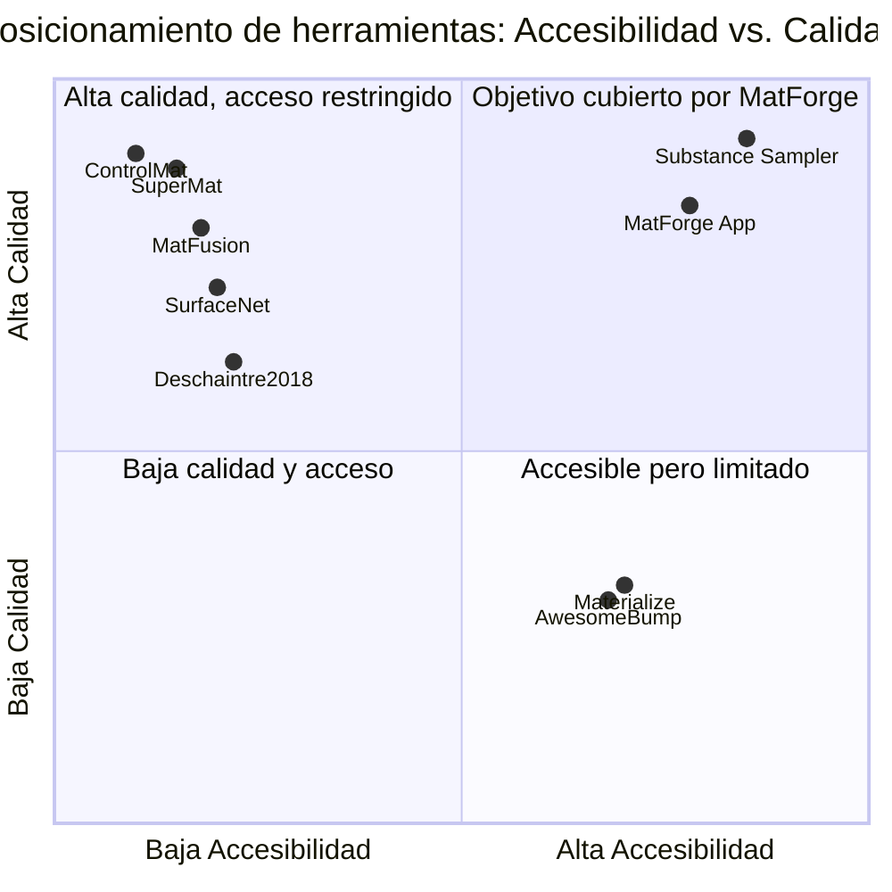
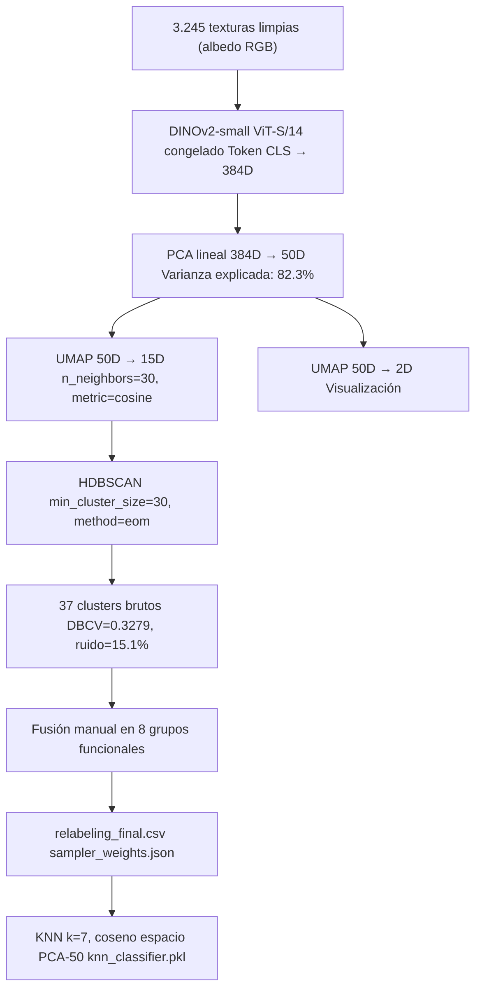
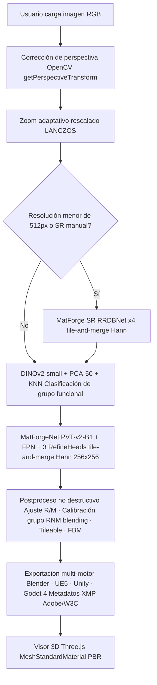
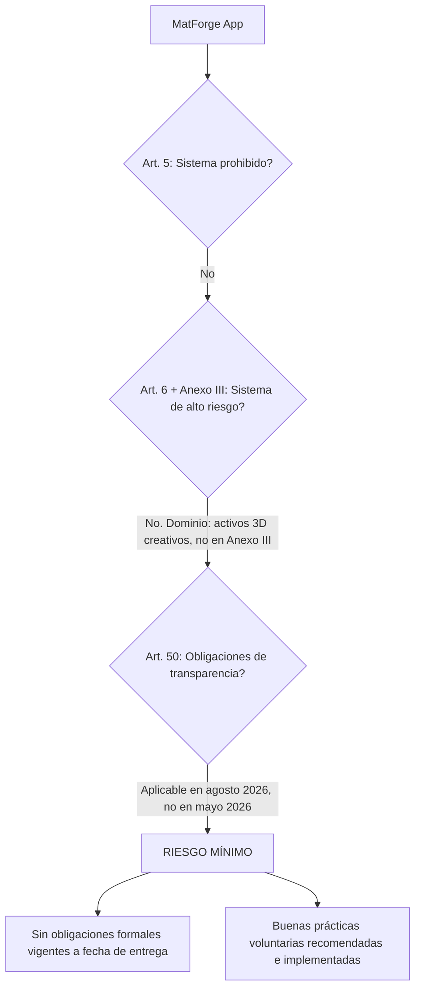

# 2. Marco Teórico

El presente marco teórico se organiza en torno a los objetivos específicos definidos en §1.5. Cada subsección identifica explícitamente el objetivo al que responde, de modo que la justificación tecnológica quede anclada a los logros concretos del sistema y no constituya una revisión genérica desvinculada del problema abordado.

---

## 2.1 Renderizado físico y estimación de SVBRDF: estado del arte y brecha identificada

*Responde a: OE1, OE6*

### 2.1.1 El modelo de reflexión PBR y la SVBRDF

El estándar de representación de apariencia superficial en los motores de renderizado modernos es el flujo de trabajo metallic-roughness, que descompone las propiedades ópticas de una superficie en tres mapas de textura: el mapa de Normales, que codifica la microgeometría superficial como un campo vectorial unitario en espacio tangente OpenGL; el mapa de Rugosidad, que parametriza la dispersión de luz en el continuo entre reflexión especular perfecta (valor 0) y difusión completa (valor 1); y el mapa Metálico, que determina si el modelo de reflexión trata la superficie como conductor o dieléctrico, con las implicaciones que ello tiene sobre el valor de reflectancia a incidencia normal $F_0$ y sobre la presencia o ausencia de componente difusa [76].

El término técnico que designa el problema investigado en la literatura académica es **estimación monocular de SVBRDF** (*Spatially-Varying Bidirectional Reflectance Distribution Function*). La SVBRDF extiende la BRDF estándar permitiendo que los parámetros de reflexión varíen por píxel, lo que la hace funcionalmente equivalente al conjunto de mapas PBR del flujo de trabajo artístico. El problema es inherentemente mal condicionado (*ill-posed*): múltiples combinaciones de parámetros de material e iluminación pueden producir la misma imagen observada [3]. Los métodos de aprendizaje profundo abordan esta ambigüedad incorporando priors estadísticos aprendidos desde grandes colecciones de materiales.

### 2.1.2 Evolución del estado del arte

El trabajo fundacional de Deschaintre et al. [2] (SIGGRAPH 2018) estableció el marco de referencia para la estimación de SVBRDF desde imagen única con redes profundas. La arquitectura combina una rama encoder-decoder con conexiones de salto para extracción de características locales y una rama de características globales basada en capas completamente conectadas. Su contribución más significativa es la **pérdida de renderizado diferenciable**: en lugar de evaluar el error sobre los mapas predichos directamente, renderiza esos mapas bajo múltiples condiciones de iluminación y compara los renders con los del ground truth. Esta idea es el fundamento directo de la función de pérdida de MatForgeNet (§2.3).

La línea adversarial se consolidó con SurfaceNet [5] (ICCV 2021), que reformula la estimación como traslación imagen-a-imagen mediante una GAN basada en parches capaz de producir mapas de alta resolución con mayor fidelidad perceptual que los métodos puramente supervisados. MaterialGAN [6] (ACM TOG 2020) adopta un paradigma diferente: entrena un modelo generativo sobre un corpus de materiales y formula la estimación como una búsqueda en el espacio latente mediante optimización de la pérdida de renderizado, a costa de un coste computacional elevado en inferencia.

Los métodos basados en difusión representan la frontera actual de calidad perceptual. MatFusion [7] (SIGGRAPH Asia 2023) es el primer trabajo que formula la estimación de SVBRDF explícitamente como tarea de difusión, entrenando un modelo incondicional sobre 312.165 materiales sintéticos. ControlMat [9] (ACM TOG 2024), desarrollado en Adobe Research, constituye el estado del arte más avanzado en estimación controlada: condiciona un modelo de difusión para generar materiales PBR tileables de alta resolución desde una fotografía bajo iluminación no controlada, con una técnica de *noise rolling* que garantiza la tilabilidad periódica del resultado. SuperMat [11] (2024) propone un framework de inferencia de paso único derivado de Stable Diffusion con ramas de experto estructurado, reduciendo el tiempo de inferencia de segundos a milisegundos, aunque sus pesos no están confirmados como acceso público.

### 2.1.3 Brecha confirmada

El análisis de herramientas existentes identifica tres patrones de cobertura insatisfactoria que definen la brecha que MatForge App aborda. Los métodos de investigación con mayor calidad (ControlMat, SuperMat, MatFusion) requieren entre 5 y 12 GB de VRAM y carecen de interfaz accesible. Las herramientas de código abierto basadas en heurísticas (Materialize [18], AwesomeBump [19]) son accesibles pero producen mapas insuficientes para producción. Las soluciones comerciales de referencia (Adobe Substance 3D Sampler [16, 17]) imponen modelos de suscripción y autenticación en línea incompatibles con flujos de trabajo con requisitos de privacidad de activos.

Ninguna herramienta identificada satisface simultáneamente los cuatro criterios del caso de uso objetivo: ejecución completamente local, hardware de consumo (≤8 GB VRAM), salida completa N+R+M desde imagen única e interfaz accesible para artistas no técnicos. Esta brecha está confirmada por el análisis de la literatura y el mercado, y no ha sido cerrada por ninguna publicación o herramienta identificada hasta mayo de 2026.

---

## 2.2 Arquitecturas de predicción densa: de CNN a Transformers visuales

*Responde a: OE1*

### 2.2.1 La limitación de los encoders de clasificación en predicción densa

Las primeras aproximaciones a la estimación de SVBRDF utilizaron encoders convolucionales diseñados originalmente para clasificación de imágenes (como ResNet), que presentan una limitación estructural para tareas de predicción densa: el pooling global y las capas de reducción de resolución descartan de forma irreversible la información espacial fina que la predicción de normales y roughness a nivel de píxel requiere. Recuperar esa información mediante conexiones de salto es costoso y parcialmente ineficaz.

### 2.2.2 Dense Prediction Transformer (DPT)

Ranftl et al. [12] (ICCV 2021) demostraron que los Vision Transformers (ViT) ofrecen ventajas sistemáticas sobre las redes convolucionales para tareas de predicción densa. La arquitectura DPT mantiene representaciones a resolución relativamente alta durante todo el procesamiento —sin operaciones de downsampling agresivas tras el embedding inicial— y dispone de campo receptivo global en cada etapa. Los tokens se ensamblan desde múltiples etapas del transformer para construir representaciones de tipo imagen a distintas resoluciones, que se combinan progresivamente con un decoder convolucional. Los experimentos mostraron mejoras de hasta el 28% en rendimiento relativo frente a redes totalmente convolucionales en estimación de profundidad monocular.

### 2.2.3 Swin Transformer

El Swin Transformer [13] (ICCV 2021) introduce mecanismos de atención local con ventana desplazada (*shifted window*) que capturan tanto información local como global con complejidad computacional lineal respecto al tamaño de la imagen. A diferencia del ViT estándar, el Swin está diseñado explícitamente para tareas de predicción densa y clasificación, con estructura piramidal que genera mapas de características a múltiples escalas.

### 2.2.4 Pyramid Vision Transformer v2 (PVT-v2)

El PVT-v2 [3] incorpora la estructura piramidal de las CNN en un backbone transformer, superando las dificultades del ViT original para tareas de predicción densa. A diferencia del Swin, no utiliza ventanas desplazadas, sino un mecanismo de atención espacial reducida (*Linear Spatial Reduction Attention*) que opera eficientemente en las cuatro etapas de resolución decreciente del encoder. Su variante B1 (~13 M de parámetros) produce representaciones a cuatro escalas (1/4, 1/8, 1/16 y 1/32 de la resolución de entrada) directamente compatibles con decoders de tipo FPN.

La elección de PVT-v2-B1 sobre MiT-B1 (la alternativa inicialmente considerada, propuesta en SegFormer [29]) responde a una razón de compatibilidad técnica concreta: `mit_b1` no está disponible en la versión de `timm` instalada en el entorno de entrenamiento (v1.0.25 en Kaggle), mientras que `pvt_v2_b1` sí lo está, produce shapes de feature maps idénticos y tiene el mismo régimen de preentrenamiento en ImageNet-1K.

### 2.2.5 Feature Pyramid Network (FPN)

Lin et al. [30] (CVPR 2017) propusieron la Feature Pyramid Network como decoder que combina los feature maps del encoder en un proceso top-down: partiendo del mapa más grueso (menor resolución, mayor semántica), añade detalle progresivamente hasta alcanzar la resolución del primer nivel del encoder. En cada fusión, la operación es: upsample bilinear 2× del stream top-down, proyección 1×1 del skip connection al mismo número de canales, concatenación y convolución 3×3 + BN + ReLU para fusionar la información. El uso de concatenación en lugar de suma preserva la información complementaria de ambos streams.

### 2.2.6 Tabla comparativa de arquitecturas candidatas

| Arquitectura | Tipo | Parámetros | Preentrenamiento | Representación | Riesgo principal |
|---|---|---|---|---|---|
| **PVT-v2-B1 + FPN** (elegida) | Encoder jerárquico + decoder piramidal | ~20–23 M | ImageNet-1K (disponible) | Multi-escala, 4 niveles | Suavizado de bordes finos |
| Restormer dual-head (Plan B) | Transformer de restauración | ~26 M | Sin preentrenamiento aplicable | Alta frecuencia, sin semántica | Dependencia total de datos |
| DPT-Hybrid | Transformer + CNN | ~123 M | ImageNet (ResNet-50) | Resolución constante | Coste VRAM elevado |
| Swin-Tiny | Transformer jerarq. | ~28 M | ImageNet-1K | Piramidal, ventana local | VRAM ajustada sin margen |
| Difusión (SuperMat, IntrinsicImageDiffusion) | Difusión multiescala | >500 M | Stable Diffusion base | Generativa, lenta | VRAM, latencia, no entrenable en T4 |

La elección de PVT-v2-B1 + FPN como Plan A se justifica por cuatro razones complementarias: el preentrenamiento en ImageNet-1K aporta representaciones de textura y borde sin coste de datos; la representación multiescala nativa resuelve directamente la limitación de los encoders de clasificación; la combinación preentrenamiento fuerte + learning rate diferenciado entre encoder y decoder es una receta de estabilidad bien establecida en la literatura de ajuste fino de transformers visuales [29]; y el tamaño total (~20–23 M de parámetros) cabe en la GPU T4 de 16 GB con batch size 8 y precisión mixta AMP.

---

## 2.3 Aprendizaje adversarial y función de pérdida físicamente fundamentada

*Responde a: OE1*

### 2.3.1 Fundamentos del aprendizaje adversarial en síntesis de mapas PBR

Las redes generativas adversariales introducen un discriminador que evalúa la plausibilidad estadística de las salidas del generador, presionándolo a producir distribuciones de parches más realistas que las que obtiene una red entrenada exclusivamente con pérdidas de reconstrucción. En el contexto de síntesis de mapas PBR, el principal beneficio del componente adversarial es la recuperación de alta frecuencia: los bordes de grano, las transiciones abruptas de rugosidad y el microdetalle geométrico que las pérdidas L1 y L2 tienden a suavizar por su naturaleza de minimización de error cuadrático medio.

SurfaceNet [5] fue el primer trabajo en aplicar sistemáticamente una GAN basada en parches a la estimación de SVBRDF, demostrando mejoras cuantitativas y cualitativas significativas respecto a los métodos supervisados anteriores. La inestabilidad del entrenamiento adversarial temprano —documentada tanto en SurfaceNet como en el trabajo previo DeepPBR— se mitiga mediante la estrategia de activación diferida (*delayed adversarial training*): el discriminador se introduce solo cuando el generador ya ha aprendido las estructuras básicas de los mapas mediante épocas supervisadas previas [2].

MatForge aplica esta estrategia: las 90 épocas de entrenamiento supervisado (épocas 0–89) establecen las orientaciones angulares básicas, la coherencia roughness y la señal metallic antes de que el discriminador PatchGAN multiescala introduzca la presión adversarial en las 20 épocas de ajuste fino GAN.

### 2.3.2 Función de pérdida compuesta de MatForgeNet

La función de pérdida total de MatForgeNet combina seis componentes con roles diferenciados:

$$L_{total} = \alpha \cdot L_{normal} + \beta \cdot L_{roughness} + \zeta \cdot L_{metallic} + \gamma \cdot L_{grad} + \delta_1 \cdot L_{render,L1} + \delta_2 \cdot L_{render,LPIPS}$$

**$L_{normal}$** combina pérdida coseno y pérdida Charbonnier. La pérdida coseno mide directamente el error angular entre vectores normales predichos y ground truth, que es la métrica geométricamente correcta para mapas de normales en espacio tangente:

$$L_{coseno} = 1 - \text{mean}(\hat{N}_{pred} \cdot \hat{N}_{gt})$$

La pérdida Charbonnier actúa como componente auxiliar con gradientes más suaves que L1 cerca de cero y más robusta que L2 ante valores atípicos.

**$L_{roughness}$** y **$L_{metallic}$** aplican Charbonnier y BCEWithLogitsLoss respectivamente. La elección de pérdida binaria cruzada con `pos_weight=8.0` para el mapa metálico responde al desbalance extremo del dataset: solo 238 de las 3.245 texturas contienen materiales genuinamente metálicos; sin compensación de clase, la cabeza Metallic colapsaría a predecir cero constante.

**$L_{grad}$** aplica el operador Sobel a dos escalas sobre los mapas de normales y rugosidad, penalizando diferencias en bordes y transiciones. Esta pérdida complementa la de reconstrucción global capturando la estructura de alta frecuencia que las pérdidas pixel-wise tienden a ignorar.

**$L_{render}$** compara renders sintetizados a partir de los mapas predichos con renders del ground truth bajo el modelo Cook-Torrance diferenciable (§2.3.3), usando K=3 luces aleatorias por batch para que el modelo aprenda coherencia física bajo iluminación variada. El componente LPIPS [24] utiliza activaciones de AlexNet preentrenado para medir similitud perceptual sobre los renders, sensible a diferencias de nitidez y textura que L1 no captura. Chambon et al. [15] (SIGGRAPH 2021) demostraron que la pérdida perceptual no puede aplicarse directamente sobre los mapas multicanal PBR —cuya distribución difiere completamente de la de imágenes RGB naturales para la que VGG fue entrenado— sino sobre renders de esos mapas en espacio RGB; MatForge implementa esta corrección.

La activación de $L_{render}$ sigue un schedule progresivo: desactivada en épocas 0–4 (mientras el modelo aprende orientaciones angulares básicas), L1 sobre renders con peso 0,10 en épocas 5–14, y función completa con LPIPS a partir de la época 15. Esta estrategia evita que la señal física domine sobre la supervisada directa antes de que el modelo haya establecido estructuras básicas correctas.

### 2.3.3 Renderer Cook-Torrance diferenciable

El modelo Cook-Torrance [25] describe la reflectancia total de una superficie como suma de componente difusa lambertiana y componente especular microfacetas:

$$L_{out} = \sum_{k} \left[ \left(\frac{k_D \cdot \text{albedo}}{\pi} + \frac{D \cdot G \cdot F}{4 \cdot (\mathbf{n} \cdot \mathbf{l}) \cdot (\mathbf{n} \cdot \mathbf{v})}\right) \cdot L_k \cdot \max(\mathbf{n} \cdot \mathbf{l}_k, 0) \right]$$

donde $D$ es la distribución NDF GGX/Trowbridge-Reitz [26], $G$ es el término geométrico de oclusión Smith-Schlick, y $F$ es la aproximación de Fresnel de Schlick [28]. El workflow metallic-roughness de UE4 [27] interpola $F_0$ entre el valor dieléctrico estándar (0,04) y el albedo del material en función del mapa Metallic, garantizando que los metales tengan reflectancia especular tintada por su color propio.

El renderer se implementa como código PyTorch puro, sin dependencias de rasterización de triángulos, lo que lo hace completamente diferenciable. Para texturas tileables planas, la dirección de visión $\mathbf{v}$ es constante e igual a $(0, 0, 1)$ (cámara ortográfica perpendicular a la superficie), simplificando el cómputo considerablemente.

---

## 2.4 Super-resolución para materiales: Real-ESRGAN y líneas de trabajo futuro

*Responde a: OE2*

### 2.4.1 Taxonomía del estado del arte en super-resolución

Los métodos modernos de super-resolución se articulan en cuatro familias arquitectónicas. Los **métodos basados en GAN** —ESRGAN [65] y su extensión Real-ESRGAN [37]— introducen un discriminador que presiona al generador a producir distribuciones de parches con alta frecuencia realista. Real-ESRGAN extiende la arquitectura con una estrategia de degradación sintética de segundo orden que imita las degradaciones del mundo real (blur, ruido gaussiano, compresión JPEG en múltiples pasadas), haciendo al modelo robusto a condiciones de captura variadas. Los **métodos basados en difusión** (StableSR, DiffBIR, OSEDiff [70], SinSR [71]) alcanzan alta calidad perceptual en escenas complejas, pero su inferencia requiere entre 20 y 200 pasos de denoising —incompatibles con el requisito de 10 segundos máximo en GTX 1650 Max-Q— o presentan inestabilidad de ajuste fino en datasets de tamaño moderado. Los **métodos basados en transformers** (SwinIR [66], HAT [67]) logran resultados líderes en métricas PSNR/SSIM en benchmarks estándar, pero su VRAM estimada supera los 4 GB con tiles de tamaño estándar, sin margen de seguridad para el hardware objetivo. Los **métodos ligeros** (IMDN [72], RFDN [73]) priorizan la eficiencia a costa de calidad perceptual en zonas de alta frecuencia, limitación crítica para materiales con bordes de grano pronunciados.

### 2.4.2 Selección de Real-ESRGAN y criterios de decisión

La arquitectura RRDBNet con 23 bloques RRDB (*Residual-in-Residual Dense Block*) de Real-ESRGAN [37] es la única que satisface simultáneamente los cuatro criterios de corte del módulo SR: VRAM de inferencia en tile 256×256 con FP16 de 584 MB (dentro del límite de 3.500 MB de la GTX 1650 Max-Q de 4.096 MB totales), latencia compatible con el requisito de interactividad, pesos preentrenados públicos y compatibilidad con tile-and-merge mediante ventana de Hann. Los experimentos de validación de VRAM sobre el hardware de despliegue real confirman que la diferencia en VRAM entre las variantes de 23 y 6 bloques RRDB es de solo 23 MB, lo que implica que la elección entre variantes debe basarse en calidad perceptual y estabilidad de ajuste fino, no en consumo de memoria.

### 2.4.3 Resultados del ajuste fino sobre MatSynth

El ajuste fino del módulo SR (Fase 1, solo generador, sin discriminador) se ejecutó durante 30 épocas sobre las 2.758 texturas de entrenamiento de MatSynth, partiendo del checkpoint oficial `RealESRGAN_x4plus.pth`. La función de pérdida combina reconstrucción L1, pérdida perceptual VGG-19 [74] y LPIPS [24]:

| Época | LPIPS validación | Mejora vs. base |
|---|---|---|
| 0 (base sin ajuste) | 0,2672 | — |
| 10 | 0,2510 | −6,1% |
| 20 | 0,2430 | −9,1% |
| 24 (óptimo) | **0,2380** | **−10,9%** |
| 30 (final) | 0,2401 | −10,1% |

El checkpoint `sr_ft_phase1_best_lpips.pt` (época 24, LPIPS = 0,2380) es el utilizado en producción. La Fase 2, que preveía activar el discriminador con peso adversarial progresivo, se abortó por colapso del discriminador desde la primera época —D(real) y D(fake) convergiendo a ~0,5 simultáneamente— comportamiento esperado y documentado en la literatura de ajuste fino adversarial con datasets de tamaño moderado.

### 2.4.4 Trabajo futuro: MUJICA

El módulo SR de MatForge opera exclusivamente sobre la imagen RGB de entrada, sin conocimiento de la estructura multimodal del material. Esta limitación —reconocida en la literatura reciente— produce inconsistencia entre mapas upscalados independientemente. MUJICA [38] (*Multimodal Upscaling Joint Inference via Cross-map Attention*, Du et al., 2025) propone un adaptador que reforma modelos SISR preentrenados basados en Swin Transformer para SR de materiales PBR mediante un mecanismo de atención cruzada ponderada (W-MCA) entre mapas. Aplicado sobre SwinIR, DRCT y HMANet, MUJICA mejora PSNR, SSIM y LPIPS preservando la consistencia entre mapas. Su integración en el pipeline de MatForge implicaría un cambio de paradigma: en lugar de actuar como preprocesado del RGB de entrada, operaría como postprocesado de los mapas PBR predichos. Este enfoque se clasifica como trabajo futuro de alta relevancia técnica, fuera del alcance de la entrega actual.

---

## 2.5 Clasificación semántica de materiales: DINOv2, clustering y KNN

*Responde a: OE3*

### 2.5.1 Motivación del relabeling semántico

Las categorías originales de MatSynth son asignaciones nominales realizadas por los proveedores del material, no el resultado de un análisis visual sistemático. El análisis exploratorio del dataset identificó inconsistencias significativas: texturas etiquetadas como `ceramic` con apariencia visual de piedra, texturas de `plaster` que mezclan mosaico, mortero y pared rasgada, y texturas de `metal` que incluyen cotas de malla, cadenas y placas base de circuitos impresos. Utilizar estas categorías directamente para construir un sampler de entrenamiento balanceado introduciría un sesgo basado en etiquetas incorrectas que el modelo absorbería durante el aprendizaje.

La solución adoptada es un **pipeline de relabeling semántico no supervisado**: reasignar cada textura a un grupo funcional basado en similitud visual real, determinada por un modelo de visión sin dependencias de los tags originales.

### 2.5.2 DINOv2 como extractor de características

DINOv2 [31] es un modelo de visión por computador desarrollado por Meta AI y entrenado de forma auto-supervisada sobre el corpus LVD-142M mediante una combinación de DINO, iBOT y SwAV sobre arquitecturas Vision Transformer (ViT). Su propiedad clave para este uso es que produce representaciones de propósito general que no requieren ajuste fino: se utiliza directamente como extractor de características congelado. Sus representaciones han sido validadas específicamente para clustering y segmentación de materiales [32].

La variante ViT-S/14 (small, 21 M de parámetros, embeddings de 384 dimensiones) se seleccionó por ser la única viable en CPU local para la fase de extracción (~24 minutos para las 3.245 texturas). Se utiliza el token [CLS] de la capa final, que captura la identidad visual global de la textura, en lugar de los patch tokens, que representan regiones locales.

### 2.5.3 Reducción de dimensionalidad: PCA + UMAP

Trabajar directamente con los 384 dimensiones del embedding DINOv2 en HDBSCAN produce resultados subóptimos por la maldición de la dimensionalidad: en espacios de alta dimensión, las distancias entre pares de puntos tienden a homogeneizarse, degradando el concepto de densidad local que el algoritmo de clustering requiere [35]. La documentación oficial de UMAP recomienda explícitamente reducir la dimensionalidad antes de aplicar HDBSCAN [34].

La reducción se realiza en dos etapas. Un PCA lineal reduce de 384D a 50D, preservando el 82,3% de la varianza total y eliminando dimensiones de ruido numérico. Sobre el espacio PCA se aplica UMAP [34] para reducción no lineal a 15D (para clustering) y 2D (para visualización), con parámetros `n_neighbors=30`, `min_dist=0.0` y `metric=cosine`. La superioridad de UMAP sobre PCA como paso previo a HDBSCAN en embeddings de transformers ha sido demostrada empíricamente [42]: UMAP preserva las relaciones no lineales entre grupos semánticamente distintos que PCA colapsa, produciendo clusters separados y cohesionados.

### 2.5.4 HDBSCAN y grupos funcionales resultantes

HDBSCAN [35] (*Hierarchical Density-Based Spatial Clustering of Applications with Noise*) agrupa puntos en regiones de densidad local superior a un umbral adaptativo, sin requerir especificar el número de clusters a priori, y asigna automáticamente un label de ruido (−1) a los puntos ambiguos. El Silhouette Score —métrica de clustering más conocida— es inadecuado para HDBSCAN porque asume clusters convexos de densidad uniforme [36]; la métrica correcta es el DBCV [78] (*Density-Based Clustering Validation*), diseñada específicamente para algoritmos basados en densidad.

Con los parámetros `min_cluster_size=30`, `min_samples=5`, `metric=euclidean` y `cluster_selection_method=eom`, HDBSCAN encontró 37 clusters (DBCV = 0,3279, ruido = 15,1%, NMI = 0,3604). Los 37 clusters se fusionaron manualmente en **8 grupos funcionales** mediante análisis de composición por categoría original: stone_rough, wood, ceramic_ground, mixed_ambiguous, brick_terracotta, marble_smooth, metal y concrete_plaster.

### 2.5.5 Clasificador KNN para inferencia en la aplicación

El clasificador serializado (KNN k=7, métrica coseno, pesos por distancia) opera sobre el espacio de 50 dimensiones post-PCA —no sobre el espacio UMAP de 15D, cuya proyección no es determinista para puntos nuevos fuera del dataset de entrenamiento. La latencia de clasificación es inferior a 5 ms en CPU [33]. Este clasificador se reutiliza en la aplicación para tres funcionalidades: identificación automática del grupo de material de cualquier textura de entrada, calibración diferenciada del postproceso por grupo funcional, y habilitación del sampler balanceado durante el entrenamiento. La integración de KNN con modelos de fundación como DINOv2 para clasificación adaptable ha sido validada en la literatura reciente [33].

---

## 2.6 Dataset MatSynth y pipeline de datos

*Responde a: OE1, OE3*

### 2.6.1 MatSynth como fuente de datos

MatSynth [1] (Vecchio y Deschaintre, CVPR 2024) es el dataset de referencia más relevante para la tarea investigada. Contiene más de 4.000 materiales PBR de ultra-alta resolución (hasta 4K) bajo licencias CC0 y CC-BY —sin cláusulas NC ni SA, compatibles con entrenamiento de modelos y distribución de obras derivadas— organizados en 13 categorías semánticas. El split de entrenamiento disponible comprende aproximadamente 3.980 materiales; para MatForge se seleccionaron 9 categorías, descargando un total de 3.814 texturas. Tras el proceso de limpieza y relabeling, el dataset final de entrenamiento comprende 3.245 texturas distribuidas en los 8 grupos funcionales descritos en §2.5.4.

El estándar de coordenadas adoptado por MatSynth para el mapa Normal es OpenGL, donde el eje Z apunta hacia fuera de la superficie. Este dato técnico determina directamente los filtros de calidad del EDA y la formulación de la pérdida coseno de MatForgeNet.

El propio paper de MatSynth demuestra que reentrenar métodos existentes con este dataset produce mejoras cuantitativas consistentes: SurfaceNet entrenado con MatSynth alcanzó un RMSE de renderizado de 0,135 frente a 0,161 con el dataset anterior, un SSIM de 0,613 frente a 0,494, y un LPIPS de 0,281 frente a 0,395.

### 2.6.2 Pipeline de limpieza: EDA con 8 filtros por categoría

La innovación metodológica principal del análisis exploratorio es la adopción de **umbrales por categoría** en lugar de umbrales globales, justificada por la diversidad física de los materiales: un mármol pulido tiene roughness genuinamente cercano a 0, que bajo un umbral global sería descartado incorrectamente como "roughness plano sin variación". Los 8 filtros aplicados evalúan: coherencia albedo-normal (F1), convención OpenGL del canal Z (F2), equilibrio de canales tangenciales (F3), unitariedad de los vectores normales (F4), ruido de alta frecuencia extremo (F5), roughness completamente plano en rangos extremos (F6), mapa metálico completamente blanco en la categoría metal (F7), y detección de near-duplicates por distancia de Hamming sobre pHash (F8). El resultado fue la eliminación de 564 texturas (14,8% del total), con tasas de descarte del 36,1% en metal y 35,1% en plaster por ser las categorías con mayor proporción de mapas físicamente incorrectos.

### 2.6.3 Augmentación coherente para mapas PBR

La augmentación de datos para texturas PBR presenta una peculiaridad ausente en datasets de imágenes naturales: el mapa de Normales es un campo vectorial con restricción de norma unitaria, no una imagen RGB arbitraria. Cualquier transformación geométrica sobre la imagen debe ir acompañada de la transformación matemática correspondiente sobre los vectores del mapa. Por ejemplo, un flip horizontal implica invertir la componente X del vector normal; una rotación 90° CCW implica la permutación (−Y, X, Z). Las rotaciones se restringen a múltiplos de 90° para evitar la interpolación del campo vectorial que requieren las rotaciones arbitrarias. Las perturbaciones fotométricas (jitter de brillo, contraste, saturación y hue) se aplican exclusivamente al RGB de entrada, nunca a los mapas ground truth, cuya naturaleza es intrínseca al material e independiente de las condiciones de captura.

---

## 2.7 Herramientas de la aplicación: justificación técnica

*Responde a: OE4, OE5, OE7*

### 2.7.1 Arquitectura general de la aplicación

MatForge App se implementa como aplicación Streamlit local en Python 3.11.9. La elección de Streamlit permite distribuir una interfaz web interactiva sin requerir que el usuario instale ni configure un servidor web, siendo suficiente la ejecución de un único proceso Python. El modelo de gestión de recursos de GPU sigue el patrón `@st.cache_resource`, que mantiene los modelos cargados en memoria entre reruns sin serialización, y el protocolo de liberación secuencial `model.to('cpu') → del → gc.collect() → torch.cuda.empty_cache()` para garantizar que SR y MatForgeNet no coexisten en VRAM simultáneamente dado el límite de 4 GB del hardware objetivo.

El pipeline de inferencia integra dos sistemas de tile-and-merge independientes y secuenciales: el módulo SR (parches 256×256 de entrada, salida 1024×1024) y MatForgeNet (parches 256×256 sobre la imagen RGB resultante, stride 128, fusión con ventana de Hann 2D). La renormalización L2 del mapa de Normales tras la fusión Hann se realiza sobre el mapa fusionado completo, no por parche, porque el promedio ponderado de vectores unitarios no es unitario y renormalizar por parche produciría un campo vectorial físicamente incorrecto en las costuras.

### 2.7.2 Zoom adaptativo

El zoom adaptativo es un requisito estructural del modelo, no una herramienta opcional. MatForgeNet fue entrenado sobre parches de 256×256 píxeles recortados de texturas a resolución 1K. Si la imagen de entrada tiene resolución muy superior (2K, 4K), cada tile del pipeline de inferencia abarcará un fragmento diminuto de superficie sin contexto de material suficiente, generando mapas PBR incoherentes. El slider de zoom reescala la imagen de entrada antes del tile-and-merge mediante interpolación LANCZOS, de forma que el contenido visual de cada tile corresponda a la distribución de entrenamiento. La regla operativa es: imagen 1K → zoom 1,0; imagen 2K → zoom 0,5; imagen 4K → zoom 0,25.

### 2.7.3 Corrección de perspectiva

La corrección de perspectiva endereza fotografías tomadas en ángulo antes de la inferencia. El componente `streamlit-image-coordinates` recoge cuatro clics del usuario sobre la imagen y devuelve las coordenadas de las esquinas de la superficie. La transformación se realiza con `cv2.getPerspectiveTransform` y `cv2.warpPerspective` con interpolación bicúbica, produciendo una imagen ortogonal que elimina las distorsiones proyectivas que afectarían a la predicción de normales.

### 2.7.4 Panel de ajuste físico post-predicción

El panel de ajuste físico permite modificar Roughness y Metallic globalmente mediante sliders de ganancia y desplazamiento (`x_out = clip(gain · x_in + offset, 0, 1)`) sin reinferir los mapas. Los mapas de rugosidad y metálico son lineales en el espacio del flujo de trabajo metallic-roughness; no se aplica corrección gamma. Si el mapa de Normales se modifica, se requiere renormalización L2 obligatoria por píxel.

### 2.7.5 Mezclador de materiales por Reoriented Normal Mapping

El mezclador de materiales combina dos predicciones MatForge preservando la coherencia física de los vectores normales mediante el método **RNM** (*Reoriented Normal Mapping*) de Barré-Brisebois y Hill [46], publicado en 2012. La interpolación lineal directa sobre normales empacados en [0, 255] produce vectores invalidados; RNM opera sobre vectores desempacados en [−1, 1] y garantiza norma unitaria en el resultado:

La operación RNM define dos vectores auxiliares a partir de los mapas de entrada $n_1$ (base) y $n_2$ (detalle): $t = n_1 + (0, 0, 1)$ y $u = n_2 \cdot (-1, -1, 1)$. El vector resultado se obtiene como: r = normalize( t * dot(t, u) / t.z - u ) donde `normalize` aplica renormalización L2. La implementación opera sobre vectores desempacados en el rango $[-1, 1]^3$ y renormaliza el resultado antes de reempaquetar a $[0, 1]^3$ para almacenamiento en PNG.

Para Roughness y Metallic se aplica interpolación lineal ponderada por máscaras procedurales FBM generadas con `opensimplex` o `pyfastnoiselite`.

### 2.7.6 Conversión a textura tileable

La conversión a textura tileable aplica desplazamiento de 50% + fundido cruzado lineal en la región central de la imagen, eliminando la costura visible cuando la textura se repite en un motor 3D. Para el mapa de Normales, el fundido se realiza en el espacio de vectores desempacados con renormalización L2, no sobre los valores RGB empacados. La técnica de edición de Poisson [75] (Pérez et al., SIGGRAPH 2003) ofrece una alternativa de mayor calidad mediante `cv2.seamlessClone`, con un coste computacional superior.

### 2.7.7 Exportación multi-motor con convenciones verificadas

El sistema de exportación genera los mapas con el empaquetado de canales correcto para cada motor de renderizado. Las convenciones difieren de forma no trivial:

| Motor | Formato Normal | Empaquetado especial |
|---|---|---|
| Blender | OpenGL (Y+) | Mapas separados |
| Unreal Engine 5 | DirectX (flip canal G, Y−) | ORM: R=AO, G=Rough, B=Metal |
| Unity URP | OpenGL | MetallicSmoothness: R=Metal, A=1−Rough |
| Unity HDRP | OpenGL | Mask Map: R=Metal, G=AO, B=detail, A=Smooth [77] |
| Godot 4 | OpenGL (glTF 2.0 [76]) | ORM: R=AO, G=Rough, B=Metal |

El flip del canal G del mapa de Normales para UE5 (conversión OpenGL→DirectX) es la fuente de error más frecuente en pipelines de integración; producida omisión genera el síntoma de "bumps invertidos" en el motor de destino. El módulo de exportación incluye este flip de forma automática y añade un archivo `README.txt` en el ZIP exportado documentando las convenciones aplicadas.

### 2.7.8 Procesado en lote (Batch ZIP)

El módulo de procesado en lote acepta un archivo ZIP de imágenes mediante `st.file_uploader` y descomprime los miembros de forma secuencial mediante `zipfile.ZipFile(buffer).open(member)`, sin cargar el ZIP completo en RAM. Cada imagen pasa por el pipeline completo (zoom, SR condicional, clasificación, inferencia, exportación) y los resultados se acumulan en un ZIP de salida disponible para descarga al finalizar el procesado.

### 2.7.9 Visor 3D integrado con Three.js

El visor 3D permite al artista validar las texturas predichas sobre una primitiva (esfera, cubo o plano) con iluminación PBR coherente sin salir de la aplicación. Se implementa con Three.js r160+ [41] distribuido localmente, usando `MeshStandardMaterial` que admite `normalMap`, `roughnessMap` y `metalnessMap` directamente. El render ocurre en la GPU del navegador (cero VRAM Python); las texturas se transfieren como URI `data:image/png;base64` dentro del HTML generado. `MeshStandardMaterial` implementa el mismo modelo Disney/UE4 (GGX) que los motores de producción, garantizando que la validación visual en el visor es representativa del resultado en producción.

### 2.7.10 Generación de variaciones procedurales

El módulo de variaciones procedurales genera múltiples variantes de un material a partir de una sola predicción mediante ruido FBM (*Fractional Brownian Motion*) multi-octava generado con `pyfastnoiselite`. Las operaciones incluyen mezcla zonal por interpolación lineal con máscara FBM, simulación de desgaste en aristas mediante producto del gradiente Sobel del mapa de Normales con una máscara de ruido de baja frecuencia, y variación de escala mediante redimensionado con tile-wrap. La utilidad de estas variaciones es evitar la repetición visible en superficies de gran extensión donde el mismo material se tilea decenas de veces.

---

## 2.x Consideraciones éticas y legales

*Responde a: OE5 (metadatos de procedencia), OE7 (despliegue local y privacidad)*

Esta sección es de cumplimiento obligatorio en el contexto del desarrollo de sistemas de inteligencia artificial en el marco regulatorio europeo. MatForge App combina modelos de aprendizaje profundo, datos de terceros bajo licencias abiertas y generación autónoma de contenido de imagen, lo que activa un conjunto de consideraciones legales que se documentan a continuación con base en fuentes primarias verificadas.

### 2.x.1 Clasificación de riesgo bajo el Reglamento UE 2024/1689 (AI Act)

El Reglamento (UE) 2024/1689 [49] (*AI Act*), publicado en el Diario Oficial de la UE el 12 de julio de 2024 y en vigor desde el 1 de agosto de 2024, establece un sistema de clasificación de riesgo escalonado para los sistemas de inteligencia artificial.

MatForge no realiza ninguna práctica prohibida por el Art. 5 (manipulación subliminal, scoring social, identificación biométrica en tiempo real). El Anexo III enumera taxativamente los dominios de alto riesgo —infraestructura crítica, educación, empleo, aplicación de ley, migración, administración de justicia—; la predicción de mapas de materiales para motores de renderizado 3D no está incluida en ninguna categoría. MatForge se clasifica, por tanto, como **sistema de riesgo mínimo**.

### 2.x.2 Exención académica — Art. 2(6)

El Art. 2(6) del AI Act establece que el Reglamento no se aplica a los sistemas de IA desarrollados y puestos en servicio con el único propósito de investigación científica [50]. MatForge cumple los criterios para activar esta exención en su configuración actual: fue desarrollado específicamente para un Proyecto de Investigación universitario, su puesta en servicio es local y de usuario único, y no ha sido colocado en el mercado ni distribuido públicamente. La literatura jurídica especializada advierte que la exención tiene un alcance estricto y depende críticamente de la interpretación del término *"for the sole purpose"* [52] [53]; si el sistema fuera distribuido públicamente, la exención dejaría de aplicarse, aunque el sistema seguiría siendo de riesgo mínimo.

### 2.x.3 Obligaciones de transparencia — Art. 50

El Art. 50 del AI Act establece obligaciones de transparencia para sistemas que generan contenido sintético de imagen, incluyendo marcado legible por máquina en los outputs. Estas obligaciones entran en vigor el **2 de agosto de 2026** —24 meses después de la entrada en vigor del Reglamento [64]— y no están en vigor en mayo de 2026, fecha de entrega del PI. MatForge implementa, de forma preventiva, metadatos XMP de procedencia incrustados en todos los archivos PNG exportados, con los campos `dc:creator`, `dc:rights`, `xmp:CreatorTool` y `xmpRights:Marked`. Esta implementación cumple el espíritu del Art. 50(2) y anticipa las obligaciones que serían de aplicación en cualquier distribución pública posterior a agosto de 2026. El estándar C2PA [58] (Coalition for Content Provenance and Authenticity, versión 2.2, mayo 2025), que requiere firma criptográfica con certificados X.509, se identifica como la solución técnica de referencia para una futura distribución pública.

La conexión entre el OE5 (exportación con metadatos XMP) y esta sección es directa: la implementación de metadatos de procedencia no es solo una decisión de diseño de producto, sino una decisión de conformidad regulatoria anticipada.

### 2.x.4 Derechos sobre los outputs generados

El marco europeo de derecho de autor, desarrollado por la jurisprudencia del TJUE a través de las sentencias *Infopaq*, *Painer*, *Football Dataco* y *Cofemel* (C-683/17), ha establecido el criterio de la "elección creativa libre" como requisito de originalidad para la protección por derechos de autor. En *Cofemel*, el TJUE determinó que para que una obra sea original debe reflejar la personalidad de su autor como expresión de elecciones libres y creativas. Este enfoque es radicalmente antropocéntrico [54].

Los mapas Normal, Roughness y Metallic generados por MatForge son producidos de forma autónoma por el modelo a partir de una imagen de entrada del usuario. El proceso de generación es enteramente computacional; el usuario no realiza elecciones creativas sobre la estructura, composición o valores de los mapas resultantes. Aplicando el criterio europeo, los mapas PBR generados por MatForge **no son susceptibles de protección por derechos de autor**. El Parlamento Europeo reafirmó en su informe de 2026 sobre derechos de autor e IA generativa que el contenido generado por IA no debe ser elegible para protección por derechos de autor [55]. Los outputs se sitúan en el dominio público efectivo desde el momento de su generación y pueden ser utilizados libremente, incluyendo para fines comerciales, con la única salvedad de la incertidumbre jurídica sobre los pesos PVT-v2-B1 derivada de la advertencia del autor de `timm` sobre la licencia no comercial de ImageNet-1K para escenarios de distribución pública o uso comercial.

### 2.x.5 Licencias de los componentes

La siguiente tabla sintetiza el estado de licencias de los componentes de MatForge App:

| Componente | Licencia | Compatibilidad académica | Incertidumbre |
|---|---|---|---|
| timm / código | Apache 2.0 [40] | Total | Ninguna |
| PVT-v2-B1 / pesos | Apache 2.0 + ⚠️ ImageNet | Total (uso académico) | Distribución pública: consulta legal recomendada |
| DINOv2-small | Apache 2.0 [60] | Total | Ninguna |
| Real-ESRGAN | BSD-3-Clause [61] | Total | Ninguna |
| MatSynth | CC0 + CC-BY 4.0 [56] [57] | Total | Ninguna |

La advertencia del autor de `timm` sobre los pesos preentrenados de PVT-v2-B1 [63] se refiere a la incertidumbre jurídica no resuelta sobre si los pesos de un modelo entrenado en ImageNet-1K heredan las restricciones no comerciales de ese dataset. En el contexto del presente Proyecto de Investigación universitario, el uso de estos pesos es coherente con el propósito de investigación no comercial que ImageNet-1K permite. Cualquier distribución pública del checkpoint `best_gan.pt` requeriría consulta con un especialista en propiedad intelectual antes de su ejecución.

La atribución del dataset MatSynth en este documento cumple la obligación de la licencia CC-BY 4.0 aplicable a los materiales del artista Julio Sillet incluidos en la colección: el modelo MatForge fue entrenado sobre el dataset MatSynth [1], distribuido bajo licencias CC0 y CC-BY 4.0, con materiales bajo licencia CC0 procedentes de AmbientCG, CGBookCase, PolyHaven, ShareTextures y TextureCan, y materiales bajo licencia CC-BY del artista Julio Sillet.
