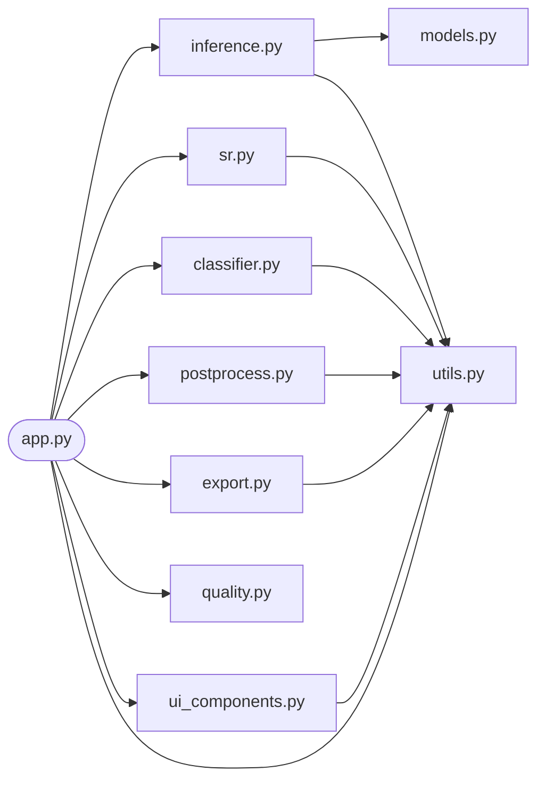
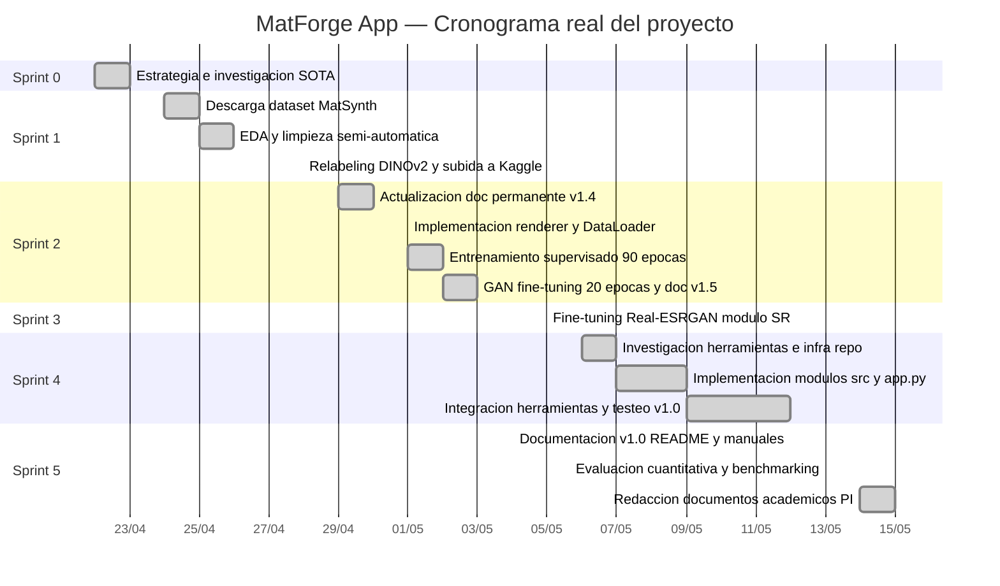

# 3. Marco Metodológico

## 3.1 Metodología de desarrollo: SCRUM adaptado

El desarrollo de MatForge App se llevó a cabo mediante una adaptación de la metodología SCRUM [39] a las condiciones específicas de un proyecto de investigación aplicada unipersonal. La elección de un marco iterativo e incremental frente a un modelo en cascada responde a una característica estructural de los proyectos de aprendizaje profundo: el resultado de cada fase de entrenamiento no es predecible con precisión antes de ejecutarla, lo que invalida la planificación lineal como estrategia de desarrollo.

En MatForge, esta incertidumbre se materializó de forma concreta en varias dimensiones. El rendimiento del modelo principal tras 90 épocas de entrenamiento supervisado condicionó directamente la decisión de añadir o no una fase de fine-tuning adversarial (GAN). La estabilidad del discriminador durante esa fase GAN condicionó cuántas épocas se ejecutarían y qué checkpoint se adoptaría como resultado final. El comportamiento del módulo de super-resolución durante su propio fine-tuning determinó si se usarían los pesos especializados o los preentrenados genéricos. Ninguna de estas decisiones era planificable en el momento de escribir la especificación inicial: dependían de datos empíricos que solo existirían tras ejecutar el cómputo. Un modelo en cascada habría exigido comprometerlas a priori, con el riesgo de dedicar semanas a una rama técnica cuyo resultado ya fuese conocido como insatisfactorio. SCRUM, al organizar el trabajo en sprints con revisión de resultados al final de cada uno, permite pivotar antes de comprometer el presupuesto completo de tiempo y cómputo.

La estructura SCRUM se adaptó al contexto unipersonal del siguiente modo. El desarrollador asumió simultáneamente los roles de *Product Owner* —responsable de definir los objetivos específicos (OE1–OE7), establecer prioridades y aceptar o rechazar los entregables de cada sprint— y de *Scrum Master* —responsable de gestionar el avance diario, identificar bloqueos técnicos y garantizar que el proceso de trabajo se mantuviese coherente con la planificación. Esta fusión de roles, frecuente en proyectos académicos individuales, no contradice los principios del marco; simplemente elimina la fricción de coordinación entre personas al concentrar la toma de decisiones en un único agente con acceso completo tanto a la visión de producto como a la realidad técnica del desarrollo.

Los *sprints* se definieron como bloques de trabajo orientados a la consecución de uno o varios OE relacionados, con un entregable funcional y verificable al final de cada uno. El backlog de producto, formalizado en `backlog_scrum.md`, recoge las historias de usuario que articulan los requisitos funcionales desde la perspectiva del artista 3D destinatario de la herramienta. La correspondencia entre sprints e historias de usuario se detalla en el Sprint Backlog del mismo documento.

La elección de SCRUM frente a otras alternativas iterativas como Kanban o XP se justifica por su estructura de sprints con duración fija, que impone una disciplina de revisión periódica especialmente valiosa en proyectos con restricciones de tiempo duras. En un proyecto con fecha de entrega inamovible y entrenamientos de resultado incierto, la cadencia de revisión al final de cada sprint garantiza que los problemas técnicos —colapso del discriminador, incompatibilidad de arquitecturas, distribution shift en el módulo SR— se detectan y se gestionan en el momento oportuno, no al final cuando el margen de maniobra es nulo.

---

## 3.2 Herramientas y entorno tecnológico

La selección de herramientas respondió a tres criterios concurrentes: adecuación técnica para las tareas específicas de cada objetivo, compatibilidad con las restricciones de hardware del entorno de despliegue (GTX 1650 Max-Q, 4 GB VRAM) y disponibilidad bajo licencias de código abierto o uso gratuito. A continuación se describen las herramientas organizadas por categoría funcional, con justificación de su elección y vinculación explícita a los OE a los que dan respuesta.

### Entorno de desarrollo

**Python 3.11.9** (64 bits, Windows) fue la versión de referencia para todo el proyecto. Su elección sobre versiones más recientes responde a una restricción práctica: es la única versión con cobertura completa de *wheels* precompilados para todas las dependencias críticas del proyecto en Windows, incluyendo `torch 2.5.1+cu121`, `timm 1.0.25`, `streamlit-image-coordinates 0.4.0` y `pyfastnoiselite 0.0.4`. La compatibilidad de estas bibliotecas con Python 3.12 o superior no estaba garantizada en el momento del desarrollo. Afecta a todos los OE como base del entorno de ejecución.

**Visual Studio Code** sirvió como entorno de edición de código para todos los módulos de la aplicación (`src/`), scripts de entrenamiento y utilidades de diagnóstico. Su integración con extensiones de Python, Jupyter y control de versiones Git lo hace adecuado para la gestión simultánea de múltiples tipos de archivo en un proyecto heterogéneo como MatForge.

**Git** y **GitHub** (repositorio privado `MatForge-App`) proporcionaron el sistema de control de versiones del proyecto. Se adoptaron *commits* semánticos con prefijos normalizados (`feat`, `fix`, `chore`) para mantener un historial legible de los cambios introducidos en cada módulo. **Git LFS** (*Large File Storage*) se configuró para rastrear los archivos de pesos (extensiones `*.pt` y `*.pth`), que suman 415 MB, permitiendo que los evaluadores puedan clonar el repositorio completo con los checkpoints incluidos mediante un único comando. Esta decisión afecta directamente a OE7 (despliegue local reproducible).

### Framework de inteligencia artificial

**PyTorch 2.5.1+cu121** constituye el framework central de entrenamiento e inferencia del proyecto (OE1, OE2). La migración desde TensorFlow —framework del modelo de referencia DeepPBR— se justificó por tres razones técnicas. En primer lugar, la biblioteca `timm` (*PyTorch Image Models*) [39], que proporciona acceso a arquitecturas de encoder jerárquico preentrenadas como PVT-v2-B1, opera exclusivamente sobre PyTorch y no tiene equivalente en el ecosistema TensorFlow. En segundo lugar, PyTorch ofrece soporte nativo de *Automatic Mixed Precision* (AMP) mediante `torch.cuda.amp.GradScaler` y `torch.amp.autocast`, lo que reduce el consumo de VRAM en aproximadamente un 50% durante el entrenamiento sin modificar la lógica del modelo. En tercer lugar, la inspección directa del *state dict* de los checkpoints —necesaria para depurar discrepancias entre la arquitectura especificada y la almacenada— es considerablemente más directa en PyTorch que en TensorFlow.

**timm 1.0.25** [40] proporcionó el encoder PVT-v2-B1 preentrenado en ImageNet-1K utilizado como *backbone* de MatForgeNet (OE1). La versión 1.0.25 es relevante porque la arquitectura MiT-B1, prevista en el diseño inicial, no está disponible en este registro (0 modelos encontrados); PVT-v2-B1, accesible mediante `timm.create_model('pvt_v2_b1', pretrained=True)`, produce *feature maps* con shapes idénticos a los previstos para MiT-B1 —L1: 64×64×64, L2: 32×32×128, L3: 16×16×320, L4: 8×8×512— lo que permitió sustituirlo sin modificar el decoder FPN ni las cabezas de refinado.

### Modelos base preentrenados

**PVT-v2-B1** (*Pyramid Vision Transformer v2*, Wang et al., 2022) [3] actúa como encoder jerárquico de MatForgeNet, con aproximadamente 13 M de parámetros preentrenados en ImageNet-1K. Su arquitectura de atención local con ventanas deslizantes y su capacidad para producir representaciones multiescala lo hacen especialmente adecuado para tareas de predicción densa como la estimación de mapas PBR, donde la coherencia espacial a múltiples resoluciones es determinante (OE1).

**DINOv2-small** (*ViT-S/14*, Oquab et al., 2024) [31] se integra como extractor de *embeddings* visuales de 384 dimensiones para el pipeline de clasificación de material (OE3). El token CLS producido por DINOv2-small captura representaciones semánticas de alto nivel que permiten distinguir familias de materiales (piedra, madera, metal, cerámica) sin necesidad de supervisión explícita con etiquetas de clase, lo que resultó fundamental para el relabeling semántico del dataset (§3.4).

**Real-ESRGAN** (*RealESRGAN\_x4plus.pth*, Wang et al., 2021) [37] proporciona los pesos de partida para el fine-tuning del módulo de super-resolución (OE2). El checkpoint oficial de 23 bloques RRDB preentrenado sobre imágenes reales con degradación sintética compleja fue seleccionado sobre el checkpoint de 6 bloques orientado a animación, por su mayor adecuación al dominio de fotografías de materiales de superficie.

### Dataset y cómputo en la nube

**MatSynth** (Vecchio y Deschaintre, CVPR 2024) [1] es el dataset de materiales PBR utilizado para el entrenamiento de MatForgeNet y el fine-tuning del módulo SR. Se distribuye a través de **Hugging Face** bajo licencias CC0 y CC-BY, lo que garantiza la compatibilidad con la licencia Apache 2.0 del proyecto. El acceso se realizó mediante descarga programática con el script `matforge_downloader.py` (disponible en `PI/anexos/`).

**Kaggle** proporcionó el entorno de cómputo en GPU para todos los entrenamientos (OE1, OE2). Se utilizaron aceleradores T4×2 (16 GB VRAM combinada) dentro de la cuota gratuita de la plataforma (~30 horas semanales). La incompatibilidad de los aceleradores P100 (arquitectura CUDA sm_60) con PyTorch 2.10+CUDA12.8 obligó a migrar todos los notebooks al acelerador T4 (sm_75) antes de ejecutar el primer entrenamiento real.

**Git LFS** se utilizó adicionalmente para gestionar los checkpoints de entrenamiento en el dataset privado de Kaggle (`MatForge PBR Dataset`, 3.245 texturas, ~12 GB), garantizando la reproducibilidad del split de validación fijo (`matforge_split.csv`, SEED=42).

### Interfaz de usuario

**Streamlit ≥ 1.50** constituye el framework de la aplicación local (OE4, OE5, OE7). Su modelo de ejecución reactiva —en el que cualquier interacción del usuario relanza el script completo— requirió un diseño cuidadoso de la gestión de estado mediante `st.session_state` y del sistema de caché de modelos mediante `@st.cache_resource`, el decorador canónico para objetos PyTorch en GPU desde Streamlit 1.18 (el decorador `@st.cache`, presente en el código del baseline DeepPBR, está obsoleto desde esa versión). La elección de Streamlit sobre alternativas como Gradio o Flask responde a su capacidad para integrar componentes HTML personalizados mediante `st.markdown(unsafe_allow_html=True)`, lo que permitió implementar el visor 3D con Three.js y el slider de comparación directamente en la interfaz sin necesitar un servidor de backend separado.

### Bibliotecas clave del pipeline

**OpenCV 4.10.x** proporcionó la transformación de perspectiva mediante homografía (`cv2.getPerspectiveTransform`, `cv2.warpPerspective`) utilizada en la herramienta de corrección de perspectiva (OE4).

**Three.js r160** [41] se integra como motor de renderizado 3D en el visor PBR de la aplicación (OE4). Se utilizó la distribución CDN de jsdelivr como fuente primaria, con archivos locales (`assets/three/`) descargados como respaldo para funcionamiento sin red (OE7).

**pyfastnoiselite 0.0.4** y **opensimplex** proporcionan el generador de ruido procedural utilizado en las variaciones FBM (OE4). La incompatibilidad de la API de pyfastnoiselite con la implementación prevista forzó un *fallback* automático a opensimplex como backend efectivo, documentado como comportamiento esperado en `src/postprocess.py`.

**Pillow 10.4.x** gestionó la carga, validación y transformación de imágenes en todos los módulos del pipeline. La operación de redimensionado con filtro LANCZOS, utilizada para el ajuste de zoom adaptativo, se implementó mediante `PIL.Image.resize(LANCZOS)`.

**scikit-learn 1.5.2** proporcionó el clasificador KNN (OE3) y el modelo PCA para reducción de dimensionalidad. La versión 1.5.2 es la misma con la que se serializaron los artefactos `knn_classifier.pkl` y `pca_model.pkl`, lo que garantiza la compatibilidad de carga sin advertencias de versión.

**UMAP-learn** [42] y **HDBSCAN** [35] se utilizaron en el pipeline de relabeling semántico del dataset (§3.4, OE3): UMAP para la reducción de dimensionalidad de 50D a 15D (clustering) y 2D (visualización), y HDBSCAN para el agrupamiento jerárquico basado en densidad.

**LPIPS** (Zhang et al., 2018) [24] se utilizó como métrica de evaluación perceptual tanto en la función de pérdida del entrenamiento (sobre renders Cook-Torrance) como en el protocolo de benchmarking (OE6). Se seleccionó el backbone AlexNet por su mejor relación coste-rendimiento en el entorno Kaggle.

### Control de versiones y verificación

El archivo `.gitignore` excluye explícitamente el entorno virtual (`.venv/`), los archivos de configuración del agente de código (`CLAUDE.md`, `.claudeignore`, `.claude/`) y los archivos intermedios de diagnóstico. El archivo `.gitattributes` configura Git LFS para los patrones `*.pt` y `*.pth`, garantizando que los checkpoints de modelo sean accesibles mediante `git clone` sin pasos adicionales.

El script `scripts/matforge_app_00_inference_check.py` implementa una batería de nueve pasos de verificación del pipeline de inferencia completo —detección de dispositivo, carga de modelos, inferencia de prueba, pipeline KNN y liberación de VRAM— que permite confirmar la integridad de la instalación antes de lanzar la aplicación.

---

## 3.3 Proceso de desarrollo: sprints y fases

El desarrollo completo de MatForge App se organizó en seis sprints ejecutados entre el 22 de abril y el 15 de mayo de 2026. Cada sprint tiene un objetivo técnico primario vinculado a uno o varios OE, un conjunto de artefactos entregables verificables y, en los casos en que se produjeron desviaciones respecto al plan inicial, una justificación de las decisiones tomadas. La bitácora de desarrollo (`Bitácora_en_sucio.md`) registra con detalle de entrada diaria el progreso, las decisiones críticas y las evidencias de cada sesión de trabajo.

### Sprint 0 — Estrategia e investigación SOTA (22–23/04/2026)

El Sprint 0 tuvo como objetivo cerrar todas las decisiones de diseño que condicionan el trabajo técnico posterior, de modo que el inicio del desarrollo no se produjese con ambigüedades abiertas sobre arquitectura, datos o evaluación.

Durante la primera jornada (E01) se ejecutó una investigación del estado del arte centrada en arquitecturas viables para GPUs T4 de Kaggle, que identificó tres planes arquitectónicos alternativos (A, B y C) y estableció el Plan A —encoder jerárquico tipo *transformer* más decoder piramidal— como primera opción por su relación calidad/coste en el entorno de cómputo disponible. Se definió el alcance mínimo viable del proyecto y se auditó el estado del trabajo heredado del proyecto grupal DeepPBR.

La segunda jornada (E02) cerró la Fase 0 completa con el bautizo oficial del modelo como **MatForge** y la producción del documento de arquitectura permanente `MatForge_Arquitectura_Permanente.md` (v1.1). Las decisiones críticas cerradas en este sprint incluyen la elección de PyTorch como framework (descartando TensorFlow del baseline), la adopción de un encoder jerárquico de tipo transformer con decoder piramidal (Plan A), materializado en Sprint 2 como PVT-v2-B1 al confirmar su disponibilidad en timm 1.0.25, el diseño del decoder FPN con tres cabezas de salida independientes (Normal, Roughness y Metallic), y la estrategia de relabeling semántico del dataset mediante DINOv2 y HDBSCAN en lugar de reclasificación manual. También se implementó el descargador de dataset `matforge_downloader.py` (v2.0), reanudable y tolerante a fallos.

**Artefactos:** `MatForge_Arquitectura_Permanente.md` (v1.1), `matforge_downloader.py` (v2.0).

### Sprint 1 — Dataset: descarga, EDA y relabeling (24–28/04/2026)

El Sprint 1 abarca la construcción completa del dataset de entrenamiento, desde la descarga hasta la serialización de los artefactos de clasificación que se integrarían posteriormente en la aplicación. Cubre directamente OE3 y es condición necesaria para OE1.

La tercera jornada (E03) completó el diseño del EDA profesional con umbrales por categoría en lugar de globales —decisión crítica que evitaría el descarte incorrecto de mármoles pulidos con roughness baja, que un umbral global de roughness mínima habría marcado como inválidos. Se rediseñó el descargador para soportar cuatro nuevas categorías de material (wood, metal, ceramic, ground) con el mapa Metallic como cuarto canal de salida, lo que implicó actualizar la arquitectura del modelo a *triple-head*.

La cuarta jornada (E04) completó la descarga del dataset: 3.814 texturas brutas distribuidas en nueve categorías. Los límites no alcanzados en cinco categorías (concrete, marble, plaster, terracotta, ground) reflejan el techo real del split de entrenamiento de MatSynth, no un fallo del script.

La quinta jornada (E05) ejecutó el EDA profesional sobre 3.809 texturas (tras eliminación manual previa de placas base en la categoría metal). El script `matforge_eda.py` aplicó ocho filtros de calidad (F1–F8, descritos en §3.4) y generó un informe HTML para revisión humana de los 490 casos ambiguos. Tras la revisión y aplicación del descarte, el dataset quedó en **3.245 texturas** limpias. Metal (40,0% de descarte) y plaster (38,9%) resultaron las categorías más problemáticas.

La sexta jornada (E06) implementó el pipeline completo de relabeling semántico mediante el script `matforge_relabeling.py` (modos `cluster`, `validate`, `export`). El proceso extrajo *embeddings* DINOv2-small de las 3.245 texturas en 23 minutos en CPU, los redujo de 384D a 50D mediante PCA (varianza explicada: 82,3%), los proyectó a 15D con UMAP para clustering y a 2D para visualización, y ejecutó HDBSCAN obteniendo 37 clústeres brutos (DBCV=0,3279, ruido 15,1%). La fusión manual de los 37 clústeres en 8 grupos funcionales se realizó mediante análisis de la tabla de dominancia de categorías originales por clúster. El clasificador KNN resultante (k=7, distancia coseno) fue serializado junto con el modelo PCA y el codificador de etiquetas para su integración posterior en la aplicación. Todo el dataset procesado se subió a Kaggle como dataset privado `MatForge PBR Dataset`.

**Artefactos:** `matforge_eda.py`, `metricas_completas.csv`, `candidates_to_discard.csv`, `revision_humana.html`, `matforge_relabeling.py`, `relabeling_final.csv`, `sampler_weights.json`, `cluster_metrics.json`, `knn_classifier.pkl`, `pca_model.pkl`, `label_encoder.pkl`, dataset Kaggle `MatForge PBR Dataset`.

### Sprint 2 — Implementación y entrenamiento de MatForgeNet (29/04–03/05/2026)

El Sprint 2 es el de mayor densidad técnica del proyecto. Cubre la implementación completa de MatForgeNet desde cero y su entrenamiento en dos fases (supervisada y adversarial). Responde directamente a OE1.

**Actualización del documento permanente (E07–E08, 29–30/04).** La investigación profunda específica de MatForge realizada previo a la implementación identificó cuatro cambios críticos respecto al diseño inicial que se incorporaron al documento permanente en su versión 1.4: (C1) sustitución de la pérdida Charbonnier por `BCEWithLogitsLoss(pos_weight=8,0)` para la cabeza Metallic, dado el desequilibrio estructural de 238 ejemplos positivos (metal) frente a 3.007 negativos; (C2) sustitución del sampler ponderado ×1,3 por un sampler garantizado de 2 texturas metal + 6 no-metal por *batch* de 8; (C3) reducción del periodo de congelación del encoder de 5 épocas a 2–3; y (C4) activación progresiva del render loss (desactivado épocas 1–5, parcial épocas 6–15, completo desde época 16).

**Implementación (E09, 01/05).** El renderer Cook-Torrance diferenciable en PyTorch se implementó y validó de forma aislada mediante el notebook `matforge-01-renderer-test.ipynb`, superando todos los tests unitarios (flujo de gradientes, inputs extremos, *benchmark* de rendimiento). La implementación del DataLoader con `MetalGuaranteedSampler` y el split estratificado 85/15 por grupo funcional (SEED=42, persistido en `matforge_split.csv`) se validaron mediante `matforge-02-dataloader-test.ipynb`.

En este punto se produjo la primera desviación técnica significativa del proyecto: la arquitectura MiT-B1, prevista como encoder principal, no está disponible en `timm 1.0.25` (0 modelos encontrados). Se sustituyó por **PVT-v2-B1** (*Pyramid Vision Transformer v2*) [3], arquitectura jerárquica equivalente con shapes de *feature maps* idénticos —L1: 64×64×64, L2: 32×32×128, L3: 16×16×320, L4: 8×8×512— lo que permitió mantener el decoder FPN y las tres cabezas de refinado sin ninguna modificación.

El notebook de entrenamiento `matforge-03-training.ipynb` implementó la arquitectura completa: `FPNDecoder` *top-down* con cuatro escalas, tres `RefineHead` independientes, función de pérdida compuesta con calendario de activación progresivo, EMA (τ=0,999), *checkpointing* por métricas (best\_overall, best\_normal, best\_roughness, last) y panel de validación fijo con ocho texturas representativas seleccionadas manualmente por grupo funcional. La suma de hiperparámetros de entrenamiento se recoge en la Tabla 1.

| Parámetro | Valor |
|---|---|
| Optimizador | AdamW |
| LR encoder | 1×10⁻⁴ |
| LR decoder + cabezas | 3×10⁻⁴ |
| *Weight decay* | 1×10⁻² |
| *Batch size* | 8 (con AMP) |
| *Scheduler* | Cosine decay, *warmup* 5 épocas |
| EMA | τ=0,999 (activo desde descongelación del encoder, época 3) |
| Épocas supervisadas | 90 (tramo 0–19 + cosine restart + tramo 20–89) |
| Resolución base | 256×256 px (curriculum a 320×320 px desde época 65) |
| Semilla | 42 |

*Tabla 1. Hiperparámetros del entrenamiento supervisado de MatForgeNet.*

Una segunda incidencia técnica afectó al scheduler: diseñado con T\_max=15 para el primer tramo de 20 épocas, agotó su ciclo en época 19 con LR=1×10⁻⁶. Se aplicó un reinicio *cosine* conservador (LR\_encoder=2×10⁻⁵, LR\_decoder=6×10⁻⁵) para las 70 épocas restantes.

La segunda incidencia de compatibilidad afectó al hardware: el acelerador P100 de Kaggle (arquitectura CUDA sm\_60) es incompatible con PyTorch 2.10+CUDA12.8 (`cudaErrorNoKernelImageForDevice`). Todos los notebooks se migraron al acelerador T4 (sm\_75) antes de lanzar el entrenamiento completo.

**Entrenamiento supervisado (90 épocas).** El primer tramo (épocas 0–19) produjo una mejora consistente sin plateau: MAE Normal de 13,49° a 10,88°, Roughness MAE de 0,1667 a 0,1221, LPIPS de 0,1835 a 0,1127. El criterio de pivot cuantitativo `S = MAE_normal + 0,6·MAE_roughness + 0,2·LPIPS` resultó en S=10,98 en época 19, superando con claridad el umbral de continuación del Plan A. El segundo tramo (épocas 20–89) alcanzó plateau claro desde época 70. Métricas finales del entrenamiento supervisado en época 89: MAE Normal 10,45°, Roughness MAE 0,1087, LPIPS 0,1094 (S=10,533).

**Fine-tuning adversarial (E10–E11, 02–03/05).** Tras confirmar el plateau supervisado, se diseñó e implementó un discriminador PatchGAN condicional de dos escalas (D₁ a 256/320 px, D₂ a 128/160 px) con normalización espectral, InstanceNorm, LSGAN loss, *feature matching loss* (W\_FM=10,0) y penalización R1 *lazy* (λ=10, cada 16 *steps*). El input al discriminador es un tensor de 8 canales: RGB(3)+Normal(3)+Roughness(1)+Metallic(1), lo que permite detectar inconsistencias físicas entre canales. El peso adversarial siguió una activación progresiva: 0,02 (épocas GAN 0–4) → 0,05 (5–9) → 0,10 (10+).

Durante el fine-tuning se identificaron y corrigieron tres bugs críticos: NaN en la penalización R1 bajo AMP (resuelto forzando float32 dentro de `r1_gradient_penalty`), colapso del discriminador por asimetría generador/discriminador (resuelto con guardado/carga del estado del discriminador en checkpoints separados), y paths de checkpoints incorrectos en el entorno Kaggle.

El discriminador colapsó a D(real)≈D(fake)≈0,50 desde época GAN 1 —comportamiento que la literatura atribuye a la madurez del generador tras 89 épocas supervisadas, que supera inmediatamente al discriminador inicializado desde cero [43]. No obstante, la *feature matching loss* continuó aportando señal perceptual útil de forma independiente. El mejor checkpoint GAN se obtuvo en época 11: MAE Normal 10,37°, LPIPS 0,0976 (mejora del 10,8% respecto al supervisado), S=10,457. El checkpoint final del proyecto es `best_gan.pt` (GAN época 11). El documento permanente se actualizó a v1.5 cerrando todas las fases de investigación y entrenamiento.

**Artefactos:** `matforge-01-renderer-test.ipynb`, `matforge-02-dataloader-test.ipynb`, `matforge-03-training.ipynb`, `matforge_split.csv`, `best_gan.pt`, `MatForge_Arquitectura_Permanente_v1.5.md`.

### Sprint 3 — Módulo SR (05/05/2026)

El Sprint 3 diseñó, implementó y evaluó el módulo de super-resolución como preprocesado del pipeline MatForge. Responde directamente a OE2.

El benchmark de VRAM (script `matforge_sr_00_vram_check.py`) evaluó tres arquitecturas candidatas —RRDBNet ×4 de 23 bloques, RRDBNet ×4 de 6 bloques y SRVGGNet compact ×4— con tiles de 256×256, 320×320 y 512×512 en FP16. Todos los candidatos superaron el constraint de 3.500 MB (GTX 1650 Max-Q), con diferencias de VRAM entre RRDBNet de 23 y 6 bloques de solo 23 MB, confirmando que la VRAM en inferencia está dominada por los *feature maps* intermedios, no por los pesos del modelo.

Se seleccionó el **Plan A**: fine-tuning de RRDBNet ×4 (23 bloques) con pesos de partida `RealESRGAN_x4plus.pth` sobre el dataset MatSynth. El checkpoint de 6 bloques orientado a animación se descartó por su dominio de preentrenamiento inadecuado. El fine-tuning se ejecutó en dos fases mediante el notebook `matforge-sr-01-training.ipynb` (9 celdas, con *flag* DRY\_RUN para validación previa). La **Fase 1** (30 épocas, solo generador) aplicó una cadena de degradación sintética *on-the-fly*: downscale bicúbico ×4 + ruido gaussiano (σ∼U(0,10)) + blur gaussiano (σ∼U(0,2; 1,5)) + compresión JPEG (q∼U(70,95)). La función de pérdida combinó L1 (λ₁=1,0), perceptual VGG-19 ReLU3-4 (λ₂=1,0) y LPIPS-AlexNet (λ₃=0,5).

El mejor checkpoint de Fase 1 se obtuvo en época 24 (`sr_ft_phase1_best_lpips.pt`, val\_LPIPS=0,2380), con una mejora del **10,9%** sobre el modelo base (val\_LPIPS\_base=0,2672). La **Fase 2** (discriminador U-Net PatchGAN con *spectral norm*) colapsó desde la época P2 0 (D(real)≈D(fake)≈0,497) y fue abortada automáticamente en P2 2 tras tres señales consecutivas de colapso.

La mejora cuantitativa del fine-tuning es real y medible, pero la mejora perceptual visual es moderada. Este comportamiento responde al fenómeno de *distribution shift* entre la cadena de degradación sintética utilizada en el entrenamiento y la degradación real presente en las imágenes de usuario: el modelo aprende a invertir el patrón de degradación específico del entrenamiento, pero produce salidas conservadoras cuando la imagen de entrada presenta una degradación diferente [44] [45]. Este límite es inherente a cualquier enfoque de super-resolución supervisado con degradación sintética sobre un dataset de tamaño moderado. El checkpoint `sr_ft_phase1_best_lpips.pt` se adoptó como pesos primarios del módulo SR en inferencia, con `RealESRGAN_x4plus.pth` como *fallback*.

**Artefactos:** `matforge_sr_00_vram_check.py`, `matforge-sr-01-training.ipynb`, `sr_ft_phase1_best_lpips.pt`, `MatForge_SR_Informe_Tecnico.md`.

### Sprint 4 — Integración en Streamlit y herramientas (06–09/05/2026)

El Sprint 4 comprende la implementación completa de la aplicación Streamlit: infraestructura del repositorio, todos los módulos de `src/`, integración en `app.py` y todas las herramientas de postproceso y exportación. Responde a OE4, OE5 y OE7.

**Investigación de herramientas (E13, 06/05).** Se produjo el informe técnico `MatForge_App_Informe_Herramientas.md` con el análisis de diez herramientas bajo la estructura A (valor técnico) / B (viabilidad de implementación) / C (restricciones de VRAM) / D (referencias). Se confirmaron Python 3.11.9 y `@st.cache_resource` como estándares de despliegue, y el decorador `@st.cache` (presente en el código heredado de DeepPBR) como obsoleto desde Streamlit 1.18.

**Infraestructura del repositorio (E14, 07/05).** Se creó el repositorio GitHub privado `MatForge-App`, se configuró Git LFS para `*.pt` y `*.pth`, y se generó el documento de arquitectura permanente de la aplicación `MatForge_App_Arquitectura_Permanente.md`. El *scaffold* mínimo de Streamlit —módulos `models.py` e `inference.py` con pipeline tile-and-merge Hann y `app.py` con carga, *upload* e inferencia básica— se validó con una imagen real, confirmando la generación correcta de los tres mapas PBR. En este punto se detectó y cerró la decisión de usar `DTYPE=torch.float32` para todos los modelos: el encoder PVT-v2-B1 produce NaN con float16 en imágenes reales (no detectado con datos sintéticos del script de diagnóstico).

**Módulos de lógica pura (E15, 08/05).** Se implementaron `src/classifier.py` (DINOv2-small + PCA-50 + KNN, con corrección de resolución de entrada a 518×518 detectada por discrepancia en el código fuente del relabeling), `src/postprocess.py` (seis funciones de postproceso), `src/quality.py` (evaluación heurística de mapas de normales) y `src/export.py` (empaquetado multi-motor con metadatos XMP). Se realizaron cuatro commits semánticos.

**Módulos de interfaz y SR (E16, 09/05).** Se implementaron `src/sr.py` (RRDBNet autocontenido, protocolo de liberación de VRAM, fallback de checkpoint) y `src/ui_components.py` (sistema de diseño *warm-dark*, tipografía Inter, visor Three.js, slider de comparación, aviso de transparencia IA según Art. 50 AI Act). Se recibió y validó el informe de auditoría legal, que determinó las tres acciones de implementación: cabeceras de licencia en módulos que usan modelos de terceros, función `add_xmp_metadata()` en `export.py`, y banner de aviso en la UI.

**Integración completa de `app.py` (E17, 09/05).** La reescritura completa de `app.py` integró todos los módulos. La primera prueba real con imagen de ladrillos (640×640 px) produjo pipeline sin SR en ~2 s, con clasificación KNN correcta (`brick_terracotta`, distancia 0,054). La sesión de depuración identificó y corrigió cinco bugs críticos, incluyendo el bug de SR con salida completamente negra (NaN) por autocast float16 —corregido deshabilitando autocast y forzando float32 en `src/sr.py`— y el bug de artefactos de borde (píxeles de borde con peso Hann casi cero), corregido con padding simétrico TILE//2 en los cuatro bordes antes del *tile loop*. Las sesiones de iteración B (E18, 10/05) e iteración C (E19, 11/05) completaron el visor Three.js con RoomEnvironment, las herramientas H5 (mezclador RNM), H6 (tileabilidad por frecuencias), H8 (corrección de perspectiva) y H9 (variaciones procedurales FBM), y los selectores de estado para comparación y exportación. La sesión E20 (12/05) implementó H4 (Batch ZIP), calibró los umbrales de variaciones procedurales y ejecutó el testeo pre-*release* completo: seis tests sobre seis materiales distintos sin bugs bloqueantes. La versión v1.0 fue declarada estable.

**Artefactos:** todos los módulos de `src/`, `app.py`, `MatForge_App_Arquitectura_Permanente.md` (v1.3), repositorio GitHub `MatForge-App`.

### Sprint 5 — Evaluación, benchmarking y documentación (10–15/05/2026)

El Sprint 5 comprende la evaluación cuantitativa completa del sistema, la comparativa con herramientas externas y la redacción de toda la documentación académica del PI. Responde a OE6 y cierra el proyecto.

**Documentación de v1.0 (E21, 12/05).** Se redactaron el README bilingüe (EN/ES), el manual de usuario bilingüe (`docs/USER_MANUAL.md`, `docs/MANUAL_DE_USUARIO.md`), las *release notes* bilingües con guía de instalación y siete escenarios de solución de problemas, los scripts de instalación y lanzamiento (`install.bat`, `launch_matforge.bat`, `launch_matforge.ps1`) y el archivo `LICENSE` (Apache 2.0).

**Evaluación cuantitativa (E22, 13/05).** El notebook `matforge-benchmark.ipynb` ejecutado en Kaggle (T4) evaluó cuatro modelos —Pix2Pix, DeepPBR, MatForge y MatForge SR— sobre el split de validación fijo de MatForge (487 texturas, SEED=42, estratificado por grupo funcional). La gestión de frameworks mixtos (TensorFlow para Pix2Pix y DeepPBR, PyTorch para MatForge) requirió liberación explícita de VRAM entre bloques (`tf.keras.backend.clear_session()`, `gc.collect()`). Los resultados cuantitativos (Tablas 1–3) se presentan en `04_resultados.md`. Se procesaron manualmente las seis texturas de la muestra mediante Materialize y Adobe Substance 3D Sampler (modo AI Powered) para la comparativa cualitativa. Se configuró una escena Blender normalizada (plano 2×2, cámara cenital, motor Cycles, 128 *samples*) para los renders comparativos de tres texturas.

**Documentación académica (E23–E24, 14–15/05).** Se redactaron los tres documentos de investigación académica: Doc3 de MatForge actualizado con el protocolo de evaluación real ejecutado, informe técnico de MatForge SR con resultados reales y sección de trabajo futuro (MUJICA [46]), e informe de benchmarking comparativo completo (`Informe_Benchmarking_MatForge.md`). El informe de benchmarking fue actualizado en E24 para reflejar MatForge como sistema de producción completo comparable a Materialize y Substance 3D Sampler, ampliando la tabla de posicionamiento de 8 a 18 dimensiones y añadiendo las referencias IEEE de PVT-v2-B1 [3], DINOv2 [31] y RNM blending [47].

**Artefactos:** `matforge-benchmark.ipynb`, `generate_qualitative_panels.py`, CSVs de resultados (×7), grids PBR (×6), grids SR (×4), paneles cualitativos (×6), `Informe_Benchmarking_MatForge.md`, documentos académicos del PI.

### 3.3.6 Gestión de riesgos técnicos

El proceso de desarrollo evidenció una serie de riesgos técnicos que se materializaron durante la ejecución del proyecto. La Tabla 2 recoge los más significativos con su momento de aparición, la mitigación aplicada y el resultado.

| Riesgo | Sprint | Descripción | Mitigación aplicada | Resultado |
|---|---|---|---|---|
| MiT-B1 no disponible en timm 1.0.25 | 2 | Arquitectura de encoder prevista ausente del registro | Sustitución por PVT-v2-B1 (shapes equivalentes) | Entrenamiento completado sin cambios en decoder ni cabezas |
| Incompatibilidad P100 con PyTorch 2.10+CUDA12.8 | 2 | `cudaErrorNoKernelImageForDevice` en acelerador Kaggle | Migración a acelerador T4 (sm_75) | Sin impacto en el entrenamiento |
| Agotamiento prematuro del scheduler cosine | 2 | T_max=15 agotado en época 19 con LR=1×10⁻⁶ | Cosine restart conservador (LR_enc=2×10⁻⁵) | Segundo tramo completado correctamente |
| Colapso del discriminador GAN de MatForgeNet | 2 | D(real)≈D(fake)≈0,50 desde época GAN 1 | Feature matching loss independiente; adopción de best_gan.pt (época 11) | Mejora LPIPS del 10,8% sobre el supervisado |
| Colapso del discriminador SR en Fase 2 | 3 | Mismo patrón que en MatForgeNet GAN | Abort automático en época P2 2; adopción de checkpoint Fase 1 | sr_ft_phase1_best_lpips.pt validado con mejora del 10,9% en LPIPS |
| float16 produce NaN en GTX 1650 Max-Q | 4 | RRDBNet y PVT-v2-B1 producen NaN con autocast en hardware real | DTYPE=torch.float32 universal en todos los modelos | Pipeline estable en producción |
| Artefactos de borde en mapas PBR exportados | 4 | Píxeles de borde con peso Hann casi cero → división por valor próximo a cero | Padding simétrico TILE//2 en cuatro bordes antes del tile loop | Artefactos eliminados en normal, roughness y metallic |
| Distribution shift en módulo SR | 3 | Mejora cuantitativa real pero mejora perceptual moderada | Reportado como limitación estructural documentada [44, 45] | Limitación aceptada y documentada en informe técnico |

*Tabla 2. Riesgos técnicos identificados y mitigaciones aplicadas durante el desarrollo de MatForge.*

---

## 3.4 Pipeline de datos: EDA y relabeling

La construcción del dataset de entrenamiento de MatForgeNet constituye una fase metodológica propia que integra decisiones de ingeniería de datos con criterios físicos derivados del modelo PBR Cook-Torrance. Esta sección documenta el proceso completo desde la descarga hasta la serialización del clasificador, siguiendo la decisión D18 del Documento Vivo que establece el EDA y el relabeling como subsección del Marco Metodológico.

### 3.4.1 Estrategia de descarga

El dataset MatSynth [1] se distribuye en formato Parquet a través de Hugging Face, organizado en 431 fragmentos que cubren un total de aproximadamente 3.980 materiales en el split de entrenamiento. La descarga se implementó mediante el script `matforge_downloader.py` (v2.0), diseñado con dos características críticas para la robustez del proceso: reanudabilidad —mediante el *flag* `FORCE_RESCAN=False`, el script retoma la descarga desde el último parquet procesado sin repetir los ya completados— y tolerancia a fallos en la conexión con reintentos automáticos.

Se descargaron nueve categorías semánticas con límites individuales: stone (800), wood (600), metal (600), ceramic (600), terracotta (350), plaster (300), concrete (300), ground (400) y marble (150). Para cada textura se descargaron cuatro mapas: RGB (albedo), Normal, Roughness y Metallic. La Tabla 3 recoge el resultado final de la descarga.

| Categoría | Descargadas | Objetivo | Observación |
|---|---|---|---|
| stone | 800 | 800 | ✅ Completo |
| wood | 600 | 600 | ✅ Completo |
| metal | 565 | 600 | MatSynth agotado |
| ceramic | 582 | 600 | MatSynth agotado |
| terracotta | 319 | 350 | MatSynth agotado |
| concrete | 278 | 300 | MatSynth agotado |
| ground | 263 | 400 | MatSynth agotado |
| plaster | 265 | 300 | MatSynth agotado |
| marble | 142 | 150 | MatSynth agotado |
| **TOTAL** | **3.814** | **4.050** | — |

*Tabla 3. Resultado de la descarga del dataset MatSynth por categoría.*

Los límites no alcanzados en siete categorías reflejan el techo real del split de entrenamiento de MatSynth para esas categorías, no un error del script.

### 3.4.2 EDA y limpieza semi-automática

Previo a la ejecución del EDA automatizado, se realizó un descarte manual de las texturas de placas base electrónicas (PCBs) en la categoría metal —identificables visualmente por su patrón de circuitos impresos, semánticamente distorsionador para el relabeling. Tras esta eliminación, el dataset quedó en 3.809 texturas candidatas al análisis.

El script `matforge_eda.py` ejecutó el análisis en dos modos secuenciales. El modo `analizar` computó métricas por píxel para cada textura y volcó el resultado completo en `metricas_completas.csv`. A partir de esas métricas se generó `candidates_to_discard.csv`, con los casos candidatos al descarte automático o a revisión, y `revision_humana.html`, un informe visual utilizado para inspeccionar los casos ambiguos antes de aplicar decisiones definitivas. El modo `aplicar_descarte` aplicó el CSV de decisiones confirmadas por revisión humana.

Se diseñaron ocho filtros de calidad con umbrales específicos por categoría en lugar de globales, decisión que evitó el descarte sistemático de materiales válidos pero atípicos —en particular, mármoles pulidos (roughness muy baja) y superficies de suelo con normales localmente irregulares que habrían sido descartados con umbrales calibrados para el dominio pétreo general. Los filtros se describen en la Tabla 4.

| Filtro | Descripción | Criterio de descarte |
|---|---|---|
| F1 | Albedo muerto con relieve fuerte | std\_rgb < 5,0 AND std\_normal > 50,0 |
| F2 | Canal Z del normal bajo | media\_azul < umbral por categoría (150–160) |
| F3 | Desequilibrio R/G del normal | ratio R/G fuera de [0,70 ; 1,40] |
| F4 | Vectores normales no unitarios | desviación media de la norma > 0,30 |
| F5 | Ruido extremo en normal | std\_normal > umbral por categoría (80–90) |
| F6 | Roughness completamente plano | std\_rough < umbral AND media fuera de rango válido por categoría |
| F7 | Metallic todo blanco en metal | std\_metallic < 2,0 AND media\_metallic > 240 |
| F8 | Near-duplicates | distancia Hamming pHash ≤ 6 en todo el dataset |

*Tabla 4. Filtros del EDA aplicados al dataset MatSynth descargado.*

El filtro F8 merece mención especial: la búsqueda de near-duplicates se realizó sobre el dataset completo (no solo dentro de cada categoría) mediante *perceptual hashing* con umbral de distancia Hamming ≤ 6, detectando texturas con alta similitud visual que podrían inflar artificialmente la señal de entrenamiento o contaminar el split de validación.

La Tabla 5 recoge el resultado del EDA por categoría original de MatSynth. Metal (36,1% de descarte) y plaster (35,1%) resultaron las categorías más problemáticas, confirmando los riesgos identificados en la fase de diseño: el alto porcentaje de mapas Metallic planos en metal y el problema conocido de albedo muerto con relieve incoherente en plaster. Las métricas completas que sustentan este resumen se conservan en `metricas_completas.csv`, mientras que la trazabilidad de los casos dudosos se conserva en `candidates_to_discard.csv` y `revision_humana.html`. Tras la revisión humana de los 490 casos marcados para revisión, el dataset quedó en **3.245 texturas** limpias.

| Categoría | Pre-EDA | Post-EDA | Descartadas | % descarte |
|---|---|---|---|---|
| stone | 800 | 733 | 67 | 8,4% |
| wood | 600 | 548 | 52 | 8,7% |
| ceramic | 582 | 520 | 62 | 10,7% |
| terracotta | 319 | 311 | 8 | 2,5% |
| metal | 560 | 358 | 202 | 36,1% |
| concrete | 278 | 255 | 23 | 8,3% |
| ground | 263 | 207 | 56 | 21,3% |
| marble | 142 | 141 | 1 | 0,7% |
| plaster | 265 | 172 | 93 | 35,1% |
| **TOTAL** | **3.809** | **3.245** | **564** | **14,8%** |

*Tabla 5. Resultado del EDA por categoría original de MatSynth.*

#### 3.4.2.1 Evidencia visual del análisis exploratorio

El script `matforge_eda.py` generó ocho gráficos de distribución que fundamentaron las decisiones de diseño de los filtros F1–F8 y permitieron calibrar los umbrales por categoría. Las figuras que se presentan a continuación documentan las propiedades estadísticas del dataset antes de la limpieza y justifican la elección de umbrales diferenciados frente a un criterio global.


*Figura 1. Distribución de texturas por categoría original tras la descarga. Evidencia el desequilibrio entre categorías y justifica la estrategia de muestreo ponderado en el entrenamiento.*


*Figura 2. Relación entre la variabilidad cromática (std RGB) y la variabilidad geométrica (std Normal). Las texturas con std\_rgb bajo y std\_normal alto corresponden al patrón del filtro F1 (albedo muerto con relieve fuerte).*


*Figura 3. Distribución del valor medio del canal azul (componente Z del vector normal) por categoría. Los valores bajos indican vectores que no apuntan predominantemente hacia la cámara, criterio del filtro F2.*


*Figura 4. Relación entre media y desviación estándar del mapa de Roughness por categoría. Permite identificar texturas con Roughness completamente plano (std muy bajo) independientemente de su valor medio, criterio del filtro F6.*


*Figura 5. Distribución de la variabilidad cromática por categoría mediante boxplot. Evidencia que las distribuciones son heterogéneas entre categorías, lo que justifica el uso de umbrales por categoría en lugar de un umbral global para F1.*


*Figura 6. Distribución del valor medio del mapa Metallic por categoría. Permite identificar texturas con Metallic homogéneamente alto en categorías no metálicas y texturas con Metallic plano en la categoría metal, criterio del filtro F7.*


*Figura 7. Distribución del cociente entre los canales R y G del mapa Normal. Valores fuera del intervalo [0,70 ; 1,40] indican desequilibrio entre las componentes X e Y del vector normal, criterio del filtro F3.*


*Figura 8. Desviación media de la norma de los vectores normales respecto a la unidad. Valores superiores a 0,30 indican vectores no unitarios que invalidan el mapa Normal para su uso en renderizado PBR, criterio del filtro F4.*

### 3.4.3 Pipeline de relabeling semántico

Las etiquetas originales de MatSynth son categorías semánticas de alto nivel (stone, wood, metal…) que no reflejan la variabilidad visual real del dataset: existen texturas de piedra rugosa, piedra pulida, piedra con musgo y piedra con óxido que el modelo debería aprender a tratar de forma diferenciada. El relabeling semántico aborda esta limitación agrupando las texturas según su similitud visual en el espacio de representaciones de un modelo preentrenado, sin depender de etiquetas humanas.

El pipeline implementado en `matforge_relabeling.py` opera en tres etapas:

**Etapa 1 — Extracción de embeddings (DINOv2-small).** Para cada una de las 3.245 texturas limpias se extrae el *token CLS* (384 dimensiones) del modelo DINOv2-small [31] (`vit_small_patch14_dinov2.lvd142m`, resolución de entrada 518×518 px). Este proceso se ejecutó en CPU y requirió aproximadamente 23 minutos. DINOv2 es adecuado para esta tarea porque sus representaciones capturan características semánticas y texturales de alto nivel sin supervisión explícita de etiquetas de categoría.

**Etapa 2 — Reducción de dimensionalidad y clustering.** Los *embeddings* de 384D se redujeron a 50D mediante PCA, conservando el **82,3%** de la varianza explicada. Sobre el espacio de 50D se aplicó UMAP [42] en dos configuraciones: reducción a 15D para el clustering y reducción a 2D para la visualización de los resultados. El clustering se ejecutó con HDBSCAN [35] sobre el espacio 15D, produciendo **37 clústeres brutos** con una puntuación DBCV de 0,3279 y un 15,1% de puntos clasificados como ruido (sin asignación de clúster). Las métricas completas del proceso de clustering se conservaron en `cluster_metrics.json`.

**Etapa 3 — Fusión manual a grupos funcionales.** Los 37 clústeres brutos se fusionaron manualmente en 8 grupos funcionales mediante análisis de la tabla de dominancia de categorías MatSynth por clúster —cada clúster se asignó al grupo funcional cuya categoría original era dominante, con revisión visual de los paneles UMAP para los clústeres mixtos. El resultado se recoge en la Tabla 6 y queda materializado en `relabeling_final.csv`; los pesos derivados para el sampler balanceado se almacenan en `sampler_weights.json`.

| Grupo funcional | Texturas | Peso sampler | Rol en el modelo |
|---|---|---|---|
| `stone_rough` | 479 | 1,0 | Dominio principal |
| `wood` | 658 | 1,0 | Vacuna de generalización |
| `ceramic_ground` | 503 | 1,0 | Vacuna de generalización |
| `mixed_ambiguous` | 775 | 0,5 | Heterogéneo (23,9% del total) |
| `brick_terracotta` | 276 | 1,0 | Dominio principal |
| `marble_smooth` | 189 | 1,2 | Dominio principal (*upweight* por escasez) |
| `metal` | 238 | 1,3 | Vacuna de generalización (*upweight* por señal Metallic escasa) |
| `concrete_plaster` | 127 | 1,0 | Dominio principal (grupo más pequeño) |
| **TOTAL** | **3.245** | — | — |

*Tabla 6. Grupos funcionales post-relabeling con número de texturas y peso del sampler balanceado.*

Los pesos del sampler reflejan tres criterios: `marble_smooth` y `metal` reciben *upweight* (1,2 y 1,3 respectivamente) para compensar su escasez relativa y la importancia de la señal Metallic en el segundo grupo; `mixed_ambiguous` recibe *downweight* (0,5) porque su heterogeneidad introduce ruido de entrenamiento; el resto se pondera en 1,0. El grupo `concrete_plaster` (127 texturas) es el más pequeño del dataset y constituye el riesgo de subrepresentación más importante a monitorizar durante el entrenamiento.

Los paneles de visualización UMAP pre- y post-relabeling (Figuras 1 y 2) muestran la separación conseguida en el espacio semántico: el grupo `wood` forma una región compacta y bien delimitada, `metal` aparece como islas dispersas coherentes con su presencia en múltiples categorías originales, y `mixed_ambiguous` se distribuye difusamente, confirmando su naturaleza genuinamente heterogénea.


*Figura 1. Proyección UMAP 2D de los embeddings DINOv2-small coloreada por categoría original de MatSynth. La mezcla de categorías en el espacio semántico motiva el relabeling.*


*Figura 2. Proyección UMAP 2D coloreada por grupo funcional tras el relabeling. La separación de `wood` (rojo oscuro), `brick_terracotta` y `metal` (islas naranjas) es visible; `mixed_ambiguous` (gris) se distribuye difusamente, confirmando su carácter heterogéneo.*

### 3.4.4 Clasificador KNN para inferencia en producción

El modo `export` del script `matforge_relabeling.py` entrenó un clasificador KNN (k=7, distancia coseno, ponderación por distancia) sobre los *embeddings* DINOv2-small post-PCA de las 3.245 texturas del dataset con sus grupos funcionales asignados. El clasificador, el modelo PCA y el codificador de etiquetas se serializaron en tres archivos (`knn_classifier.pkl`, `pca_model.pkl`, `label_encoder.pkl`) que se integran en el módulo `src/classifier.py` de la aplicación.

En inferencia, el pipeline de clasificación opera de la siguiente manera: la imagen de entrada del usuario se procesa por DINOv2-small para extraer el *token CLS* de 384D; el PCA lo reduce a 50D; el KNN predice la etiqueta de grupo funcional más probable y la distancia al vecino más cercano. Esta distancia se utiliza en la herramienta de calibración por grupo (OE4) como indicador de confianza: a menor distancia, mayor fiabilidad de la calibración específica del grupo. El clasificador logra una clasificación correcta como `mixed_ambiguous` para entradas sin estructura de material reconocible (distancia alta), lo que proporciona una degradación elegante para imágenes atípicas.

---

## 3.5 Arquitectura del software

La aplicación MatForge se organiza en una arquitectura modular con separación explícita entre lógica de inferencia, postproceso, exportación e interfaz. El punto de entrada es `app.py`, que actúa como orquestador de alto nivel y delega toda la lógica funcional a los módulos del directorio `src/`. Esta separación garantiza que los módulos de lógica pura —que no dependen de Streamlit— sean verificables de forma aislada y reutilizables en contextos distintos de la interfaz gráfica.

### 3.5.1 Estructura de módulos

```
MatForge_App/
├── app.py                    ← Punto de entrada Streamlit
├── checkpoints/
│   ├── matforge/best_gan.pt  ← Pesos MatForgeNet (Git LFS)
│   └── sr/
│       ├── sr_ft_phase1_best_lpips.pt  ← SR primario (Git LFS)
│       └── RealESRGAN_x4plus.pth       ← SR fallback (Git LFS)
├── artifacts/
│   ├── knn_classifier.pkl
│   ├── pca_model.pkl
│   └── label_encoder.pkl
├── assets/three/             ← Three.js r160 local
└── src/
    ├── models.py
    ├── inference.py
    ├── sr.py
    ├── classifier.py
    ├── postprocess.py
    ├── export.py
    ├── quality.py
    ├── ui_components.py
    └── utils.py
```

La Tabla 7 describe cada módulo de `src/` con sus entradas, salidas y efectos secundarios.

| Módulo | Función principal | Recibe | Devuelve | Efectos secundarios |
|---|---|---|---|---|
| `models.py` | Definiciones de `MatForgeNet`, `FPNDecoder`, `RefineHead` | — | Subclases de `nn.Module` | Ninguno |
| `inference.py` | Pipeline tile-and-merge MatForgeNet | `PIL.Image` RGB | `dict` {normal, roughness, metallic} como `np.ndarray` float32 | Asignación GPU; lectura de checkpoint en primera llamada |
| `sr.py` | Pipeline tile-and-merge SR | `PIL.Image` RGB | `PIL.Image` RGB (×4 resolución) | Asignación GPU durante SR; liberación explícita al completar |
| `classifier.py` | Clasificación DINOv2+PCA+KNN | `PIL.Image` RGB | `tuple(str, float)`: grupo + distancia | Asignación GPU para DINOv2 |
| `postprocess.py` | Ajustes post-predicción | `np.ndarray` + parámetros | `np.ndarray` modificado | Ninguno |
| `export.py` | Empaquetado multi-motor con XMP | `np.ndarray`×3 + motor + nombre | `bytes` (ZIP) | Ninguno |
| `quality.py` | Evaluación heurística de normal map | `np.ndarray` (H,W,3) float32 [-1,1] | `dict` {puntuación, heatmap} | Ninguno |
| `ui_components.py` | Inyección CSS, componentes HTML | — | HTML/JS como strings | Renderizado en Streamlit |
| `utils.py` | Utilidades compartidas | Variable | Variable | Ninguno |

*Tabla 7. Módulos de `src/` con descripción funcional.*

### 3.5.2 Diagrama de dependencias entre módulos



*Figura 3. Grafo de dependencias entre módulos de `src/`. `app.py` orquesta todos los módulos; `utils.py` es la única dependencia compartida entre módulos de lógica pura.*

### 3.5.3 Gestión de recursos GPU

La restricción de 4 GB de VRAM de la GTX 1650 Max-Q impide que el módulo SR (RRDBNet, ~585 MB en inferencia) y MatForgeNet (~800 MB en inferencia) residan simultáneamente en GPU. El protocolo establece ejecución estrictamente secuencial: SR completo → liberación de VRAM → carga de MatForgeNet → inferencia.

La liberación de VRAM tras el módulo SR sigue cuatro pasos obligatorios:

```python
model.to('cpu')          # mover tensores fuera del allocator CUDA
del model                # eliminar la referencia Python
gc.collect()             # forzar ciclo de recolección de basura
torch.cuda.empty_cache() # devolver bloques al driver
```

MatForgeNet se carga con `@st.cache_resource(max_entries=1)` y permanece en caché durante toda la sesión —su carga (lectura del checkpoint y warm-up) requiere varios segundos y no debe repetirse en cada rerun de Streamlit. El módulo SR se carga, usa y libera explícitamente en cada invocación: su presencia en caché durante la sesión consumiría permanentemente ~600 MB de VRAM que MatForgeNet necesita.

La detección de dispositivo y el tipo de dato se fijan en el arranque de la aplicación:

```python
DEVICE = "cuda" if torch.cuda.is_available() else "cpu"
DTYPE  = torch.float32  # float16 produce NaN en GTX 1650 Max-Q
```

El uso de `torch.float32` es obligatorio para todos los modelos del proyecto. El intento de usar `torch.float16` (autocast) con MatForgeNet producía NaN en imágenes reales por desbordamiento numérico en el encoder PVT-v2-B1, y con RRDBNet producía NaN en el módulo SR. Ambos casos fueron diagnosticados y cerrados experimentalmente durante el Sprint 4.

### 3.5.4 Pipeline de inferencia tile-and-merge

El sistema de inferencia tile-and-merge —heredado conceptualmente del proyecto de referencia DeepPBR y reimplementado íntegramente en PyTorch— permite procesar imágenes de resolución arbitraria sin restricciones de tamaño para el usuario. El pipeline opera en cinco pasos:

1. **Padding simétrico** `TILE//2 = 128 px` en los cuatro bordes de la imagen mediante reflexión, garantizando cobertura Hann no trivial en todos los píxeles del borde.
2. **División en tiles** de 256×256 px con *stride* de 128 px (solapamiento del 50%).
3. **Inferencia independiente** de cada tile por MatForgeNet, con normalización ImageNet en entrada (`mean=[0.485, 0.456, 0.406]`, `std=[0.229, 0.224, 0.225]`).
4. **Fusión ponderada** con ventana de Hann 2D: `w(x,y) = sin²(πx/(N-1)) · sin²(πy/(N-1))`. Los vectores normales predichos se acumulan con sus pesos Hann *antes* de la renormalización L2, garantizando la corrección geométrica del campo vectorial en las costuras entre tiles.
5. **Post-procesado del mapa fusionado completo**: renormalización L2 por píxel sobre el mapa de normales (obligatoria —el promedio ponderado de vectores unitarios no es unitario), aplicación de sigmoid al mapa Metallic (emitido como logit por la cabeza del modelo), y clip de todos los mapas a sus rangos válidos.

El *stride* de 128 px y el tamaño de tile de 256 px son parámetros fijos no expuestos al usuario. Exponer estos parámetros no aportaría valor perceptible al artista 3D y añadiría complejidad de configuración. El módulo SR aplica el mismo esquema tile-and-merge con los mismos parámetros, garantizando la tileabilidad del output en los bordes.

### 3.5.5 Flujo de datos completo

```
[Usuario sube imagen]
│
▼
[utils.py: carga + validación]         original_image ← guardada aquí
│
▼
[app.py: corrección de perspectiva]    si warp_confirmed
│
▼
[utils.py: apply_zoom LANCZOS]
│
├── SR activo? → [sr.py: tile-and-merge RRDBNet ×4]   input_image ← sobreescrita con SR
│
▼
[classifier.py: DINOv2 → PCA → KNN]   etiqueta + distancia
│
▼
[inference.py: tile-and-merge MatForgeNet]
│  normal (H,W,3) | roughness (H,W,1) | metallic (H,W,1)
▼
[session_state: maps_raw ← copia inmutable]
│
├── [postprocess.py: adjust_gain_offset]     → maps_adjusted
├── [postprocess.py: calibrate_by_group]     → maps_calibrated
├── [postprocess.py: make_tileable_frequency]→ maps_tileable
├── [postprocess.py: blend_materials]        → maps_blended
├── [postprocess.py: generate_variations]    → maps_variations
├── [quality.py: evaluate_normal_quality]
├── [export.py: export_maps + XMP]
└── [ui_components.py: visor Three.js, slider, tiling preview]
```

El estado inmutable `maps_raw` actúa como fuente de verdad para las operaciones de ajuste y calibración, garantizando que las herramientas no destructivas no modifiquen los mapas originales predichos por MatForgeNet.

---

## 3.6 Cronograma

El proyecto se desarrolló en 24 días naturales (22/04/2026–15/05/2026), organizados en los seis sprints descritos en §3.3. El diagrama de Gantt siguiente refleja las fechas reales extraídas de la bitácora de desarrollo.



*Figura 4. Diagrama de Gantt con las fechas reales del proyecto según la bitácora de desarrollo.*

---

## 3.7 Presupuesto

La estimación económica del proyecto se articula en cuatro categorías: horas de trabajo del desarrollador, amortización del hardware de desarrollo, coste de cómputo en la nube y licencias de software y datos. La Tabla 8 presenta el desglose completo.

| Categoría | Detalle | Coste real | Coste de referencia |
|---|---|---|---|
| **Horas de trabajo** | 24 jornadas de trabajo intensivo (~8 h/día promedio). Total estimado: ~220 h. Tarifa de referencia junior-medio en IA, España: 30 €/h | — | **6.600 €** |
| **Hardware de desarrollo** | GTX 1650 Max-Q (portátil propio). Coste estimado del equipo: ~1.200 €. Vida útil: 3 años. Amortización proporcional a 3,5 semanas / 156 semanas | 0 € (equipo propio) | ~27 € |
| **Cómputo en la nube (Kaggle)** | ~25 h de GPU T4×2. Cuota gratuita de Kaggle (~30 h/semana). Coste de referencia: Google Cloud T4 ~0,35 $/h × 25 h | **0 €** | ~9 € |
| **Licencias de software** | Python, PyTorch, Streamlit, VS Code, GitHub (free tier), Kaggle (free tier), UMAP-learn, scikit-learn, HDBSCAN, OpenCV, Three.js, Pillow — todos de código abierto o gratuitos | **0 €** | **0 €** |
| **Dataset MatSynth** | Distribuido bajo CC0 y CC-BY en Hugging Face | **0 €** | **0 €** |
| **TOTAL** | | **0 € en licencias y cómputo** | **~6.636 €** |

*Tabla 8. Estimación económica del proyecto MatForge App.*

El coste real monetario del proyecto es cero en licencias, cómputo y datos: todas las herramientas son de código abierto o gratuitas, el cómputo en GPU se realizó dentro de la cuota gratuita de Kaggle, y el dataset MatSynth está disponible públicamente. La partida dominante del coste de referencia son las horas de trabajo del desarrollador (~6.600 €), que representan el 99,5% del coste total estimado a precio de mercado. Esta estructura de costes es representativa de proyectos de investigación aplicada en IA donde el acceso a infraestructura cloud gratuita (Kaggle, Google Colab, Hugging Face) permite desarrollar sistemas de calidad investigadora sin inversión en recursos computacionales propios.

---

## 3.8 Consideraciones éticas en la metodología

Las consideraciones éticas identificadas en el marco teórico (§2) se tradujeron en decisiones metodológicas concretas que afectaron al diseño e implementación del sistema. La elección del dataset MatSynth [1], distribuido bajo licencias CC0 y CC-BY en Hugging Face, eliminó cualquier ambigüedad sobre los derechos de uso de los datos de entrenamiento y garantizó la compatibilidad con la licencia Apache 2.0 del proyecto. Los modelos de encoder y SR utilizados como punto de partida —PVT-v2-B1 [3] y Real-ESRGAN [37]— se distribuyen bajo licencia Apache 2.0 y BSD-3-Clause respectivamente, ambas compatibles con uso académico y derivación. DINOv2-small [31] se distribuye igualmente bajo Apache 2.0.

La implementación preventiva de metadatos XMP estándar Adobe/W3C en todos los mapas PBR exportados por la aplicación —mediante el módulo `export.py` con la función `add_xmp_metadata()`— responde a las obligaciones de transparencia del AI Act europeo (Reglamento 2024/1689, Art. 50), que entrarán en vigor en agosto de 2026. Los campos incrustados en cada PNG exportado (`dc:creator`, `dc:rights`, `xmp:CreatorTool`, `xmpRights:Marked`) permiten identificar el contenido como generado con asistencia de IA, independientemente de la plataforma en que se visualice el archivo.

El diseño de la aplicación como herramienta de ejecución estrictamente local —sin transmisión de imágenes a servidores externos, sin telemetría de uso y sin dependencias de red en el pipeline de inferencia— responde tanto al requisito OE7 como a una decisión ética explícita: las imágenes de materiales que los artistas 3D procesan pueden ser activos en desarrollo no publicados, y su transmisión a servicios en la nube sin consentimiento informado constituiría una vulneración de la confidencialidad profesional del usuario.

# Archivos complementarios referenciados

La metodología descrita en esta sección se apoya en los siguientes archivos complementarios del proyecto, ubicados en `PI/anexos/` y `PI/investigaciones/`.

## Archivos en `PI/anexos/`

- `PI/anexos/backlog_scrum.md` — backlog de producto y sprint backlog utilizado para formalizar la adaptación de SCRUM al proyecto.
- `PI/anexos/bitacora_de_desarrollo.md` — registro cronológico de decisiones, incidencias técnicas y evidencias de desarrollo empleado para reconstruir los sprints y el cronograma real.
- `PI/anexos/matforge_downloader.py` — script de descarga reanudable del dataset MatSynth.
- `PI/anexos/matforge_eda.py` — script de análisis exploratorio, limpieza semi-automática y aplicación de filtros de calidad.
- `PI/anexos/matforge_relabeling.py` — script del pipeline de relabeling semántico mediante DINOv2, PCA, UMAP, HDBSCAN y KNN.
- `PI/anexos/matforge-01-renderer-test.ipynb` — notebook de validación del renderer Cook-Torrance diferenciable.
- `PI/anexos/matforge-02-dataloader-test.ipynb` — notebook de validación del DataLoader, sampler y split de entrenamiento.
- `PI/anexos/matforge-03-training.ipynb` — notebook principal de entrenamiento supervisado y ajuste fino adversarial de MatForgeNet.
- `PI/anexos/matforge_sr_00_vram_check.py` — script de validación de consumo de VRAM para candidatos de super-resolución.
- `PI/anexos/matforge-sr-01-training.ipynb` — notebook de fine-tuning del módulo de super-resolución.
- `PI/anexos/matforge-benchmark.ipynb` — notebook de evaluación cuantitativa y benchmarking.
- `PI/anexos/deeppbr-net.ipynb` — notebook del baseline DeepPBR reentrenado para la comparativa.
- `PI/anexos/pix2pix.ipynb` — notebook del baseline Pix2Pix reentrenado para la comparativa.
- `PI/anexos/generate_qualitative_panels.py` — script de generación de paneles cualitativos.
- `PI/anexos/metricas_completas.csv` — métricas completas del análisis exploratorio del dataset.
- `PI/anexos/candidates_to_discard.csv` — listado de texturas candidatas al descarte o revisión durante el EDA.
- `PI/anexos/revision_humana.html` — informe visual usado para la revisión manual de casos ambiguos.
- `PI/anexos/cluster_metrics.json` — métricas agregadas del clustering usado en el relabeling.
- `PI/anexos/relabeling_final.csv` — asignación final de texturas a grupos funcionales.
- `PI/anexos/sampler_weights.json` — pesos de muestreo derivados del relabeling funcional.

## Archivos en `PI/investigaciones/`

- `PI/investigaciones/MatForge_Informe_Tecnico.md` — informe técnico principal del modelo MatForgeNet.
- `PI/investigaciones/MatForge_SR_Informe_Tecnico.md` — informe técnico del módulo de super-resolución.
- `PI/investigaciones/MatForge_App_Informe_Herramientas.md` — informe técnico de herramientas de la aplicación.
- `PI/investigaciones/MatForge_Arquitectura_Permanente_v1.5.md` — documento permanente de arquitectura del modelo, actualizado con resultados reales.
- `PI/investigaciones/MatForge_App_Arquitectura_Permanente.md` — documento permanente de arquitectura de la aplicación.
- `PI/investigaciones/Informe_Benchmarking_MatForge.md` — informe de benchmarking comparativo completo.
- `PI/investigaciones/Investigacion_Tecnica_Dataset_Limpieza.md` — investigación técnica sobre dataset, EDA y limpieza.
- `PI/investigaciones/Investigacion_Tecnica_Relabeling.md` — investigación técnica sobre clustering, relabeling y clasificación funcional.
- `PI/investigaciones/Investigacion_Discriminador_GAN_MatForge.md` — análisis técnico del discriminador y de la fase adversarial.

## Archivos del repositorio referenciados

Además de la documentación académica ubicada en `PI/`, el proyecto MatForge App incluye una serie de archivos funcionales del repositorio principal que respaldan la implementación descrita en esta metodología. Estos archivos no forman parte de la memoria académica, pero sí constituyen la aplicación desarrollada.

### Punto de entrada y configuración general

- `app.py` — punto de entrada de la aplicación Streamlit.
- `requirements.txt` — listado de dependencias necesarias para ejecutar la aplicación.
- `.gitattributes` — reglas de seguimiento de archivos pesados mediante Git LFS.
- `.gitignore` — exclusiones del repositorio.

### Pesos y artefactos serializados

- `checkpoints/matforge/best_gan.pt` — checkpoint final del modelo MatForgeNet.
- `checkpoints/sr/sr_ft_phase1_best_lpips.pt` — checkpoint primario del módulo de super-resolución.
- `checkpoints/sr/RealESRGAN_x4plus.pth` — checkpoint de respaldo del módulo de super-resolución.
- `artifacts/knn_classifier.pkl` — clasificador KNN de material.
- `artifacts/pca_model.pkl` — modelo PCA utilizado para reducir embeddings de 384 a 50 dimensiones.
- `artifacts/label_encoder.pkl` — codificador de las ocho clases funcionales de material.

### Módulos principales de la aplicación

- `src/models.py` — definición de MatForgeNet, FPNDecoder y RefineHead.
- `src/inference.py` — pipeline de inferencia mediante tile-and-merge con ventana Hann.
- `src/sr.py` — carga y ejecución del módulo de super-resolución.
- `src/classifier.py` — pipeline de clasificación DINOv2 + PCA + KNN.
- `src/postprocess.py` — herramientas de postproceso no destructivo.
- `src/export.py` — lógica de exportación multi-motor.
- `src/quality.py` — evaluación heurística de calidad del mapa de normales.
- `src/ui_components.py` — componentes visuales reutilizables e inyección CSS.
- `src/utils.py` — utilidades compartidas de la aplicación.

### Recursos estáticos y diagnóstico

- `assets/three/three.module.js` — biblioteca Three.js utilizada por el visor 3D local.
- `assets/three/OrbitControls.js` — controles de cámara del visor 3D.
- `scripts/matforge_app_00_inference_check.py` — script de diagnóstico para verificar la carga de modelos y el pipeline de inferencia.

### Documentación técnica complementaria externa a `PI/`

- `docs/investigacion_pbr_estado_del_arte.md` — documento técnico de apoyo sobre el estado del arte PBR en mayo de 2026.

## Recursos externos de reproducibilidad

Además de los archivos incluidos en `PI/anexos/` y `PI/investigaciones/`, el proyecto cuenta con recursos externos alojados en Kaggle que respaldan la reproducibilidad del entrenamiento y de los modelos comparativos:

- MatForge PBR Dataset: <https://www.kaggle.com/datasets/mjgut05/matforge-pbr-dataset>
- DeepPBR notebook: <https://www.kaggle.com/code/mjgut05/deeppbr-net>
- Pix2Pix notebook: <https://www.kaggle.com/code/mjgut05/pix2pix>

Estos recursos se referencian como material externo asociado al proyecto y no forman parte de la carpeta `PI/`.
