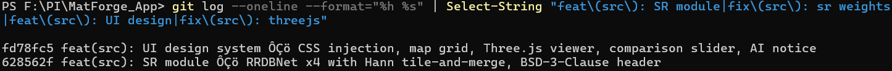

# Bitácora de Desarrollo — MatForge App
**Proyecto Intermodular** | Postgrado en Inteligencia Artificial y Big Data  
**EUSA — Cámara de Comercio de Sevilla** | Autor: Miguel Jerónimo Gutiérrez Barranco  
**Período:** 22 de abril – 15 de mayo de 2026 | **Entradas:** 24 | **Capturas:** 56

---

## Entrada E01 — 22/04/2026 — Arranque estratégico e investigación SOTA

**Hito del día:** Establecimiento de la dirección técnica y consolidación del Estado del Arte (SOTA).

### Tareas realizadas

- Asignación de roles: Director del Proyecto y Líder de Ejecución.
- Definición del MVP: mejora del modelo principal V2 y mantenimiento de la aplicación funcional.
- Auditoría de activos: validación de acceso al Borrador Vivo, Memoria V1 y dataset MatSynth.
- Ejecución de investigación avanzada para identificar arquitecturas viables en Kaggle.

### Decisiones críticas

- **Arquitectura:** se prioriza el Plan A, basado en un encoder jerárquico tipo SegFormer MiT-B1, por su relación calidad/coste en GPUs T4.
- **Enfoque de datos:** se decide no ampliar masivamente el dataset, sino realizar una limpieza disciplinada del ruido en los tags de MatSynth.

### Riesgos detectados

El tiempo disponible es extremadamente limitado, con entrega prevista en menos de tres semanas. Se identifica como crítico que la Fase 0 quede correctamente definida para no perder días en arquitecturas inviables.

*Figura 1. Captura de pantalla de la respuesta con el resumen de la investigación SOTA donde se comparan los planes A, B y C. Se observa el énfasis en modelos jerárquicos y pérdidas físicas.*

*Figura 2. Captura del Borrador Vivo con la estructura inicial de gestión del proyecto y el MVP definido.*

---

## Entrada E02 — 23/04/2026 — Arquitectura MatForge, pipeline de datos y descargador v2.0

**Hito del día:** Cierre completo de la Fase 0, centrada en la estrategia, y arranque de la Fase 1, centrada en datos. Bautizo oficial del modelo como **MatForge**.

### Tareas realizadas

- Lectura e interpretación crítica del archivo de investigación SOTA, la memoria de DeepPBR y la documentación de MatSynth.
- Ejecución completa de la Fase 0: diagnóstico del baseline, comparación de planes A/B/C, decisión de arquitectura, estrategia de datos y detección de riesgos.
- Aclaración conceptual de términos técnicos: inductive bias, GAN prematuro, pérdida coseno para normales, Charbonnier, `timm`, segmentación densa, jerarquía de encoder, FPN decoder, AMP, re-render loss y renderer differentiable.
- Respuesta y cierre de las cuatro preguntas críticas de Fase 0: framework, renderer, métricas baseline y estado del dataset.
- Creación del documento de arquitectura permanente `MatForge_Arquitectura_Permanente.md`, con la especificación técnica del modelo, pérdidas, entrenamiento, riesgos y mitigaciones.
- Análisis de los códigos existentes de EDA y descargador original para diseñar el nuevo pipeline.
- Diseño e implementación del `MatForge Downloader v2.0`: reanudable, tolerante a fallos, con soporte para nuevas categorías (`wood`, `metal`, `ceramic`, `ground`) y descarga del mapa Metallic.
- Decisión de añadir una tercera cabeza de salida, Metallic, a la arquitectura MatForge, con justificación física: el modelo PBR Cook-Torrance requiere metallic para renderizar metales correctamente.
- Actualización de la estrategia de dataset: relabeling con DINOv2 + HDBSCAN en lugar de reclasificación manual, con los nuevos dominios tratados como “vacuna de generalización”, no como dominio principal.

### Decisiones críticas

- **Nombre del modelo:** MatForge (`Mat` = materiales PBR; `Forge` = forja, creación desde cero).
- **Framework:** PyTorch, migrando desde TensorFlow respecto al baseline DeepPBR.
- **Arquitectura final prevista:** encoder MiT-B1 con `timm`, preentrenado en ImageNet, FPN decoder custom y tres ramas independientes: Normal, Roughness y Metallic, con refine heads convolucionales a 1/2 y 1/1 resolución. Total estimado: aproximadamente 20–22 M de parámetros.
- **Sin GAN en la primera corrida:** decisión derivada de la experiencia previa de colapso de DeepPBR en la época 158.
- **Pérdidas:** coseno + Charbonnier para normales, Charbonnier para roughness y metallic, gradient loss multiescala moderada y re-render loss con Cook-Torrance differentiable.
- **Estrategia de datos:** relabeling asistido mediante DINOv2 embeddings + HDBSCAN clustering + UMAP visualización, en lugar de reclasificación manual.
- **Dataset objetivo inicial:** aproximadamente 2.400 texturas: 1.603 pétreas existentes y alrededor de 800 nuevas de `wood`, `metal`, `ceramic` y `ground`.
- **Inferencia:** Hann blending por parches de 256 × 256 con stride 128, heredado de DeepPBR y compatible con cualquier resolución de entrada.
- **Scope de los nuevos dominios:** MatForge se defiende sobre el dominio pétreo. `wood`, `metal`, `ceramic` y `ground` actúan como vacuna de generalización, no como dominio principal del PI.

### Riesgos detectados / abiertos

- El renderer differentiable Cook-Torrance en PyTorch aún no existe; se identifica como el componente de mayor riesgo técnico de la Fase 2.
- El coste real del decoder custom, formado por FPN + tres refine heads, requiere validación con dry run antes de comprometer el presupuesto de cómputo completo.
- MatSynth puede no tener suficientes texturas de `wood` o `metal` para alcanzar los límites configurados. El script lo gestiona con gracia, pero la distribución final solo se conocerá después de la descarga.

**Artefactos de esta entrada:**

- `MatForge_Arquitectura_Permanente.md` — documento de referencia técnica completo, v1.1, con cabeza Metallic y estrategia de dataset actualizada.
- `matforge_downloader.py` — script de descarga robusto v2.0.

---

## Entrada E03 — 24/04/2026 — Estrategia de descarga ampliada e investigación del EDA

**Hito del día:** Decisión de ampliar el dataset más allá del dominio pétreo y diseño completo de la estrategia del EDA profesional.

### Tareas realizadas

- Análisis del log de la descarga parcial, de aproximadamente 9 h, y extracción de conclusiones sobre la distribución real de MatSynth: `wood`, `metal` y `ceramic` alcanzaron sus límites en menos de 275 parquets de 431, confirmando abundancia de material no pétreo en el repositorio.
- Decisión técnica razonada sobre la continuación de la descarga frente a la reutilización del dataset anterior. Se opta por continuar para maximizar diversidad y calidad.
- Revisión y ajuste de los límites de descarga por categoría: `stone` sube a 800; se añaden `wood`, `metal`, `ceramic` y `ground` con límites de 300–400; `marble` sube a 200 por su escasez relativa.
- Resolución de la pregunta crítica sobre el mapa Metallic: se confirma que es imprescindible para renderizar metales correctamente bajo el modelo Cook-Torrance. Esto provoca una actualización de arquitectura: MatForge pasa de dual-head a triple-head, con Normal + Roughness + Metallic.
- Investigación y diseño del EDA profesional: filtrado de datasets de imagen, detección de near-duplicates con perceptual hashing y validación de normal maps por propiedades matemáticas del espacio OpenGL.
- Definición de la estrategia de EDA semi-automático, basada en filtros automáticos por categoría con informe HTML de revisión humana para casos ambiguos.
- Identificación y documentación de los problemas conocidos del dataset: albedo muerto con relieve incoherente, roughness plano, normales con convención incorrecta, near-duplicates entre categorías, metallic plano en metal y placas base en metal.
- Decisión técnica sobre texturas oxidadas en `stone`: se conservan, al tratarse de dieléctricos válidos con manchas de color, no de metales reales.

### Decisiones críticas

- **Triple-head confirmado:** la cabeza Metallic se añade a MatForge con coste mínimo, estimado en aproximadamente 0,5 M de parámetros adicionales. Se actualiza el documento de arquitectura permanente.
- **Umbrales por categoría, no globales:** el EDA anterior usaba umbrales globales para el dominio pétreo que habrían descartado mármoles válidos. Los nuevos umbrales son específicos por categoría.
- **Conservación de texturas oxidadas en `stone`:** el óxido sobre piedra se considera un dieléctrico válido (`metallic = 0`). El relabeling deberá agruparlas correctamente.
- **Descarte manual previo al EDA:** se limita a las placas base en metal, por ser visualmente inconfundibles y semánticamente distorsionadoras para el relabeling.
- **Near-duplicates entre categorías:** el filtro de pHash se aplica a todo el dataset, no solo dentro de cada categoría, con umbral Hamming ≤ 6.

### Riesgos detectados

- La abundancia de `stone`, con límite de 800 potencialmente alcanzable, puede reintroducir desequilibrio si el sampler no está bien calibrado.
- El porcentaje de metallic planos en la categoría `metal`, estimado en aproximadamente el 41 % antes del EDA, reduce la señal efectiva de entrenamiento para esa cabeza.

### Próximo paso

Completar la descarga del dataset y ejecutar el EDA.

**Artefactos de esta entrada:**

- `matforge_downloader.py` — script de descarga robusto v2.0, con soporte para nuevas categorías y mapa Metallic.
- `MatForge_Arquitectura_Permanente.md` — actualización a v1.1, con triple-head y estrategia de dataset ampliada.

---

## Entrada E04 — 25/04/2026 — Descarga completa del dataset MatForge

**Hito del día:** Finalización de la descarga del dataset completo. Se alcanzan 3.814 texturas brutas disponibles en local, en SSD, bajo `F:\PI\matforge_dataset`.

### Tareas realizadas

- Reanudación de la descarga con `FORCE_RESCAN = False` desde el parquet 275/431.
- Monitorización del proceso hasta completarse sin errores críticos.
- Verificación del resumen final generado por el script.

### Resultado de la descarga

| Categoría | Descargadas | Objetivo | Estado |
|---|---:|---:|---|
| concrete | 278 | 300 | Incompleto (MatSynth agotado) |
| marble | 142 | 150 | Incompleto (MatSynth agotado) |
| plaster | 265 | 300 | Incompleto (MatSynth agotado) |
| stone | 800 | 800 | Completo |
| terracotta | 319 | 350 | Incompleto (MatSynth agotado) |
| wood | 600 | 600 | Completo |
| metal | 565 | 600 | Incompleto |
| ceramic | 582 | 600 | Incompleto |
| ground | 263 | 400 | Incompleto (MatSynth agotado) |
| **TOTAL** | **3.814** | **4.050** | — |

Los límites no alcanzados reflejan que MatSynth no dispone de más texturas de esas categorías en su split de entrenamiento, estimado en 3.980 materiales totales. No se considera un error del script.

### Decisiones críticas

- Se confirma que los límites incompletos son el techo real de MatSynth para esas categorías.
- No se realizarán descargas adicionales de otras fuentes en esta fase.
- La distribución final pre-EDA se considera aceptable para los objetivos del proyecto.

### Próximo paso

Eliminar manualmente las placas base en `metal` y ejecutar el EDA.

*Figura 3. Captura de la consola mostrando el resumen final del script `matforge_downloader.py`, con las barras de progreso por categoría y el total de 3.814 texturas descargadas.*

---

## Entrada E05 — 26/04/2026 — Ejecución del EDA profesional y limpieza del dataset

**Hito del día:** Análisis exploratorio completo del dataset, generación de métricas, detección de near-duplicates y limpieza semi-automática. Dataset final: **3.245 texturas** listas para el relabeling.

### Tareas realizadas

- Eliminación manual previa de las texturas de placas base (PCBs) en la categoría `metal`, identificadas visualmente en `maps/rgb/`.
- Ejecución del script `matforge_eda.py` en modo `"analizar"` sobre las 3.809 texturas restantes, con una duración aproximada de 20 minutos en SSD local.
- Revisión del informe HTML generado: análisis visual de las 490 texturas marcadas como “revisar” (`score < 3`), con decisiones de conservar o descartar.
- Ejecución del modo `"aplicar_descarte"` con el CSV confirmado.

### Resultados del análisis en modo `"analizar"`

| Categoría | Total | Flaggeadas | Ratio |
|---|---:|---:|---:|
| ceramic | 582 | 88 | 15,1 % |
| concrete | 278 | 63 | 22,7 % |
| ground | 263 | 66 | 25,1 % |
| marble | 142 | 38 | 26,8 % |
| metal | 560 | 224 | 40,0 % |
| plaster | 265 | 103 | 38,9 % |
| stone | 800 | 113 | 14,1 % |
| terracotta | 319 | 24 | 7,5 % |
| wood | 600 | 90 | 15,0 % |
| **TOTAL** | **3.809** | **809** | **21,2 %** |

Metal fue la categoría con mayor porcentaje de texturas flaggeadas, con un 40,0 %, principalmente por mapas metallic planos y texturas con convención de normal incorrecta. Plaster fue la segunda categoría más problemática, con un 38,9 %, por el problema conocido de albedo muerto con relieve incoherente.

### Resultado tras la limpieza en modo `"aplicar_descarte"`

| Categoría | Texturas limpias |
|---|---:|
| ceramic | 520 |
| concrete | 255 |
| ground | 207 |
| marble | 141 |
| metal | 358 |
| plaster | 172 |
| stone | 733 |
| terracotta | 311 |
| wood | 548 |
| **TOTAL** | **3.245** |

### Métricas y filtros aplicados

- **F1 — Albedo muerto + relieve fuerte:** `std_rgb < 5,0` AND `std_normal > 50,0`.
- **F2 — Canal Z del normal bajo:** `media_azul < umbral por categoría` (150–160).
- **F3 — Desequilibrio R/G del normal:** ratio fuera del rango `[0,70, 1,40]`.
- **F4 — Vectores no unitarios:** desviación media de la norma `> 0,30`.
- **F5 — Ruido extremo en normal:** `std_normal > umbral por categoría` (80–90).
- **F6 — Roughness completamente plano:** `std_rough < umbral` y media fuera de rango válido por categoría.
- **F7 — Metallic todo blanco en metal:** `std_metallic < 2,0` AND `media_metallic > 240`.
- **F8 — Near-duplicates:** distancia Hamming de pHash ≤ 6 en todo el dataset.

### Decisiones críticas

- Los ocho gráficos de distribución generados por el EDA confirman visualmente la heterogeneidad de `metal` y `plaster`, así como la coherencia de `terracotta` y `stone`.
- El umbral de roughness para `marble` se configuró en `rough_media_min=5`, frente al valor global anterior de `25`, evitando el descarte incorrecto de mármoles pulidos.
- Las texturas de `ground` con normales de baja intensidad en el canal Z (`azul_min=150` en lugar de 160) se trataron con mayor permisividad, dado que las superficies de suelo con piedras y raíces pueden tener vectores localmente invertidos en zonas pequeñas sin ser inválidas.

### Riesgos que quedan abiertos

- `metal` y `plaster` siguen siendo las categorías con menor número de texturas limpias en proporción a su total original. Si el relabeling agrupa muchas de las 358 texturas de `metal` en grupos mezclados, la señal de entrenamiento para la cabeza Metallic podría ser insuficiente.
- `ground` queda con solo 207 texturas, lo que la convierte en la categoría más pequeña del dataset. El sampler balanceado deberá compensar esta limitación.

### Próximo paso

Implementar el pipeline de relabeling con DINOv2 + HDBSCAN + UMAP sobre las 3.245 texturas limpias.

*Figura 4. Vista del informe HTML de revisión humana mostrando una textura de plaster flaggeada por “Albedo muerto con relieve fuerte”, con los tres thumbnails RGB, Normal y Roughness visibles y el score de descarte.*

*Figura 5. Captura del CSV `candidates_to_discard.csv` abierto en Excel, mostrando las columnas de score, motivos y la columna `confirmar_descarte` con valores “si”, “no” y “revisar” asignados tras la revisión.*

## Entrada E06 — 28/04/2026 — Relabeling semántico del dataset y subida a Kaggle

**Hito del día:** Implementación completa del pipeline de relabeling semántico con DINOv2 + HDBSCAN. Dataset final de 3.245 texturas relabelado, clasificado en 8 grupos funcionales y subido a Kaggle como `MatForge PBR Dataset`.

### Tareas realizadas

- Investigación avanzada sobre la estrategia óptima de relabeling: variante de DINOv2, parámetros de HDBSCAN, métricas de evaluación del clustering (`DBCV` frente a `Silhouette`) y clasificador ligero para inferencia en Streamlit.
- Decisión técnica razonada sobre entrenamiento unificado frente a entrenamientos por grupo: se mantiene el modelo unificado con sampler balanceado. El condicionamiento por etiqueta de material se descarta técnicamente.
- Decisión sobre el uso del modelo de relabeling en inferencia: el clasificador KNN entrenado sobre embeddings DINOv2 se integrará en el pipeline de Streamlit para identificar automáticamente el grupo de material de la textura del usuario.
- Implementación del script `matforge_relabeling.py` con tres modos de ejecución: `cluster`, `validate` y `export`.
- Resolución de dos errores de ejecución: resolución fija de 518 × 518 del modelo `vit_small_patch14_dinov2.lvd142m` en `timm`, y acceso incorrecto al atributo `relative_validity_` de HDBSCAN.
- Ejecución completa del modo `cluster`: extracción de embeddings DINOv2-small sobre 3.245 texturas en 23 minutos en CPU; reducción PCA 384D → 50D, con varianza explicada del 82,3 %; UMAP 50D → 15D para clustering y 50D → 2D para visualización; HDBSCAN con 37 clusters encontrados, DBCV 0,3279 y ruido del 15,1 %.
- Fusión manual de los 37 clusters en 8 grupos funcionales mediante análisis de la tabla de dominancia por categoría original.
- Adición del Panel D, correspondiente a grupos funcionales post-relabeling, para visualización del resultado final.
- Ejecución del modo `validate`: generación de paneles UMAP actualizados con los grupos funcionales asignados.
- Evaluación visual de los paneles pre y post-relabeling.
- Ejecución del modo `export`: entrenamiento del clasificador KNN sobre 2.756 texturas limpias y 8 grupos, con serialización de artefactos de inferencia.
- Subida del dataset completo a Kaggle como dataset privado `MatForge PBR Dataset`.

### Resultado del relabeling

| Grupo funcional | Texturas | Peso sampler |
|---|---:|---:|
| stone_rough | 479 | 1,0 |
| wood | 658 | 1,0 |
| ceramic_ground | 503 | 1,0 |
| mixed_ambiguous | 775 | 0,5 |
| brick_terracotta | 276 | 1,0 |
| marble_smooth | 189 | 1,2 |
| metal | 238 | 1,3 |
| concrete_plaster | 127 | 1,0 |
| **TOTAL** | **3.245** | — |

### Decisiones críticas

- **Entrenamiento no condicionado por etiqueta:** con 775 texturas ambiguas, equivalentes al 23,9 %, la ambigüedad es significativa, pero no justifica añadir etiquetas de material como input del modelo. MiT-B1 infiere el tipo de material a partir de la imagen. Si el modelo muestra peor rendimiento en materiales específicos durante el entrenamiento, el primer ajuste será bajar el peso de `mixed_ambiguous` a 0,3.
- **Marble recuperado por clustering:** `force_assign_marble` no fue necesario. El clustering asignó 189 texturas a `marble_smooth`, superando las 141 originales de la categoría MatSynth.
- **`concrete_plaster` es el grupo más pequeño:** con 127 texturas, constituye un riesgo conocido para el entrenamiento. El sampler con peso 1,0 ya lo compensa parcialmente.

### Rutas definitivas del dataset en Kaggle

- `/kaggle/input/matforge-pbr-dataset/maps/rgb/`
- `/kaggle/input/matforge-pbr-dataset/maps/normal/`
- `/kaggle/input/matforge-pbr-dataset/maps/roughness/`
- `/kaggle/input/matforge-pbr-dataset/maps/metallic/`
- `/kaggle/input/matforge-pbr-dataset/relabeling/relabeling_final.csv`
- `/kaggle/input/matforge-pbr-dataset/relabeling/sampler_weights.json`

### Riesgos detectados / abiertos

- `mixed_ambiguous`, con 775 texturas, equivalentes al 23,9 %, es el grupo más grande del dataset. Si el modelo muestra degradación en grupos específicos, el primer ajuste será reducir su peso a 0,3.
- `concrete_plaster`, con solo 127 texturas, es el grupo de dominio principal más pequeño. Sus métricas de validación deberán monitorizarse específicamente durante el entrenamiento.
- El clasificador KNN para Streamlit necesita validación con imágenes fuera del dataset de entrenamiento antes de considerarlo robusto para producción.

### Próximo paso

Fase 2: implementación de la arquitectura MatForge, inicialmente prevista con encoder MiT-B1, FPN decoder, tres refine heads y renderer Cook-Torrance diferenciable en PyTorch. Ejecución en Kaggle.

**Artefactos de esta entrada:**

- `matforge_relabeling.py` — script completo del pipeline de relabeling, con modos `cluster`, `validate` y `export`.
- `relabeling_output/relabeling_final.csv` — asignación de grupo funcional por textura.
- `relabeling_output/sampler_weights.json` — pesos por textura para el DataLoader.
- `relabeling_output/knn_classifier.pkl` — clasificador KNN para inferencia en Streamlit.
- `relabeling_output/pca_model.pkl` — PCA serializado para el pipeline de inferencia.
- `relabeling_output/label_encoder.pkl` — codificador de etiquetas para el KNN.
- `MatForge PBR Dataset` — dataset privado subido a Kaggle.

*Figura 6. Panel B del relabeling pre-procesamiento, mostrando las categorías originales de MatSynth en el espacio UMAP 2D. Se observa la mezcla heterogénea de categorías como stone, ceramic y plaster sin separación clara en el espacio visual.*

*Figura 7. Panel D del relabeling post-procesamiento, mostrando los 8 grupos funcionales asignados en el espacio UMAP 2D. Se observa la separación clara de wood, brick_terracotta, metal y marble_smooth. mixed_ambiguous aparece disperso en gris por toda la nube, confirmando su naturaleza genuinamente heterogénea.*

---

## Entrada E07 — 29/04/2026 — Arranque de Fase 2, diagnóstico e investigación técnica previa

**Hito del día:** Apertura de la Fase 2. Diagnóstico completo del estado del proyecto, identificación de huecos técnicos críticos y ejecución de una segunda investigación técnica específicamente adaptada a MatForge v1.3. Cierre del día con todos los bloques de conocimiento necesarios para implementar la arquitectura sin ambigüedades.

### Tareas realizadas

- Incorporación del documento `MatForge_Arquitectura_Permanente.md`, versión v1.3, como contexto de arranque de la nueva sesión de trabajo.
- Ejecución de la Tarea 1 de comprensión y diagnóstico: lectura completa del documento permanente y síntesis del estado exacto del proyecto, fases cerradas, fases pendientes y riesgos abiertos.
- Cierre de tres preguntas mínimas de diagnóstico: confirmación de que no se reutiliza código de DeepPBR, estrategia para el mapa Metallic generado en tiempo de ejecución como tensor de ceros para texturas no metálicas, y verificación del presupuesto de cómputo disponible, con 30 h GPU íntegras sin consumir.
- Análisis comparativo de la investigación SOTA previa frente a los huecos de implementación reales de MatForge v1.3: identificación de ocho bloques no cubiertos por la investigación anterior.
- Diseño del prompt de segunda investigación profunda, estructurado en 8 bloques técnicos: renderer Cook-Torrance diferenciable, extracción de features MiT-B1 vía `timm`, augmentación coherente para mapas PBR, cabeza Metallic con desbalance severo, calibración de la loss compuesta, estrategia de entrenamiento por fases, evaluación cuantitativa de DeepPBR como baseline y normalización de entrada e inferencia con Hann blending.
- Negociación y confirmación del alcance exacto de la investigación: inclusión explícita de los tres puntos ausentes en el plan inicial, relativos a cabeza Metallic con 238 positivos y 3.007 negativos, protocolo cuantitativo contra DeepPBR y Hann blending en mapas vectoriales.
- Recepción y análisis crítico del informe de investigación resultante `Investigación_avanzada_centrada_en_MatForge.md`.

### Decisiones críticas

- **No se repite la investigación en un chat nuevo:** el informe recibido cubre los 8 bloques solicitados con calidad suficiente, a pesar de que el sistema no pudo releer los documentos `.md` adjuntos y recuperó el contexto de la conversación previa.
- **DeepPBR como baseline cuantitativo:** se confirma que se dispone de pesos entrenados y dataset original de DeepPBR, lo que hace factible la re-evaluación cuantitativa en Kaggle. La comparación con MatForge deja de ser solo visual.

### Riesgos detectados / abiertos

- El informe confirma que el renderer Cook-Torrance sigue siendo el componente de mayor riesgo técnico. Se documentan cuatro puntos exactos de explosión de gradiente, que deberán protegerse con `clamp` antes de integrar el renderer en el entrenamiento.
- La cabeza Metallic requiere un cambio de loss más profundo de lo previsto: Charbonnier no es adecuado para señal binaria con desbalance 1:12,6. Requiere `BCEWithLogitsLoss` con `pos_weight` y sampler estructurado.
- El protocolo de evaluación cuantitativa añade trabajo en la Fase 4 que no estaba planificado explícitamente: re-evaluar DeepPBR sobre el split de validación de MatForge y sobre su propio dataset de validación original.

### Próximo paso

Actualizar el documento permanente a v1.4 con los cuatro cambios críticos derivados de la investigación, redactar la bitácora y abrir la Fase 2 de implementación de código.

*Figura 8. Captura del plan de investigación confirmado, con los cinco puntos de alcance, incluyendo el punto 5 actualizado que menciona explícitamente la cabeza Metallic y el protocolo cuantitativo contra DeepPBR.*

*Figura 9. Captura del inicio del informe de investigación recibido `Investigación_avanzada_centrada_en_MatForge.md`, mostrando el resumen ejecutivo con las cuatro conclusiones principales: renderer analítico PyTorch puro, WBCE para Metallic, Hann blending antes de renormalización y normalización ImageNet para MiT-B1.*

---

## Entrada E08 — 30/04/2026 — Consolidación técnica y actualización del documento permanente a v1.4

**Hito del día:** Integración completa de los resultados de la segunda investigación técnica en el documento de referencia del proyecto. Cierre definitivo del bloque de conocimiento previo a la implementación. El proyecto queda en condiciones de empezar a escribir código sin ambigüedades abiertas sobre arquitectura, pérdidas, augmentación ni protocolo de evaluación.

### Tareas realizadas

- Lectura y análisis crítico del informe `Investigación_avanzada_centrada_en_MatForge.md`, con identificación de cuatro cambios que modifican decisiones del documento permanente v1.3.
- Actualización del documento permanente a v1.4 con los siguientes cambios:
  - **C1 — Loss Metallic:** sustitución de `L_charbonnier` por `BCEWithLogitsLoss(pos_weight=8.0)`. La cabeza Metallic pasa a emitir logits, sin activación sigmoid en entrenamiento; sigmoid se aplica solo en inferencia.
  - **C2 — Sampler metal:** el peso ×1,3 se sustituye por sampler garantizado, con 2 texturas metal + 6 non-metal por batch de 8. El peso ×1,3 se considera una corrección cosmética que solo mueve la presencia de metal del 7,3 % al 9,3 % por batch, insuficiente para evitar colapso a cero.
  - **C3 — Freeze del encoder:** se reduce de 5 épocas a 2–3 épocas. No existe evidencia empírica de que 5 épocas sea óptimo para MiT-B1 en tareas densas pequeñas. Con 2–3 épocas el encoder vive parte del warmup.
  - **C4 — Activación progresiva del render loss:** `L_render` queda desactivado durante las épocas 1–5, se activa parcialmente en las épocas 6–15 (`L1=0,10`) y se activa de forma completa en las épocas 16+ (`L1=0,15`, `LPIPS=0,03`). Esta estrategia previene la dominancia del renderer sobre el error angular de normales en las primeras épocas.
- Incorporación de la sección 6.8, dedicada a data augmentation, con tabla completa de transformaciones geométricas del Normal map en espacio tangente OpenGL para flip horizontal, flip vertical y rotaciones de 90°, 180° y 270°.
- Documentación de las transformaciones descartadas: rotaciones arbitrarias, CutMix y MixUp.
- Actualización de la sección 5 de métricas de evaluación: protocolo cuantitativo completo con implementación PyTorch del Mean Angular Error en grados, plantilla de tabla comparativa MatForge frente a DeepPBR y criterio de evaluación de renders compartidos entre modelos.
- Actualización del criterio de parada temprana en la sección 4.4: sustitución del criterio visual por una métrica compuesta cuantitativa `S = MAE_normal_deg + 0.6·MAE_roughness + 0.2·LPIPS_render`, con paciencia de 8 validaciones y umbrales numéricos explícitos.
- Actualización del riesgo R3, relativo al renderer, con los cuatro puntos exactos de explosión de gradiente y sus protecciones mediante `clamp`.
- Actualización del riesgo R8, relativo a la cabeza Metallic, con la mitigación estructural correcta y el plan de contingencia con Focal Loss.
- Incorporación de detalles sobre normalización de entrada mediante `resolve_model_data_config` y orden correcto del Hann blending para Normal maps en la sección 7.
- Ampliación de la tabla de decisiones cerradas con 11 nuevas decisiones derivadas de la investigación.

### Decisiones críticas

- **`BCEWithLogitsLoss` confirmada** como loss de la cabeza Metallic. Charbonnier queda descartada definitivamente para señal binaria con desbalance severo.
- **Sampler estructurado confirmado** como mitigación principal del riesgo R8. El sampler ×1,3 del documento v1.3 queda obsoleto.
- **Criterio de pivot cuantitativo adoptado** en sustitución del criterio visual. La memoria del PI podrá referenciar un número, no una impresión subjetiva.
- **Normalización ImageNet confirmada** para el encoder MiT-B1 mediante `timm.data.resolve_model_data_config`. No se cambia a media/std del dataset propio.
- **Hann blending antes de renormalización L2 confirmado** como único orden correcto para Normal maps. El orden inverso produce un campo vectorial incorrecto en las costuras.

### Riesgos que quedan abiertos

- El renderer Cook-Torrance diferenciable aún no existe como código. Es el primer componente a implementar en Fase 2 y debe validarse de forma aislada, mediante test unitario, antes de integrarse en el loop de entrenamiento.
- El split train/val, definido como 85 % / 15 % estratificado por grupo funcional, está documentado como estrategia, pero el código que lo implementa aún no existe.
- La re-evaluación cuantitativa de DeepPBR sobre el split de validación de MatForge y sobre su dataset original no está planificada en ninguna fase explícita. Deberá incorporarse a Fase 4.

### Próximo paso

Fase 2: implementación de MatForge en PyTorch. Orden previsto: renderer Cook-Torrance con test unitario aislado → DataLoader con split estratificado y sampler garantizado → arquitectura MatForgeNet completa → loop de entrenamiento con loss compuesta.

**Artefactos de esta entrada:**

- `MatForge_Arquitectura_Permanente_v1.4.md` — documento de referencia técnica actualizado.

*Figura 10. Captura de la sección 3.2 del documento permanente v1.4, mostrando la nueva tabla de activación progresiva del render loss con las tres columnas de épocas 1–5, 6–15 y 16–90, y los valores δ₁ y δ₂ para cada fase.*

*Figura 11. Captura de la sección 6.8 del documento permanente v1.4, mostrando la tabla de transformaciones del Normal map: flip horizontal → (-X,Y,Z), flip vertical → (X,-Y,Z), rotaciones 90°/180°/270°, con la nota de advertencia sobre la obligatoriedad de aplicar la transformación de componentes además de la geométrica.*

---

## Entrada E09 — 01/05/2026 — Implementación de MatForge, renderer, DataLoader y arranque del entrenamiento real

**Hito del día:** Implementación, validación y ejecución completa de los tres componentes técnicos principales de MatForge: renderer Cook-Torrance diferenciable, pipeline de datos con sampler garantizado y loop de entrenamiento con arquitectura PVT-v2-B1. Lanzamiento del primer tramo de entrenamiento real, épocas 0–19, y arranque del segundo tramo, épocas 20–89, con cosine restart.

### Tareas realizadas

- Implementación y validación del renderer Cook-Torrance diferenciable en PyTorch mediante `matforge_01_renderer_test`: BRDF completa con NDF GGX, geometría Smith-Schlick y Fresnel Schlick bajo el workflow metallic/roughness de UE4. Todos los tests superados: componentes BRDF, flujo de gradientes, inputs extremos y benchmark de rendimiento.
- Detección y resolución del fallo de compatibilidad GPU: el acelerador P100 (`sm_60`) es incompatible con PyTorch 2.10 + CUDA 12.8. Cambio a T4 (`sm_75`), que resolvió el problema sin modificar el código.
- Implementación y validación del pipeline de datos mediante `matforge_02_dataloader_test`: split estratificado 85 % / 15 % por grupo funcional generado con `SEED=42` y persistido como `matforge_split.csv`; `MetalGuaranteedSampler` con 2 metal + 6 non-metal por batch; augmentaciones geométricas coherentes con transformación correcta de los canales X/Y del Normal map; generación on-the-fly del mapa Metallic para texturas no metálicas.
- **Cambio de encoder:** `mit_b1` no está disponible en `timm 1.0.25`. Se sustituye por `pvt_v2_b1`, arquitectura jerárquica transformer equivalente en tipo, tamaño aproximado, con unos 13 M de parámetros, y shapes de feature maps idénticos: L1 64 × 64 × 64, L2 32 × 32 × 128, L3 16 × 16 × 320 y L4 8 × 8 × 512.
- Implementación del notebook de entrenamiento completo `matforge_03_training`: `FPNDecoder` top-down con 4 escalas, tres `RefineHeads` independientes, función de pérdida compuesta con activación progresiva del render loss, EMA, checkpointing por `best_overall`, `best_normal`, `best_roughness` y `last`, y panel de validación fijo con 8 texturas representativas seleccionadas manualmente por grupo funcional.
- Dry run de 5 épocas: verificación de VRAM, tiempo por época, flujo de gradientes y arranque del entrenamiento sin errores.
- Selección manual de texturas de referencia para el panel de validación: una textura por grupo funcional elegida visualmente por representatividad, con índices hardcodeados para que el panel sea determinista entre runs. Textura difícil de referencia: `metal_0081.png`.
- Primer tramo de entrenamiento real: épocas 0–19 completadas. MAE normal de 13,49° a 10,88°; Roughness MAE de 0,1667 a 0,1221; LPIPS de 0,1835 a 0,1127. Mejora consistente sin plateau. Decisión: continuar, no pivotar al Plan B.
- Detección y corrección del agotamiento del scheduler cosine: el scheduler original fue construido con `T_max=15`, para 20 épocas totales, y llegó a `LR=1e-6` al final del tramo. Corrección mediante cosine restart desde `LR_encoder=2e-5` y `LR_decoder=6e-5` para las 70 épocas restantes.
- Lanzamiento del segundo tramo de entrenamiento, épocas 20–89, con reanudación desde `last.pt` confirmada en logs.

### Decisiones críticas

- **Cambio de encoder de MiT-B1 a PVT-v2-B1:** impuesto por la ausencia de MiT-B1 en `timm 1.0.25`. PVT-v2-B1 es arquitectónicamente equivalente y produce shapes de feature maps idénticos, por lo que el FPN y las heads no requieren cambios.
- **No pivotar al Plan B:** las métricas del primer tramo superan ampliamente el umbral de continuación. La mejora visual es sustancial incluso antes de la época 20.
- **Cosine restart para el segundo tramo:** el scheduler original agotó su ciclo en época 19. Se reinicia de forma conservadora al 30 % del LR original para no disturbar los pesos convergidos.
- **Texturas de referencia hardcodeadas:** selección manual definitiva de una textura por grupo para que el panel de validación sea determinista entre runs.
- **Checkpoint ep050:** se guardará automáticamente, por si se decide añadir discriminador GAN tras las 90 épocas y reanudar desde ese punto.

### Riesgos que quedan abiertos

- El segundo tramo, épocas 20–89, está en ejecución. Los resultados se evaluarán cuando finalice.
- El curriculum a 320 px en época 65 no ha sido probado. Si el cambio de resolución produce inestabilidad en la loss, el primer ajuste será retrasar el curriculum a época 70 o eliminarlo.
- La cabeza Metallic muestra recall estabilizado en torno al 85,7 % desde época 10 sin mejora posterior. Si persiste al final del segundo tramo, se reportará como resultado secundario en la memoria.
- La re-evaluación cuantitativa de DeepPBR, correspondiente a Fase 4, sigue pendiente y debe realizarse antes de la defensa.

### Próximo paso

Esperar la finalización del segundo tramo, épocas 20–89, y analizar logs y panel final. Si las métricas confirman convergencia, pasar a Fase 4, evaluación cuantitativa DeepPBR frente a MatForge, y Fase 5, integración en Streamlit.

**Artefactos de esta entrada:**

- `matforge_01_renderer_test.py` — notebook de validación del renderer Cook-Torrance diferenciable.
- `matforge_02_dataloader_test.py` — notebook de validación del pipeline de datos.
- `matforge_03_training.py` — notebook de entrenamiento completo.
- `matforge_split.csv` — split estratificado 85 % / 15 % con `SEED=42`, persistido en el dataset de Kaggle.
- `checkpoints/` — `best_overall.pt`, `best_normal.pt`, `best_roughness.pt`, `checkpoint_ep000.pt`, `checkpoint_ep005.pt`, `checkpoint_ep010.pt`, `checkpoint_ep015.pt`, `checkpoint_ep019.pt` y `last.pt`.
- `panels/` — paneles de validación de las 20 primeras épocas.
- `training_progression.gif` — GIF de progresión visual de las 5 validaciones del primer tramo.
- `matforge-checkpoints-ep20` — dataset Kaggle con checkpoint del tramo 0–19 para reanudación.

*Figura 12. Output de la celda 6 del notebook del renderer mostrando el test de flujo de gradientes: `||grad_N|| = 0,007801`, `||grad_R|| = 0,001792`, `Loss value = 0,025485`, `Gradient flow test: PASS`.*

*Figura 13. Imagen generada por la celda 9 del renderer: grid 3 × 3 de materiales sintéticos con roughness [0,1, 0,5, 0,9] en filas y metallic [0,0, 0,5, 1,0] en columnas bajo iluminación Cook-Torrance.*

*Figura 14. Output de la celda 9 del DataLoader mostrando la distribución de grupos en 50 batches: metal al 11,0 %, wood al 24,2 %, stone_rough al 15,2 %, con confirmación `Sampler balance: OK`.*

*Figura 15. Imagen generada por la celda 10 del DataLoader: fila 0 con la textura augmentada RGB, Normal, Roughness y Metallic, y fila 1 con la misma textura sin augmentación del split de validación.*

*Figura 16. Output de la celda 4 del notebook de entrenamiento mostrando el perfil del modelo tras el cambio a PVT-v2-B1: parámetros del encoder, decoder y total, seguido del check de VRAM tras el forward sin gradientes.*

*Figura 17. Panel de validación de la primera época del dry run, mostrando las 8 texturas de referencia con sus 7 columnas: RGB input, Normal GT, Normal pred, Rough GT, Rough pred, Metal GT y Metal pred.*

*Figura 18. Panel de validación de la última época del primer tramo de entrenamiento real, mostrando la mejora visual sustancial respecto a la época 0 en los mapas de normal y roughness predichos.*

*Figura 19. Bloque de logs del pivot decision check al final de la época 19: Normal MAE 10,88°, Roughness MAE 0,1221, Render LPIPS 0,1127, S composite 10,9805. Decisión de continuar con el Plan A.*

*Figura 20. Primeras líneas del log del segundo tramo confirmando la reanudación correcta: `Checkpoint loaded from .../last.pt (epoch 19)`, `Resumed from epoch 19. Cosine restart: LR enc=2.0e-05 dec=6.0e-05 over 70 epochs`, `Starting training: epoch 20 → 89`.*

---

## Entrada E10 — 02/05/2026 — Análisis del entrenamiento supervisado e inicio del fine-tuning adversarial

**Hito del día:** Análisis completo de los resultados de las 90 épocas supervisadas, investigación del discriminador GAN óptimo para MatForge, implementación del fine-tuning adversarial multi-escala con PatchGAN condicional de dos escalas, y resolución de tres fallos técnicos críticos: NaN en R1 bajo AMP, colapso del discriminador por asimetría y problemas de paths de checkpoints. Lanzamiento exitoso del fine-tuning GAN desde los pesos de la época 89.

### Tareas realizadas

- Análisis exhaustivo de los logs de las épocas 20–89: plateau claro desde época 70 y mejora marginal hasta época 89. MAE Normal final de 10,45°; Roughness MAE de 0,1087; LPIPS de 0,1094; S compuesto de 10,533.
- Identificación del síntoma de “borroso” como consecuencia estructural de entrenar solo con pérdidas L1/coseno: el modelo promedia incertidumbres locales en lugar de comprometerse con bordes nítidos.
- Decisión técnica razonada: el plateau supervisado está claramente establecido. El discriminador GAN es la única vía para mejorar la nitidez de alta frecuencia sin reentrenar desde cero.
- Ejecución de investigación técnica del discriminador GAN: análisis del SOTA 2018–2025 para discriminadores en tareas de image-to-image translation y estimación de SVBRDF. Producción del informe técnico `Investigación_Discriminador_GAN_MatForge.md` con 14 referencias IEEE.
- Decisión arquitectónica del discriminador: PatchGAN condicional multi-escala de dos escalas, D₁ a resolución original 256/320 px y D₂ a 128/160 px, con spectral normalization en todas las capas Conv, InstanceNorm, LSGAN loss, feature matching loss de pix2pixHD y R1 gradient penalty lazy cada 16 steps.
- Descarte de tres escalas por coste desproporcionado en 256–320 px con dataset pequeño.
- Implementación completa del discriminador en `matforge_03_training`: clase `PatchDiscriminator`, funciones `lsgan_loss_D`, `lsgan_loss_G`, `feature_matching_loss`, `r1_gradient_penalty`, `build_disc_input` y loop completo de GAN fine-tuning con schedule progresivo de peso adversarial: `w_adv` 0,02 → 0,05 → 0,10.
- **Bug 1 — NaN en R1 bajo AMP:** detectado en época GAN 5 al subir `w_adv` de 0,02 a 0,05. Causa: `torch.autograd.grad` sobre tensores `float16` bajo autocast produce NaN en los gradientes del discriminador. Solución: forzar `float32` dentro de `r1_gradient_penalty` con `real_f32 = real_input.detach().float()` y `torch.amp.autocast("cuda", enabled=False)`.
- **Bug 2 — Colapso del discriminador por asimetría generador/discriminador:** con el generador cargado desde un checkpoint avanzado y el discriminador inicializado desde cero, el generador aplastaba al discriminador desde la primera época, con `D(real)≈D(fake)≈0,5`. Solución: guardar y cargar el estado del discriminador en checkpoints separados, `best_gan_disc.pt` y `last_gan_disc.pt`, para poder reanudar con paridad generador/discriminador.
- **Bug 3 — Paths de checkpoints incorrectos:** múltiples iteraciones para resolver la versión correcta del dataset de checkpoints en Kaggle. El dataset `matforge-checkpoints-ep20` tiene múltiples versiones; solo la versión con `best_overall.pt` de época 89 es válida como punto de partida del GAN. Resolución mediante inspección directa de `/kaggle/input` en tiempo de ejecución.
- Lanzamiento exitoso del GAN fine-tuning: confirmado por log `GAN phase: loaded generator from best_overall.pt (epoch 89)`, MAE inicial 10,46°, coherente con la época 89 supervisada, `D(real)=0,511`, `D(fake)=0,465`.

### Decisiones críticas

- **Discriminador multi-escala de dos escalas confirmado:** justificado por evidencia directa en SVBRDF estimation y por equilibrio coste/beneficio para 256–320 px con 3.245 texturas. Tres escalas quedan descartadas.
- **LSGAN sobre BCE y Hinge:** se adopta por sus gradientes no saturados cuando el generador ya es competente, condición crítica para fine-tuning desde epoch 89.
- **R1 en float32 fuera de autocast:** solución definitiva al NaN. La función `r1_gradient_penalty` gestiona internamente el casting, sin impacto en el resto del loop AMP.
- **Input condicional de 8 canales al discriminador:** RGB(3) + Normal(3) + Roughness(1) + Metallic(1). Permite al discriminador detectar inconsistencias físicas entre canales, no solo evaluar cada mapa en aislamiento.
- **`w_adv` progresivo:** 0,02 → 0,05 → 0,10, para proteger los pesos de la época 89 durante la transición hacia el régimen adversarial.

### Riesgos que quedan abiertos

- El GAN fine-tuning está en ejecución durante 20 épocas. Los resultados se evaluarán cuando finalice. Señal de éxito: LPIPS < 0,095 y MAE normal ≤ 10,5° tras 10 épocas.
- Si el discriminador colapsa de nuevo, con `D(real) > 0,85` sostenido, la mitigación será subir `λ_R1` de 10 a 20.
- La re-evaluación cuantitativa de DeepPBR, correspondiente a Fase 4, sigue pendiente.
- La integración en Streamlit, correspondiente a Fase 5, sigue pendiente.

### Próximo paso

Esperar la finalización del GAN fine-tuning de 20 épocas, analizar logs y panel final, y pasar a Fase 4, evaluación cuantitativa DeepPBR frente a MatForge, y Fase 5, integración en Streamlit.

**Artefactos de esta entrada:**

- `Investigación_Discriminador_GAN_MatForge.md` — informe técnico completo del discriminador con 14 referencias IEEE.
- `matforge_03_training.py` — notebook de entrenamiento actualizado con GAN fine-tuning completo: dos PatchDiscriminators, LSGAN loss, feature matching loss, R1 lazy penalty en float32 y guardado/carga de estado del discriminador.
- `best_gan.pt` — checkpoint previsto del generador durante fine-tuning GAN.
- `best_gan_disc.pt` — checkpoint previsto del discriminador durante fine-tuning GAN.
- `last_gan.pt` — checkpoint de última época del generador durante fine-tuning GAN.
- `last_gan_disc.pt` — checkpoint de última época del discriminador durante fine-tuning GAN.

*Figura 21. Log de confirmación del inicio correcto del GAN fine-tuning: `GAN phase: loaded generator from best_overall.pt (epoch 89)`, `GAN phase: discriminator initialized from scratch`, seguido de `GAN EPOCH 000` con MAE=10,46°, D(real)=0,511, D(fake)=0,465 y L_D=0,3464.*

*Figura 22. Evidencia visual asociada al fine-tuning GAN: progresión de paneles de validación durante las épocas 90–120 y panel de referencia de la época 89, última época del entrenamiento del modelo sin discriminador GAN.*

## Entrada E11 — 03/05/2026 — Finalización del fine-tuning GAN y cierre técnico del modelo MatForge

**Hito del día:** Análisis completo de los resultados de las 20 épocas de GAN fine-tuning, actualización del documento permanente a v1.5, generación del informe técnico completo del modelo MatForge en tres documentos, y elaboración del documento de ideas para la ampliación de la herramienta.

### Tareas realizadas

- Análisis exhaustivo de los logs de las épocas GAN 0–19. El discriminador colapsó a `D(real)≈D(fake)≈0,50` desde la época GAN 1, lo que indica que fue incapaz de distinguir real de fake de forma sostenida.
- Identificación de que la feature matching loss (`W_FM=10,0`) siguió aportando señal perceptual útil de forma independiente al estado del discriminador, produciendo mejoras reales en las métricas.
- Comparación cuantitativa de resultados pre/post GAN: LPIPS mejoró de 0,1094, en la época 89 supervisada, a 0,0976, en la mejor época GAN 11, lo que supone una reducción del 10,8 %. MAE Normal mejoró de 10,45° a 10,37°. Roughness MAE experimentó un leve retroceso de 0,1087 a 0,1117.
- Identificación del checkpoint final del proyecto: `best_gan.pt`, correspondiente a la época GAN 11, con `S compuesto=10,457`. Es estrictamente mejor que el checkpoint supervisado en LPIPS y MAE Normal.
- Decisión técnica de aceptar `best_gan.pt` como resultado final sin relanzar el GAN: la mejora de LPIPS es real y cuantificable, el tiempo restante antes de la entrega no justifica investigar el colapso del discriminador, y la feature matching loss ya extrajo el beneficio principal del módulo adversarial.
- Actualización del documento permanente a v1.5: cambio del encoder de MiT-B1 a PVT-v2-B1 en toda la documentación, cierre de las fases 2 y 3, documentación de los resultados reales del entrenamiento supervisado y GAN, adición de la sección 14 con tablas de métricas, actualización del riesgo R6 con resultados reales e incorporación del checkpoint final en la tabla de decisiones cerradas.
- Generación del informe técnico completo de MatForge en tres documentos `.md`:
  - `MatForge_Informe_Tecnico_Doc1_Contexto_y_Arquitectura.md`: contexto, estado del arte, decisión arquitectónica y descripción completa de MatForgeNet con tres esquemas Mermaid y 9 referencias IEEE.
  - `MatForge_Informe_Tecnico_Doc2_Dataset_Renderer_Perdidas.md`: pipeline del dataset, augmentación, renderer Cook-Torrance diferenciable, formulación matemática completa, función de pérdida compuesta con schedule de activación y métricas de evaluación. Tres esquemas Mermaid y 9 referencias IEEE.
  - `MatForge_Informe_Tecnico_Doc3_Entrenamiento_y_Evaluacion.md`: hiperparámetros, estrategia de congelación, EMA, scheduler, plan de entrenamiento por cuatro tramos con criterios de decisión cuantitativos, Plan B Restormer, inferencia con Hann blending y protocolo de evaluación. Tres esquemas Mermaid y 4 referencias IEEE.
- Elaboración del documento `MatForge_Ideas_Mejora_Herramienta.docx`, con análisis de ocho funcionalidades adicionales para la herramienta: visor 3D, panel de ajuste físico, exportación por motor 3D, batch desde ZIP, super-resolución con Real-ESRGAN, mezclador de materiales PBR, conversión a tileable y calibración automática por grupo.
- Análisis de la viabilidad del fine-tuning de Real-ESRGAN sobre el dataset MatSynth, usando imágenes a resolución nativa como referencia de alta resolución y versiones degradadas como input.
- Identificación del mezclador de materiales PBR como la idea más diferenciadora.
- Descarte del módulo de envejecimiento por ausencia de dataset adecuado.

### Decisiones críticas

- **`best_gan.pt` confirmado como checkpoint final:** `S=10,457`, MAE Normal 10,37°, Roughness MAE 0,1117 y LPIPS 0,0976. Es estrictamente mejor que el modelo supervisado en LPIPS y Normal.
- **No se relanza el GAN:** el tiempo restante se dedica a la evaluación cuantitativa DeepPBR frente a MatForge y a la integración en Streamlit.
- **Documento permanente v1.5 cerrado:** todas las fases de investigación, entrenamiento y fine-tuning quedan documentadas. El documento se consolida como referencia técnica autoritativa del proyecto.
- **Informe técnico orientado a pre-entrenamiento:** los tres documentos del informe describen el modelo como si el entrenamiento estuviera por realizarse, siguiendo la convención de documentación de investigación. Los errores y ajustes del proceso real quedan reflejados en la bitácora.
- **Mezclador de materiales PBR identificado como funcionalidad diferenciadora:** no existe en herramientas equivalentes de código abierto, aprovecha los outputs de MatForge al 100 % y no requiere ningún modelo adicional.
- **Super-resolución con Real-ESRGAN:** identificada como segunda prioridad de ampliación. El fine-tuning usaría las imágenes del dataset a resolución nativa como referencia de alta resolución, con versiones degradadas como input. No requiere datos nuevos.

### Riesgos que quedan abiertos

- La re-evaluación cuantitativa de DeepPBR sobre el split de validación de MatForge sigue pendiente. Es el bloqueante principal antes de completar las tablas comparativas del informe.
- La integración en Streamlit sigue pendiente.
- El fine-tuning de Real-ESRGAN no está planificado en ninguna fase explícita. Si se decide realizarlo, requiere un notebook de entrenamiento nuevo en Kaggle.

### Próximo paso

Fase 4: evaluación cuantitativa DeepPBR frente a MatForge sobre el split de validación de MatForge y, si el tiempo lo permite, sobre el dataset original de DeepPBR. Fase 5: integración en Streamlit.

**Artefactos de esta entrada:**

- `MatForge_Arquitectura_Permanente_v1.5.md` — documento de referencia técnica actualizado con resultados reales del entrenamiento.
- `MatForge_Informe_Tecnico_Doc1_Contexto_y_Arquitectura.md` — primer documento del informe técnico.
- `MatForge_Informe_Tecnico_Doc2_Dataset_Renderer_Perdidas.md` — segundo documento del informe técnico.
- `MatForge_Informe_Tecnico_Doc3_Entrenamiento_y_Evaluacion.md` — tercer documento del informe técnico.
- `MatForge_Ideas_Mejora_Herramienta.docx` — análisis de funcionalidades adicionales para la herramienta.

*Figura 23. Tabla comparativa de métricas pre/post GAN mostrando la mejora de LPIPS de 0,1094, en la época 89 supervisada, a 0,0976, en la época GAN 11, la mejora de MAE Normal de 10,45° a 10,37°, y el leve retroceso de Roughness MAE de 0,1087 a 0,1117.*

*Figura 24. Panel de validación de la época GAN 11, mejor checkpoint del fine-tuning adversarial, útil para comparar con el panel de la época 89 y evaluar la mejora de nitidez en bordes introducida por la feature matching loss.*

---

## Entrada E12 — 05/05/2026 — Investigación, implementación y evaluación del módulo MatForge SR

**Hito del día:** Diseño completo, implementación y entrenamiento del módulo de super-resolución como preprocesado del pipeline de MatForge. Cierre del proceso de fine-tuning con resultados cuantificados, diagnóstico técnico del límite estructural del enfoque e identificación de la línea de trabajo futuro basada en SR especializada para materiales PBR.

### Tareas realizadas

- Validación experimental de VRAM de tres candidatos arquitectónicos sobre la GTX 1650 Max-Q con el script `matforge_sr_00_vram_check.py`: RRDBNet ×4 de 23 bloques, RRDBNet ×4 de 6 bloques y SRVGGNet compact ×4.
- Benchmark en FP16 con tiles de 256 × 256, 320 × 320 y 512 × 512.
- Investigación del estado del arte en super-resolución 2020–2026, con validación crítica posterior y descarte de una referencia no verificable del informe original.
- Generación del documento `MatForge_SR_Informe_Tecnico.md`, con taxonomía del estado del arte, criterios de selección, resultados del benchmark de VRAM, selección de planes A/B/C, especificación del pipeline tile-and-merge, pipeline completo de fine-tuning con diagramas Mermaid y sección de decisiones cerradas.
- Resolución de la incompatibilidad entre `basicsr`/`realesrgan` y `torchvision >= 0.17`, provocada por la eliminación del módulo `functional_tensor`. Se implementan RRDBNet y SRVGGNet de forma autocontenida, sin dependencias externas, cargando pesos desde el checkpoint oficial `RealESRGAN_x4plus.pth`.
- Resolución de la incompatibilidad de PyTorch con GPU P100 en Kaggle (`cudaErrorNoKernelImageForDevice`, arquitectura CUDA `sm_60` no soportada por PyTorch 2.10 + CUDA 12.8). Se cambia a T4 x2 para dry run y ejecución completa.
- Implementación completa del notebook `matforge_sr_01_training.py`, con 9 celdas: arquitectura RRDBNet autocontenida, discriminador U-Net PatchGAN con spectral norm, dataset SR con degradación sintética on-the-fly, pérdidas L1 + perceptual VGG-19 + LPIPS + LSGAN + R1 lazy, loops de entrenamiento Fase 1 y Fase 2, y validación con paneles LQ/SR/HQ cada 5 épocas.
- Corrección del bug de R1 bajo AMP: `r1_gradient_penalty` se reescribe con backward separado para evitar la suma de tensores de dtype mixto que producía NaN silenciosos en los gradientes del discriminador.
- Corrección del bug `NameError: generate_validation_panel not defined`: la función se mueve a la celda de pérdidas para garantizar su disponibilidad antes de que los loops de entrenamiento la invoquen durante la ejecución.
- Actualización de los imports de `torch.cuda.amp` deprecados a `torch.amp` para eliminar `FutureWarnings` en PyTorch ≥ 2.0.
- Dry run completo con `DRY_RUN=True`, 3 épocas de Fase 1 y 2 épocas de Fase 2, validando shapes, pérdidas, checkpointing y panel visual.
- Lanzamiento del entrenamiento completo con `DRY_RUN=False`, 30 épocas de Fase 1 y 20 épocas de Fase 2 máximo.
- Análisis exhaustivo de los resultados del entrenamiento completado.
- Investigación específica sobre SR especializado en materiales PBR, identificando MUJICA como arquitectura relevante para trabajo futuro y diagnosticando el distribution shift como límite estructural del fine-tuning con degradación sintética.
- Actualización de `MatForge_SR_Informe_Tecnico.md` con resultados reales del fine-tuning, sección de trabajo futuro, correcciones arquitectónicas y referencias nuevas.

### Resultado del benchmark de VRAM

| Modelo | Params | Tile | VRAM alloc. (MB) | Constraint |
|---|---:|---:|---:|---|
| RRDBNet ×4, 23 bloques | 16,70 M | 256 × 256 | 584,4 | PASS |
| RRDBNet ×4, 23 bloques | 16,70 M | 512 × 512 | 2.241,6 | PASS |
| RRDBNet ×4, 6 bloques | 4,47 M | 256 × 256 | 561,0 | PASS |
| SRVGGNet compact ×4 | 1,21 M | 256 × 256 | 34,8 | PASS |

Ningún candidato viola el constraint de 3.500 MB. La diferencia de VRAM entre 23 y 6 bloques es reducida porque la VRAM en inferencia está dominada por los feature maps intermedios, no por los pesos del modelo.

### Resultado del fine-tuning — Fase 1

| Época | val_LPIPS | val_L1 |
|---:|---:|---:|
| 4 | 0,2667 | 0,0338 |
| 9 | 0,2507 | 0,0329 |
| 14 | 0,2461 | 0,0339 |
| 19 | 0,2430 | 0,0328 |
| 24 | **0,2380** | 0,0336 |
| 29 | 0,2401 | 0,0327 |

Mejor checkpoint de Fase 1: época 24, con `val_LPIPS=0,2380`. La mejora es del 10,9 % sobre el modelo base, que partía de `val_LPIPS=0,2667` en la primera validación.

### Resultado del fine-tuning — Fase 2

El discriminador colapsó desde la época P2 0, con `D(real)≈D(fake)≈0,487–0,498` desde el primer batch, comportamiento equivalente al observado en el GAN fine-tuning de MatForge. La Fase 2 se abortó automáticamente en la época P2 2 tras tres rondas consecutivas de señal de colapso. La feature matching loss siguió aportando señal perceptual útil de forma independiente al estado del discriminador.

Checkpoint final adoptado: `sr_ft_phase1_best_lpips.pt`, correspondiente a la época 24, con `val_LPIPS=0,2380`.

### Diagnóstico técnico

La mejora cuantitativa del fine-tuning es real, con una reducción del 10,9 % en LPIPS, pero la mejora perceptual visual es moderada. La causa principal es el distribution shift entre degradación sintética y degradación real. El modelo aprende a revertir la cadena de degradación específica del entrenamiento, basada en bicúbica + ruido + blur + JPEG, pero cuando en inferencia recibe imágenes con degradación real diferente, produce salidas conservadoras próximas a una interpolación bicúbica mejorada.

El checkpoint `sr_ft_phase1_best_lpips.pt` se adopta como pesos primarios del módulo SR en inferencia, con `RealESRGAN_x4plus.pth` como fallback.

### Decisiones críticas

- **Plan A ejecutado con RRDBNet ×4:** el checkpoint de 6 bloques asociado a contenido de animación se descarta por dominio radicalmente distinto al de materiales de superficie. El checkpoint público sobre imágenes reales disponible en la release oficial es `RealESRGAN_x4plus.pth`.
- **`sr_ft_phase1_best_lpips.pt` como checkpoint primario de inferencia:** mejora objetivamente el LPIPS respecto al modelo base y no introduce artefactos perceptibles.
- **Colapso del discriminador esperado y gestionado:** la detección automática en tres épocas y la restauración del mejor checkpoint de Fase 1 se consideran el protocolo correcto.
- **MUJICA identificado como trabajo futuro de alta relevancia:** la arquitectura adecuada para SR especializada en PBR opera sobre los mapas predichos, no sobre el RGB de entrada. Requiere modificar el pipeline de inferencia y queda fuera del alcance de la entrega actual.
- **Módulo SR integrado con fallback:** `RealESRGAN_x4plus.pth` permanece como fallback de producción.

### Riesgos que quedan abiertos

- La re-evaluación cuantitativa de DeepPBR sobre el split de validación de MatForge sigue pendiente.
- La integración del módulo SR en Streamlit sigue pendiente.
- La verificación experimental de que el checkpoint fine-tuneado no produce artefactos sobre imágenes reales de usuario queda pendiente.

### Próximo paso

Test de inferencia del módulo SR sobre imágenes reales de materiales a baja resolución, comparación visual entre checkpoint fine-tuneado y pesos base, y decisión sobre el checkpoint de producción. A continuación, Fase 4 y Fase 5.

**Artefactos de esta entrada:**

- `matforge_sr_00_vram_check.py` — script de benchmark de VRAM para candidatos SR.
- `matforge_sr_01_training.py` — notebook de fine-tuning completo, con 9 celdas y toggle `DRY_RUN`.
- `MatForge_SR_Informe_Tecnico.md` — documento técnico del módulo SR actualizado.
- `sr_checkpoints/sr_ft_phase1_best_lpips.pt` — checkpoint primario de inferencia.
- `sr_panels/sr_panel_phase1_ep04.png` — panel de validación de Fase 1.
- `sr_panels/sr_panel_phase1_ep09.png` — panel de validación de Fase 1.
- `sr_panels/sr_panel_phase1_ep14.png` — panel de validación de Fase 1.
- `sr_panels/sr_panel_phase1_ep19.png` — panel de validación de Fase 1.
- `sr_panels/sr_panel_phase1_ep24.png` — panel de validación de Fase 1.
- `sr_panels/sr_panel_phase1_ep29.png` — panel de validación de Fase 1.
- `sr_panels/sr_panel_final.png` — panel final post Fase 2.

*Figura 25. Output del script `matforge_sr_00_vram_check.py` mostrando la tabla SUMMARY con los nueve resultados de VRAM, tres modelos por tres tamaños de tile, y el bloque de constraint check con todos los resultados marcados como PASS.*

*Figura 26. Log de las últimas épocas de la Fase 1 del entrenamiento SR, mostrando la convergencia de `val_LPIPS` desde 0,2667 hasta el mínimo de 0,2380 en la época 24, seguido del mensaje `[Phase 1 complete] Best val LPIPS=0.2380` y la transición al discriminador.*

*Figura 27. Log de la Fase 2 mostrando las tres épocas P2 00–02 con los valores `D(real)` y `D(fake)` convergiendo a aproximadamente 0,487–0,498, los mensajes de advertencia de colapso del discriminador y la restauración del mejor checkpoint de Fase 1.*

*Figura 28. Panel de validación del mejor checkpoint del fine-tuning, mostrando seis texturas de referencia con las tres columnas LQ bicúbico upscalado, SR output y HQ ground truth.*

---

## Entrada E13 — 06/05/2026 — Investigación técnica de herramientas para la aplicación MatForge

**Hito del día:** Producción del informe técnico completo de integración de herramientas en la aplicación MatForge, `MatForge_App_Informe_Herramientas.md`, tras un proceso de investigación, revisión crítica y verificación en fuentes primarias.

### Tareas realizadas

- Diseño del prompt de investigación para herramientas de la aplicación, estructurado con esquema A/B/C/D por herramienta, sección específica de gestión CPU/GPU, búsqueda de herramientas adicionales no identificadas previamente y restricciones explícitas de VRAM, dependencias offline y referencias IEEE verificables.
- Evaluación crítica de un primer informe externo, descartado por incumplir la estructura solicitada, incluir propuestas ajenas al dominio del proyecto y carecer de una sección de gestión CPU/GPU con la profundidad requerida.
- Evaluación crítica de un segundo informe externo, parcialmente válido en estructura y cobertura, pero descartado como documento final por incluir referencias IEEE no verificables, gestión CPU/GPU superficial y análisis incompleto de herramientas adicionales.
- Ejecución de una investigación definitiva con verificación directa en fuentes primarias: documentación de Streamlit, PyTorch, Three.js, Unreal Engine, Unity, Blender, Godot, GitHub, arXiv y publicaciones técnicas especializadas.
- Producción del documento `MatForge_App_Informe_Herramientas.md`, con secciones sobre versión de Python, dependencias verificadas, gestión CPU/GPU, patrón correcto de caché para modelos PyTorch, protocolo de liberación de VRAM, preprocesado de entrada y análisis de 10 herramientas con estructura A/B/C/D, diagramas Mermaid y referencias IEEE verificadas.
- Incorporación del componente de zoom/escala de entrada como requisito estructural del pipeline, derivado del entrenamiento de MatForge sobre parches 256 × 256 de texturas 1K.
- Documentación de la interacción entre zoom y módulo SR, la regla de thumb verificada —1K → 1,0; 2K → 0,5; 4K → 0,25— y los límites de aplicación.
- Definición de Python 3.11.9 como versión recomendada de despliegue y tabla de dependencias verificadas con versiones específicas y compatibilidad Windows confirmada.

### Contenido del informe `MatForge_App_Informe_Herramientas.md`

- **§1 — Python y dependencias:** Python 3.11.9 + `torch 2.5.1+cu121` + `timm 1.0.25` + `Streamlit >= 1.50` + `OpenCV 4.10.x` + `Pillow 10.4.x` + `scipy 1.13.x` + `scikit-learn 1.5.x` + `streamlit-image-coordinates 0.4.0` + `pyfastnoiselite 0.0.4`.
- **§2 — Gestión CPU/GPU:** patrón `@st.cache_resource` para modelos PyTorch; protocolo de liberación de VRAM en cuatro pasos (`to('cpu') → del → gc.collect() → torch.cuda.empty_cache()`); patrón secuencial SR → liberar → MatForge; detección automática de dispositivo con `DTYPE` adaptativo; estimaciones de latencia GPU frente a CPU.
- **§3 — Zoom / escala de entrada:** requisito estructural del pipeline, implementación con `PIL.Image.resize(LANCZOS)`, interacción con módulo SR, límite inferior adaptativo para evitar tiles vacíos y texto de ayuda al usuario.
- **§4 — Herramientas:** visor Three.js PBR, ajuste físico R/M, exportación multi-motor, batch ZIP, mezclador RNM, tileable/seamless, calibración por grupo, corrección de perspectiva, variaciones procedurales y calidad de normal map.

### Priorización de herramientas

Zoom → Export → Ajuste R/M → Visor → Batch → Perspectiva → Calidad normal → Calibración → Tileable → Mezclador → Variaciones.

### Decisiones críticas

- **Descarte de informes no válidos:** los informes que no respetaban estructura, dominio técnico o verificabilidad de referencias quedan descartados como fuente final.
- **Uso parcial de informes previos:** se aprovecha únicamente la estructura útil y cobertura básica, corrigiendo referencias y patrones técnicos obsoletos.
- **`@st.cache_resource` confirmado como patrón canónico:** `@st.cache` está deprecado desde Streamlit 1.18; se debe usar `@st.cache_resource` para modelos PyTorch y `@st.cache_data` para datos serializables.
- **Zoom documentado como requisito estructural:** no es una funcionalidad opcional, sino un componente del pipeline de entrada.
- **Python 3.11.9 confirmado como versión de despliegue:** asegura cobertura de wheels precompilados para las dependencias críticas en Windows.
- **Referencia RNM verificada:** la fórmula de mezcla de normales del mezclador PBR se atribuye a Barré-Brisebois y Hill (2012). Implementaciones basadas en interpolación lineal simple sobre normales empacadas se consideran técnicamente incorrectas.

### Riesgos que quedan abiertos

- La Fase 4 de evaluación cuantitativa DeepPBR frente a MatForge sigue pendiente.
- La integración en Streamlit sigue pendiente.
- La verificación experimental de latencias GPU sobre GTX 1650 Max-Q queda pendiente.
- La compatibilidad de `pyfastnoiselite` con Python 3.12 en Windows no está confirmada. El despliegue sobre Python 3.11.9 elimina este riesgo.

### Próximo paso

Inicio de la Fase 5: implementación de la aplicación Streamlit con el pipeline completo DINOv2 → KNN → MatForge → exportación, usando el informe de herramientas como documento de referencia.

**Artefactos de esta entrada:**

- `MatForge_App_Informe_Herramientas.md` — informe técnico completo de integración de herramientas, con referencias verificadas y diagramas Mermaid.

*Figura 29. Captura del plan de investigación confirmado, mostrando los cinco puntos del plan: revisar documentos, consultar webs priorizadas, investigar herramientas A/B/C/D, explorar propuestas adicionales y compilar informe con referencias IEEE y diagramas Mermaid.*

*Figura 30. Captura de la sección §2 del informe final mostrando la tabla de estimaciones de latencia GPU frente a CPU con los cuatro componentes del pipeline: SR, DINOv2, KNN y MatForge.*

*Figura 31. Captura de la sección §3 del informe mostrando el diagrama Mermaid del preprocesado de entrada con slider de zoom, módulo SR opcional y entrada al pipeline MatForge, junto con la tabla de reglas de thumb 1K→1,0, 2K→0,5 y 4K→0,25.*

---

## Entrada E14 — 07/05/2026 — Arranque de la Fase 5 e infraestructura de la aplicación Streamlit

**Hito del día:** Apertura del bloque director de la herramienta MatForge App. Diseño completo de la infraestructura del proyecto, configuración del repositorio, verificación del pipeline de inferencia en local y redacción del documento de arquitectura permanente de la aplicación. Scaffold mínimo funcional de Streamlit operativo con inferencia real confirmada.

### Tareas realizadas

- Apertura del bloque director de la herramienta con documentos de contexto: `MatForge_Arquitectura_Permanente_v1.5.md`, `MatForge_SR_Informe_Tecnico.md`, `MatForge_App_Informe_Herramientas.md`, `app.py` de la herramienta anterior y diagnóstico del estado del proyecto desde el punto de vista de la aplicación.
- Definición del esquema de gestión de agentes: chat director para decisiones de arquitectura, diseño visual y prompts; herramienta de integración y verificación para código; asistencia externa para módulos de lógica pura.
- Diseño completo de la estructura de carpetas del proyecto en `F:\PI\MatForge_App\` y especificación de las rutas definitivas de checkpoints y artefactos.
- Decisión técnica sobre inclusión de checkpoints en el repositorio: Git LFS para los archivos `.pt` y `.pth`, con un total aproximado de 415 MB, en lugar de exclusión o enlace externo, garantizando que los evaluadores puedan clonar el proyecto completo con un solo comando.
- Creación manual de la estructura de carpetas completa y movimiento de checkpoints y artefactos a sus rutas definitivas.
- Creación de archivos base del proyecto: `.gitignore`, con exclusión de archivos internos, `README.md` bilingüe inicial y `requirements.txt` con versiones verificadas.
- Configuración del repositorio GitHub privado `MatForge-App`: inicialización local, configuración de Git LFS para `*.pt` y `*.pth`, autenticación y primer push con la estructura vacía.
- Instalación de la herramienta de integración en PowerShell y configuración del flujo de trabajo.
- Creación y colocación del archivo de instrucciones internas en la raíz del proyecto.
- Creación del entorno virtual Python 3.11.9 e instalación de dependencias: PyTorch 2.5.1 + cu121 vía `index-url`, `timm 1.0.25` y resto de `requirements.txt`.
- Generación del script de diagnóstico `scripts/matforge_app_00_inference_check.py`: verificación de device detection, VRAM baseline, carga de MatForgeNet, imagen sintética, tile-and-merge, verificación de outputs, liberación de GPU, pipeline KNN y checkpoints SR. Resultado inicial: 5/9 pasos superados.
- Diagnóstico y corrección de fallos del script de diagnóstico: dos discrepancias entre la arquitectura especificada y la arquitectura real del checkpoint, detectadas mediante inspección directa del `state_dict`:
  - `fpn.lateral` → `fpn.proj`, con proyecciones laterales sin bias.
  - Orden de capas en `RefineHead`: `Conv → BN → ReLU → Conv → BN → ReLU`, con índices 0,1,2,3,4,5 y Conv sin bias.
- Resultado corregido: 8/9 pasos superados. Único fallo: Step 6, NaN en verificación de rangos con imagen sintética, diagnosticado como consecuencia de usar `torch.rand` normalizado con ImageNet mean/std fuera del dominio de entrenamiento.
- Actualización de `scikit-learn` de 1.5.2 a 1.8.0 para eliminar warning de versión incompatible con los artefactos KNN/PCA serializados.
- Decisión de diseño visual: Estilo B, oscuro cálido, con grises de fondo de sesgo cálido y acento ámbar `#E8A835`.
- Redacción de `MatForge_App_Arquitectura_Permanente.md`: descripción general, estructura de carpetas definitiva, descripción de módulos, flujo de datos completo, sistema de diseño visual, protocolo de gestión de VRAM y tabla de decisiones cerradas.
- Generación del scaffold mínimo funcional de Streamlit: `src/__init__.py`, `src/models.py`, `src/inference.py` y `app.py`.
- Detección y corrección de dos problemas durante el scaffold:
  - `DTYPE` forzado a `float32`: el backbone PVT-v2-B1 desborda en `float16` con imágenes reales.
  - Denominador Hann con epsilon (`acc_w + 1e-8`) para evitar división por cero en bordes.
- Verificación completa del scaffold con imagen real: inferencia exitosa, tres mapas generados y visualizados correctamente en navegador.

### Decisiones críticas

- **Git LFS para checkpoints:** los evaluadores podrán clonar el proyecto completo sin pasos manuales adicionales. Los artefactos ligeros se incluyen directamente en git.
- **`DTYPE float32` en CUDA:** PVT-v2-B1 desborda en `float16` con imágenes reales. `float16` queda reservado inicialmente para el módulo SR.
- **Denominador Hann con epsilon:** `acc_w + 1e-8` queda como protección permanente en tile-and-merge.
- **Ventana Hann no configurable:** exponer stride o tile no aporta valor perceptible al artista 3D y añade ruido de UI. Valores fijados en 256/128.
- **Asignación de módulos:** los módulos que requieren verificación inmediata en Streamlit se tratan dentro del flujo de integración; los módulos de lógica pura se implementan de forma separada.

### Riesgos detectados / abiertos

- La Fase 4, evaluación cuantitativa DeepPBR frente a MatForge, sigue pendiente.
- La verificación experimental de latencias del pipeline completo sobre imágenes reales queda pendiente.
- La investigación del marco legal aplicable a outputs generados por IA queda pendiente antes de cerrar `export.py`.

### Próximo paso

Implementación de los módulos de lógica pura: `postprocess.py`, `export.py` y `quality.py`, e integración del sistema de diseño visual mediante `ui_components.py`.

**Artefactos de esta entrada:**

- `MatForge-App` — repositorio GitHub privado con estructura completa y Git LFS configurado.
- `.gitignore` — archivo de exclusiones del repositorio.
- `README.md` — documentación bilingüe inicial.
- `requirements.txt` — dependencias verificadas.
- `scripts/matforge_app_00_inference_check.py` — script de diagnóstico del pipeline de inferencia.
- `MatForge_App_Arquitectura_Permanente.md` — documento de arquitectura permanente de la aplicación.
- `src/__init__.py` — inicialización del paquete.
- `src/models.py` — clases del modelo copiadas desde el script de diagnóstico.
- `src/inference.py` — tile-and-merge con Hann blending.
- `app.py` — scaffold mínimo funcional de Streamlit.

*Figura 32. Output del script de diagnóstico mostrando la tabla de resultados 8/9 con los steps PASS/FAIL, el log de VRAM y la detección correcta de la GPU GTX 1650 Max-Q con CUDA disponible.*

*Figura 33. Captura del navegador mostrando el scaffold mínimo de Streamlit con la imagen de entrada cargada y los tres mapas PBR generados en columnas: Normal, Roughness y Metallic.*

---

## Entrada E15 — 08/05/2026 — Implementación de módulos de lógica pura: classifier, postprocess, quality y export

**Hito del día:** Creación de cuatro módulos de lógica pura del pipeline MatForge: `classifier.py`, `postprocess.py`, `quality.py` y `export.py`. Los módulos quedan implementados, verificados y subidos al repositorio.

### Tareas realizadas

- Diagnóstico de una incidencia de consumo de contexto en una sesión paralela de investigación legal. Se decide suspender temporalmente el uso de herramientas de integración de alto consumo y priorizar implementación directa y módulos de lógica pura.
- Revisión del sistema de agentes y evaluación de una alternativa ligera dentro de VS Code, documentando sus limitaciones: número limitado de completaciones, número limitado de mensajes, sin acceso completo al proyecto ni capacidad de ejecutar comandos de terminal.
- Recepción y validación del documento de arquitectura permanente `MatForge_App_Arquitectura_Permanente.md` y del módulo `src/utils.py`, verificando que las 12 funciones de utilidad estaban correctamente implementadas y cubrían las necesidades de los módulos siguientes.
- Inspección del código fuente del relabeling para determinar la carga exacta de DINOv2-small.
- Detección de discrepancia en la resolución de entrada de DINOv2: el docstring del relabeling mencionaba 224 × 224, pero la constante `IMG_SIZE = 518` confirma que el modelo `vit_small_patch14_dinov2.lvd142m` requiere 518 × 518.
- Implementación de `src/classifier.py`: carga de DINOv2-small con `timm`, extracción del token CLS de 384D, reducción PCA a 50D y clasificación KNN con distancia coseno. Uso de `@st.cache_resource` para el modelo y los artefactos. El primer intento falló por usar `IMG_SIZE = 224` en lugar de 518 y se corrigió inmediatamente.
- Verificación del clasificador con imagen sintética de ruido aleatorio: clasificación como `mixed_ambiguous`, con distancia 0,1491, coherente con una entrada sin estructura de material reconocible.
- Implementación de `src/postprocess.py` con seis funciones: `adjust_gain_offset`, `calibrate_by_group`, `make_tileable_simple`, `blend_normals_rnm`, `generate_variations` y `blend_materials`.
- Detección y corrección de dos bugs en `postprocess.py`:
  - `blend_materials`: la máscara 3D `(H, W, 1)` no se expandía correctamente al hacer broadcasting con arrays 2D.
  - `generate_variations`: la máscara FBM generada como `(H, W)` no coincidía con el shape del array roughness cuando este tenía canal `(H, W, 1)`. Se añadió `mask.reshape(r_var.shape)` condicional.
- Verificación de importación de `postprocess.py`: OK.
- Implementación de `src/quality.py`: evaluación de calidad de mapas de normales mediante tres heurísticas: coherencia, continuidad y bloque, con heatmap RGBA combinado.
- Verificación de importación de `quality.py`: OK.
- Implementación de `src/export.py`: empaquetado de mapas PBR para cinco motores 3D: Blender, Unreal Engine 5, Unity URP, Unity HDRP y Godot 4. ZIP en memoria sin archivos temporales.
- Verificación de importación de `export.py`: OK.
- Revisión del flujo de trabajo con Git: se mantiene flujo simplificado en `main`, adecuado para un proyecto académico unipersonal, con commits semánticos.
- Realización de cuatro commits: `classifier.py`, `postprocess.py`, `quality.py` y `export.py`.

### Decisiones críticas

- **Suspensión temporal de herramientas de integración de alto consumo:** se prioriza implementación directa y módulos de lógica pura para evitar consumo anómalo de contexto.
- **Resolución de entrada de DINOv2 corregida a 518 × 518:** el docstring del relabeling contenía un error; la constante real `IMG_SIZE = 518` en el código fuente confirma el valor correcto.
- **Corrección de broadcasting en `blend_materials`:** la máscara `(H, W, 1)` debe expandirse explícitamente según la dimensionalidad de los arrays de destino.
- **Corrección de reshape de máscara FBM en variaciones zonales:** la máscara generada como `(H, W)` debe adaptarse a `(H, W, 1)` cuando roughness tiene canal.
- **Metadatos de IA diferidos:** `export.py` no incluye aún metadatos C2PA/EXIF. Esta responsabilidad se añadirá tras completar la investigación legal.

### Riesgos detectados / abiertos

- La investigación legal sobre el marco regulatorio de IA, licencias de modelos base y obligaciones de etiquetado sigue pendiente.
- La alternativa ligera evaluada en VS Code tiene limitaciones severas y no resulta adecuada para generación de módulos completos.
- La verificación experimental de latencias del pipeline completo SR → DINOv2 → KNN → MatForge sobre imágenes reales sigue pendiente.
- Quedan pendientes `sr.py` y `ui_components.py`, necesarios para completar el pipeline de la aplicación.

**Artefactos de esta entrada:**

- `src/classifier.py` — pipeline DINOv2-small + PCA-50 + KNN con carga lazy de artefactos.
- `src/postprocess.py` — ajustes post-predicción: gain/offset, calibración por grupo, tileable, RNM blending, variaciones procedurales y mezcla de materiales.
- `src/quality.py` — evaluación heurística de calidad: coherencia, continuidad, bloque y heatmap RGBA.
- `src/export.py` — exportación multi-motor: Blender, UE5, Unity URP, Unity HDRP y Godot 4.

*Figura 34. Terminal de PowerShell mostrando la verificación de `classifier.py` con imagen sintética. Output: `Group: mixed_ambiguous | Distance: 0.1491`, seguido de la lista de 8 clases esperadas, confirmando que el pipeline DINOv2 → PCA → KNN funciona correctamente.*

*Figura 35. Terminal de PowerShell mostrando la verificación de importación de `postprocess.py`, `quality.py` y `export.py`, con output `all imports OK` para los tres módulos.*

*Figura 36. Log de Git en PowerShell mostrando los cuatro commits del día con mensajes semánticos: `feat(src): material classifier`, `feat(src): postprocess module`, `feat(src): normal map quality evaluator` y `feat(src): multi-engine PBR export`.*

## Entrada E16 — 09/05/2026 — Implementación de módulos restantes y preparación del traspaso

**Hito del día:** Implementación y verificación de `src/sr.py` y `src/ui_components.py`. Recepción y validación del informe de auditoría legal. Creación del `.claudeignore`. Todos los módulos de `src/` quedan completos y subidos al repositorio. La aplicación queda lista para la integración final en `app.py`.

### Tareas realizadas

- Revisión del estado del proyecto al inicio de la sesión: diagnóstico de lo ya implementado (`models.py`, `inference.py`, `utils.py`, `classifier.py`, `postprocess.py`, `quality.py`, `export.py`) y de lo pendiente (`sr.py`, `ui_components.py`, `app.py` completo).
- Creación del archivo `.claudeignore` para evitar la lectura de archivos pesados innecesarios: `checkpoints/`, `artifacts/`, `.venv/`, `.vscode/`, `.claude/`, documentación de arquitectura y assets.
- Recepción del informe de auditoría legal `Investigación_sobre_la_auditoría_legal_del_proyecto.md` y validación de su contenido.
- El informe legal cubre licencias de los componentes principales: PVT-v2-B1 bajo Apache 2.0, DINOv2 bajo Apache 2.0, Real-ESRGAN bajo BSD-3-Clause y MatSynth bajo CC0/CC-BY.
- Validación de la clasificación de MatForge como sistema de riesgo mínimo bajo el AI Act, derechos sobre outputs generados, obligaciones de transparencia aplicables desde agosto de 2026 y recomendación de metadatos XMP para los PNG exportados.
- Identificación de tres acciones de implementación derivadas del informe legal:
  - Cabeceras de licencia en `sr.py`, `models.py` y `classifier.py`.
  - Función `add_xmp_metadata()` en `export.py`.
  - Banner de aviso de IA en `ui_components.py`.
- Lectura del notebook `matforge_sr_01_training.ipynb` para extraer la arquitectura exacta de RRDBNet verificada contra el checkpoint de entrenamiento.
- Confirmación de la arquitectura SR: `ResidualDenseBlock` con 5 convoluciones y dense connections, `RRDB` con 3 RDBs y residual scaling 0,2, `RRDBNet` con 23 bloques, dos etapas de upsampling nearest-neighbour ×2, sin dependencias externas de `basicsr` ni `realesrgan`.
- Implementación de `src/sr.py`: arquitectura RRDBNet autocontenida, carga con fallback primario/secundario (`sr_ft_phase1_best_lpips.pt` → `RealESRGAN_x4plus.pth`), tile-and-merge con Hann blending, función `release_sr_model()` para liberación explícita de VRAM y cabecera BSD-3-Clause.
- Detección y corrección de dos problemas en `sr.py` antes del commit:
  - `weights_only=True` se sustituye por `weights_only=False`, dado que el checkpoint fine-tuneado puede contener objetos Python no estándar.
  - Eliminación de `_hann_window()` por ser código muerto.
- Lectura del informe de herramientas `MatForge_App_Informe_Herramientas.md` para extraer las especificaciones del visor Three.js, slider de comparación, aviso legal y grilla de mapas.
- Implementación de `src/ui_components.py`: inyección CSS con paleta warm-dark, tipografía Inter, `render_result_card()`, `render_status_indicator()`, `render_ai_output_notice()`, `render_map_grid()`, `build_threejs_viewer()` y `render_comparison_slider()`.
- Corrección de dos problemas en `ui_components.py` antes del commit:
  - Sustitución del importmap dinámico del visor Three.js por CDN directo, ya que los importmaps no son modificables en tiempo de ejecución.
  - Documentación de la limitación de `render_result_card()`: el contenido interior queda fuera del borde del card por limitación de Streamlit con HTML mixto.
- Realización de cuatro commits: `sr.py`, corrección de `sr.py`, `ui_components.py` y corrección de `ui_components.py`.
- Decisión de realizar traspaso a un nuevo bloque director para liberar contexto.

### Decisiones críticas

- **`weights_only=False` como estándar en todos los `torch.load`:** los checkpoints del proyecto pueden contener objetos Python no estándar. Decisión cerrada y aplicada en todos los módulos.
- **CDN como fuente provisional de Three.js:** los importmaps del navegador no son modificables en tiempo de ejecución. La transición a archivos locales en `assets/three/` se realizará cuando se descarguen los archivos de Three.js r160+.
- **Limitación de `render_result_card()` documentada:** el contenido interior queda fuera del borde del card por limitación de Streamlit con HTML mixto. Se acepta en esta fase.
- **Investigación legal validada como entregable:** el informe cubre las áreas relevantes y genera tres acciones de implementación concretas.

### Riesgos detectados / abiertos

- `app.py` sigue siendo el scaffold mínimo; la integración completa de todos los módulos queda pendiente.
- Las cabeceras de licencia en `models.py` y `classifier.py` están pendientes.
- La función `add_xmp_metadata()` en `export.py` está pendiente.
- Los archivos locales de Three.js (`three.module.js`, `OrbitControls.js`) no están descargados.
- La verificación experimental de latencias del pipeline completo sobre imágenes reales sigue pendiente.

### Próximo paso

Apertura de un nuevo bloque director. Integración completa de `app.py` con todos los módulos, correcciones legales pendientes, descarga de Three.js local y construcción de la UI final con todas las herramientas.

**Artefactos de esta entrada:**

- `.claudeignore` — exclusiones para evitar lectura de archivos pesados.
- `src/sr.py` — módulo SR completo: RRDBNet ×4 autocontenido, tile-and-merge, liberación de VRAM y cabecera BSD-3-Clause.
- `src/ui_components.py` — sistema de diseño visual completo: CSS, tipografía, componentes reutilizables, visor Three.js, slider de comparación y aviso legal.

*Figura 37. Historial de commits verificado mediante `git log` en PowerShell, 
mostrando los mensajes semánticos de la jornada: módulo SR, correcciones de 
pesos y código muerto, sistema de diseño UI y fix de Three.js con importmap CDN.*

---

## Entrada E17 — 09/05/2026 — Integración completa de app.py, correcciones legales y fixes críticos

**Hito del día:** Primera versión funcional de `app.py` con UI completa, pipeline operativo en GPU y corrección de todos los bugs críticos identificados en la primera prueba real. El módulo SR, que producía salida completamente negra por NaN, queda diagnosticado y corregido. La aplicación genera mapas PBR correctos con y sin SR.

### Tareas realizadas

- Lectura completa de los documentos de referencia del proyecto: `MatForge_App_Arquitectura_Permanente.md`, `Investigación_sobre_la_auditoría_legal_del_proyecto.md`, `MatForge_App_Informe_Herramientas.md`, `app.py` de la herramienta anterior y scaffold mínimo actual.
- Identificación de discrepancias entre el borrador vivo y el documento permanente: Three.js local como requisito cerrado, no opcional; `assets/env/env_minimal.hdr` listado en el documento permanente, pero inexistente en disco.
- Confirmación de CUDA activo: GTX 1650 Max-Q detectada por PyTorch.
- **Tarea 1 — Correcciones legales:** cabeceras Apache 2.0 añadidas a `src/models.py` para PVT-v2-B1 y a `src/classifier.py` para DINOv2.
- Implementación de `add_xmp_metadata()` en `src/export.py` con `xml.etree.ElementTree`: campos `dc:creator`, `dc:rights`, `xmp:CreatorTool` y `xmpRights:Marked` incrustados como chunk iTXt en todos los PNGs exportados.
- **Tarea 2 — Three.js local:** descarga de `three.module.js` y `OrbitControls.js` r160 desde el repositorio fuente. La descarga del ZIP completo se aborta por tamaño excesivo.
- Fix crítico en `ui_components.py`: faltaban los imports de `THREE` y `OrbitControls` dentro del `<script type="module">`, por lo que el visor fallaba en silencio.
- Corrección del escaping de f-string en el importmap.
- **Tarea 3 — Reescritura completa de `app.py`:** código revisado antes del commit, con tres discrepancias detectadas y corregidas:
  - `evaluate_normal_map` → `evaluate_normal_quality`.
  - Firma de `get_effective_resolution()`, que recibe tuple, no `PIL.Image`, y requiere `sr_active`.
  - Eliminación de `load_and_validate_image()` del pipeline, ya que la imagen ya es `PIL` en `session_state`.
- Incorporación de `image_to_base64()` y `normal_map_to_display()` a `ui_components.py`.
- Primera prueba real con imagen de ladrillos 640 × 640: pipeline sin SR completado en aproximadamente 2 s. Normal y roughness correctos; metallic negro, correcto para material no metálico. Clasificador KNN: `brick_terracotta`, distancia 0,054.
- Corrección de bugs de la Iteración A:
  - **B2 — Export/Tools no aparecían hasta interactuar con el viewer:** los bloques se mueven después del bloque del pipeline.
  - **B3 — Acumulación en Adjust R/M:** se añade clave `maps_raw` en `session_state`; el ajuste opera siempre sobre los mapas brutos originales.
  - **B4 — Zoom mínimo producía error de padding:** validación adaptativa `zoom_min = max(0.1, 256 / min(w, h))`, con warning y clamp automático.
  - **B5 — SR con imagen grande producía resultado contraproducente sin aviso:** warning en rojo cuando SR produciría resolución superior a 1024 px.
- Diagnóstico del bug crítico de SR: salida completamente negra por NaN. La causa fue `autocast` de PyTorch con `float16` en el forward pass de RRDBNet sobre GTX 1650 Max-Q.
- Fix SR: `DTYPE = torch.float32`, eliminación de `autocast` en el tile loop y `.float().clamp(0,1)` tras la llamada al modelo.
- Verificación posterior del SR: `Output mean: 121.88`, `std: 59.16`.

### Decisiones críticas

- **`autocast` deshabilitado en SR:** la GTX 1650 Max-Q produce NaN con `float16` en RRDBNet, igual que con MatForge. `DTYPE = torch.float32` pasa a ser el estándar para todos los modelos del proyecto.
- **HDR environment map omitido:** `assets/env/env_minimal.hdr` aparece listado en el documento permanente pero no existe. El viewer Three.js arranca sin `envMap`; los materiales metálicos pueden verse oscuros. Queda pendiente.
- **Three.js local descargado, pero CDN funcional:** los archivos locales están descargados, aunque el servidor estático de Streamlit requiere configuración adicional (`enableStaticServing`). CDN queda operativo provisionalmente.

### Bugs conocidos pendientes

- **B1:** el viewer 3D muestra geometría ensanchada y textura incorrecta por aspecto de canvas.
- **H6:** herramienta Tileable/seamless no implementada en `app.py`.
- **H7:** calibración automática por grupo KNN no implementada.
- **H8:** corrección de perspectiva no implementada.
- **H4:** Batch ZIP no implementado.
- **H5 y H9:** mezclador RNM y variaciones procedurales no implementados.
- Umbral `continuity` en `quality.py` demasiado estricto para materiales con juntas, como ladrillos o piedra.
- Barra superior de Streamlit con color distinto al fondo; requiere CSS override.
- `estimate_processing_time()` usa constantes provisionales.
- `estimate_processing_time()` vive temporalmente en `app.py`; deberá moverse a `src/utils.py`.

### Riesgos detectados / abiertos

- La verificación experimental de latencias sigue pendiente.
- El viewer Three.js no muestra todavía los tres mapas PBR correctamente.
- Las herramientas H6, H7 y H8 estaban previstas en el informe de herramientas, pero no se incluyeron en la especificación inicial de `app.py`.

### Próximo paso

Iteración B: fix del viewer Three.js, implementación de H6 Tileable, H7 Calibración por grupo y H8 Perspectiva. Actualización del documento permanente con las decisiones cerradas de esta sesión.

**Artefactos de esta entrada:**

- `src/models.py` — cabecera Apache 2.0 PVT-v2-B1.
- `src/classifier.py` — cabecera Apache 2.0 DINOv2.
- `src/export.py` — `add_xmp_metadata()`, `_build_xmp_packet()` e `_inject_xmp_metadata()`.
- `src/ui_components.py` — fix imports Three.js, fix f-string escaping, `image_to_base64()` y `normal_map_to_display()`.
- `src/sr.py` — `DTYPE float32`, sin `autocast`, `.float().clamp()` tras model call.
- `app.py` — reescritura completa: `session_state`, sidebar con controles, pipeline SR → classify → inference, Export/Tools, visor 3D, slider de comparación y estimación de tiempo.
- `assets/three/three.module.js` — Three.js r160.
- `assets/three/OrbitControls.js` — OrbitControls r160.

*Figura 38. Terminal PowerShell mostrando descarga exitosa de `OrbitControls.js` y `three.module.js` en `assets/three/`.*

*Figura 39. Script de diagnóstico SR mostrando `Output mean: 121.88`, `std: 59.16`, `min: 0.0`, `max: 255.0` tras el fix de `autocast`.*

*Figura 40. Aplicación funcionando en navegador con imagen de ladrillos: Normal map azulado correcto, Roughness en escala de grises, Metallic negro, grupo de material `brick_terracotta` y distancia KNN 0,054.*

---

## Entrada E18 — 10/05/2026 — Iteración B: fixes de viewer, inferencia, SR, herramientas H6/H7 y UX

**Hito del día:** Corrección de todos los bugs críticos de la Iteración B. El viewer Three.js renderiza materiales metálicos correctamente con `RoomEnvironment`. Los artefactos de borde en mapas exportados quedan eliminados. Las herramientas H6, tileabilidad por frecuencias, y H7, calibración por grupo KNN, quedan implementadas e integradas. La UI se rediseña con tabs, slider de comparación por estados y selector de exportación por estado de procesado.

### Tareas realizadas

- **Fix B1 — Viewer Three.js:** aspect ratio corregido usando `clientWidth` en lugar de `window.innerWidth`.
- Tiling ×2 añadido con `RepeatWrapping`.
- Albedo neutro gris 0,6 para mejorar visibilidad sin `envMap`.
- Segunda luz de relleno añadida.
- Fix de `loadTex`: `colorSpace` forzado a `THREE.NoColorSpace` para datos no-color —normal, roughness y metallic—, ya que `SRGBColorSpace` aplicaba gamma incorrecta.
- Import de `RoomEnvironment` añadido con toggle opcional en UI, resolviendo el problema de materiales metálicos negros sin `envMap`.
- Toggle “Show source color” para usar imagen original como albedo en el viewer.
- **Fix de artefactos de borde en inferencia:** diagnóstico de que los píxeles de borde tenían peso Hann casi cero, provocando valores extremos por división `acc/weight`.
- Implementación de padding simétrico `TILE//2` en los cuatro bordes antes del tile loop, garantizando cobertura Hann no trivial.
- Ajuste del crop para omitir el padding añadido.
- Eliminación de artefactos de 1–2 px en normal, roughness y metallic, incluyendo bordes de ORM y MaskMap exportados.
- **Fix SR — NaN con autocast:** confirmación de que `autocast` con `float16` produce NaN en todos los tiles con ambos checkpoints sobre GTX 1650 Max-Q. El modelo funciona correctamente en `float32` puro sin `autocast`.
- Fix SR: `DTYPE = torch.float32`, eliminación de `autocast` del tile loop y `.float().clamp(0,1)` tras la llamada al modelo.
- **H6 — Make Tileable por frecuencias:** implementación de `_normalize_low_frequency()`, `_blend_border_seam()` y `make_tileable_frequency()` en `postprocess.py`.
- Integración de H6 en `app.py` con expander “Make Tileable”, checkbox SR seam blend y slider de sigma.
- Corrección de bug en H6: `np.roll` con tupla de tres elementos para eje 2D; se elimina el tercer elemento.
- Corrección de normal map en H6: `make_tileable_simple` esperaba entrada en `[0,1]`, pero recibía `[-1,1]`; se corrige con pack/unpack explícito.
- **H7 — Calibrate by Group:** integración de `calibrate_by_group()` en `app.py`.
- Expander con selectbox de override manual del grupo, indicador de confianza α calculado en tiempo real y warning cuando α < 0,3.
- Override manual fuerza `α=1,0` y `knn_distance=0,0`.
- Eliminación del expander independiente “Material Group”; la información queda consolidada en “Calibrate by Group”.
- **Fix `quality.py`:** ajuste de umbrales: continuity 0,80 → 0,50 y blockiness 0,85 → 0,70.
- Warnings mostrados como `st.info` para grupos de bordes duros (`brick_terracotta`, `stone_rough`, `concrete_plaster`, `mixed_ambiguous`), dado que en esos materiales los gradientes fuertes pueden ser esperados.
- **UX — rediseño del área principal:** título “🔨 MatForge” movido al área principal con indicador de dispositivo CUDA/CPU.
- Grid de mapas reemplazado por tabs: All maps, Normal, Roughness y Metallic.
- Imagen de entrada en expander colapsable con metadatos: resolución, zoom, grupo y SR.
- Intento de ocultar la barra superior de Streamlit vía CSS, posteriormente revertido al comprobar que eliminaba el botón de colapsar sidebar.
- **Comparison slider rediseñado:** línea divisoria visible, handle ↔, etiquetas Before/After, selectboxes dinámicos de estados y selector de mapa.
- **Export con selector de estado:** selectbox “Export state” dinámico: Raw, Calibrated y Tileable.
- Reordenación de secciones: Tools antes que Export para que los postprocesados se apliquen antes de generar el ZIP.
- Ampliación de `session_state` con `maps_calibrated` y `maps_tileable`, invalidados al cambiar imagen.

### Decisiones críticas

- **`DTYPE float32` universal:** `float16` queda descartado definitivamente para SR. `autocast` se elimina.
- **H6 con normalización de frecuencias, no offset + blend:** el algoritmo offset + blend genera artefactos en materiales con iluminación direccional y normal maps. La normalización de bajas frecuencias resulta más estable.
- **Barra superior de Streamlit no ocultable en v1.57:** ocultar `stHeader` elimina también el botón de colapsar sidebar. Se revierte el cambio.
- **Orden de Export:** la sección Export debe ir siempre después de Tools en el script para que los postprocesados sean visibles en el ZIP descargado.

### Pendientes para próxima sesión

- H8 — Corrección de perspectiva.
- H4 — Batch ZIP.
- H5 — Mezclador RNM.
- H9 — Variaciones procedurales.
- Barra superior Streamlit 1.57 — recuperar botón sidebar con CSS correcto.
- `estimate_processing_time()` — medir latencias reales y ajustar constantes.
- `estimate_processing_time()` — mover a `src/utils.py`.
- Three.js local con `enableStaticServing`.
- Mapa de color exportable cuando SR está activo.
- `envMap` HDR real para viewer.

### Próximo paso

Apertura de nuevo bloque director. Implementación de H8, corrección de perspectiva, y revisión del estado completo antes de decidir el orden de las herramientas restantes.

**Artefactos de esta entrada:**

- `src/inference.py` — padding simétrico `TILE//2` en los cuatro bordes y crop ajustado.
- `src/sr.py` — `DTYPE float32`, `autocast` eliminado, `.float().clamp()` tras model call.
- `src/postprocess.py` — `_normalize_low_frequency()`, `_blend_border_seam()`, `make_tileable_frequency()` y fix de `np.roll`.
- `src/quality.py` — umbrales de continuity y blockiness ajustados.
- `src/ui_components.py` — viewer con aspect ratio corregido, tiling, `RoomEnvironment`, color toggle, fix de `colorSpace`, slider de comparación y `render_map_grid()` con tabs.
- `app.py` — H6 Make Tileable, H7 Calibrate by Group, comparison slider por estados, export state selector y `session_state` ampliado.

*Figura 41. Exportaciones con artefactos de borde antes del fix de padding: borde negro de 1–2 px visible en roughness, normal map y diagnóstico de normal map.*

*Figura 42. Exportaciones limpias tras el fix de padding simétrico, sin artefactos en ningún mapa.*

*Figura 43. Viewer 3D con material metálico y `RoomEnvironment` activo, mostrando reflejos especulares correctos y detalle de arañazos visible.*

*Figura 44. Viewer 3D con herramientas expandidas: Calibrate by Group, Make Tileable y Normal Map Quality visibles en sidebar.*

*Figura 45. Comparison slider funcionando con Before: Raw, After: Calibrated, mapa Roughness, línea divisoria y handle ↔ visible.*

---

## Entrada E19 — 11/05/2026 — H8 perspectiva, H5 RNM + color, H9 variaciones, fixes de estado y UX

**Hito del día:** Implementación completa de H8, corrección de perspectiva; H5, mezclador RNM con blend de color; y H9, variaciones procedurales. Corrección de múltiples bugs de estado, UX y exportación. Refactor de `estimate_processing_time()` a `src/utils.py`. Fix de tileabilidad en bordes de SR. Investigación SOTA completada como documento académico independiente.

### Tareas realizadas

- **H8 — Corrección de perspectiva:** canvas HTML interactivo con cuatro handles arrastrables, color amber y overlay semitransparente fuera del cuadrilátero.
- Comunicación JS → Python mediante `window.parent.history.replaceState` con query param `?warp=`.
- Botón “↩ Update preview” para provocar rerun y leer `st.query_params`.
- Preview de imagen corregida + tiling 2 × 2 inline.
- Botón “✅ Apply” para confirmar warp en `session_state["warped_image"]`.
- Botón “↺ Reset” para invalidar el warp.
- Indicador “✅ Correction active” visible en el expander.
- Invalidez automática del warp al cambiar imagen.
- Corrección del aspect ratio del canvas calculando altura desde JS (`cv.height = cv.width * (IH / IW)`), eliminando distorsión en imágenes verticales.
- Uso de `apply_perspective_warp()` ya existente en `src/utils.py`.
- **Fix SR — tileabilidad en bordes:** diagnóstico de que `run_sr()` usaba padding mínimo para múltiplo de `STRIDE`, dejando píxeles de borde con peso Hann truncado.
- Fix: padding simétrico `TILE//2` en los cuatro bordes antes del tile loop, con crop escalado ×4 tras inferencia.
- Eliminación de discontinuidades en bordes de imágenes tileables procesadas con SR.
- **F1 — Adjust R/M persiste en comparación y descarga:** se añade `maps_adjusted` como estado intermedio. Comparison y Export incorporan el estado “Adjusted”. `_on_file_change()` invalida `maps_adjusted`.
- **H5 — Mezclador RNM con color:** expander “Material Blender (RNM)” en área principal.
- Cuatro uploaders: Normal B, Roughness B, Metallic B y Color B opcional.
- Slider de blend factor `[0,1]`.
- Redimensionado automático de mapas B al tamaño de A con aviso.
- Uso de `blend_materials()` de `postprocess.py`, basado en fórmula RNM.
- Estado `maps_blended` guardado con clave opcional `"color"`.
- Selectores de visor 3D, comparison, tiling y export actualizados con estado “Blended”.
- Fix de estado con patrón `_pending_*`, necesario porque Streamlit no permite modificar keys de widgets ya instanciados en el mismo rerun.
- Color blended visible en visor 3D cuando “Show source color” está activo y el estado Blended seleccionado.
- **Export de color para todos los motores:** parámetro `color` añadido a `export_maps()` en `src/export.py`.
- Función privada `_pack_color()` añadida.
- Nombres de archivo por motor: `_color.png` para Blender, `T_name_D.png` para UE5, `_Albedo.png` para Unity URP/HDRP y `_albedo.png` para Godot.
- Metadatos XMP incluidos en todos los PNG.
- Resolución de color en export: usa `maps_blended["color"]` si existe; si no, usa `input_image` como albedo.
- **Fix SR color en export y session state:** `input_image` se sobrescribe con imagen SR tras inferencia. `original_image` queda preservada en el momento del upload para cálculos de zoom y estimación de tiempo. Flag `sr_was_used` guardado al generar.
- **UX — selectores de estado en viewer 3D y tiling preview:** selectbox “Preview state” añadido al expander 3D Preview. Selectbox “State” y “Map” añadidos al Tiling Preview, con opción Color cuando hay `input_image`.
- Mosaico 2 × 2 limitado a 512 px por tile para reducir tiempo de render.
- Reset de `viewer_state` y `export_state` a “Raw” en cada nueva generación.
- **Make Tileable — fix de fuente y SR seam:** herramienta renombrada a “Make Tileable (Beta)”.
- Fuente de verdad corregida: `maps_calibrated > maps_adjusted > maps_raw`, en lugar de `maps` mutable.
- Helper de fuente añadido.
- Checkbox SR seam blend inicializado desde `sr_was_used`, no desde el toggle actual.
- **H9 — Variaciones procedurales:** expander “Procedural Variations” en área principal.
- Slider de número de variantes, 1–4, y seed.
- Grid de previsualizaciones de roughness por variante.
- Selectbox de variante a aplicar.
- Estado `maps_variations` guardado y disponible en todos los selectores.
- Fix de compatibilidad de `pyfastnoiselite 0.0.4`: probe de API con instanciación y llamada real antes de confirmar backend; fallback a `opensimplex`.
- Fix de `opensimplex 0.4.5`: `noise2` no acepta arrays; se vectoriza con `np.vectorize` y conversión explícita a float escalar.
- Fix de `generate_variations()`: `GenClass(seed)` → `GenClass(); gen.seed(seed)`.
- **DT3 — `estimate_processing_time()` movida a `src/utils.py`:** eliminada de `app.py`, añadida a `utils.py` e import actualizada.
- **UX — cabecera sidebar y design system:** cabecera “🔨 MatForge / PBR Map Prediction” añadida encima del primer divider.
- Secciones Tools y Export estilizadas con `ACCENT_1`, uppercase y letter-spacing.
- CSS para selectboxes, text inputs y file uploaders con colores del sistema.
- Intento de modificar la barra superior de Streamlit revertido, al comprobarse que cualquier override de `stHeader` elimina el botón de colapsar sidebar.
- Investigación SOTA completada como documento académico independiente: estado del arte en predicción automática de materiales PBR, con líneas de investigación, herramientas, tabla comparativa, posicionamiento técnico y referencias IEEE.

### Decisiones críticas

- **`input_image` sobrescrita con imagen SR:** tras generación con SR activo, `input_image` pasa a ser la imagen SR. `original_image` preserva la imagen pre-SR exclusivamente para cálculos de sidebar.
- **`maps_blended["color"]` opcional:** la clave `"color"` puede ser `None` si el usuario no sube color map B. Export y viewer lo gestionan con `.get("color")`.
- **Patrón `_pending_*` para redirección de estado tras rerun:** cuando un botón necesita modificar la key de un widget ya instanciado, escribe en `_pending_viewer_state`, `_pending_export_state` o `_pending_tile_state`.
- **Make Tileable opera sobre `maps_calibrated > maps_adjusted > maps_raw`:** no sobre `maps` mutable.
- **`generate_variations()` usa `opensimplex` como backend efectivo:** `pyfastnoiselite 0.0.4` tiene API incompatible con la implementada.
- **CSS de barra superior Streamlit 1.57 descartado:** cualquier selector que afecta a `stHeader` elimina el botón de colapsar sidebar. Se deja como deuda técnica.

### Pendientes para próxima sesión

- H4 — Batch ZIP.
- UX5 — Calibración de umbrales de variaciones procedurales.
- Plantilla de testeo final completo de la aplicación.
- DT6/DT7 — Documento permanente y bitácora.
- Three.js local con `enableStaticServing`.
- `envMap` HDR real para viewer.

### Próximo paso

Apertura de nuevo bloque director. Implementación de H4 Batch ZIP, calibración de umbrales H9 y plantilla de testeo final antes del cierre de v1.

**Artefactos de esta entrada:**

- `app.py` — H8, H5, H9, F1, fixes de estado, selectores de visor/tiling/comparison/export, cabecera sidebar, SR color, Make Tileable fix y eliminación de `estimate_processing_time()`.
- `src/sr.py` — padding simétrico `TILE//2` para tileabilidad en bordes.
- `src/export.py` — parámetro `color`, `_pack_color()` y nombres de color por motor.
- `src/postprocess.py` — fix de `generate_variations()`, instanciación `GenClass` y vectorización `opensimplex`.
- `src/utils.py` — `estimate_processing_time()` añadida.
- `src/ui_components.py` — cabecera sidebar y CSS design system ampliado.
- `investigacion_pbr_estado_del_arte.md` — documento SOTA del proyecto.

*Figura 46. Canvas de perspectiva con handles amber y overlay semitransparente, mostrando imagen vertical sin distorsión.*

*Figura 47. Export ZIP con cuatro archivos, incluyendo color/albedo, sidebar con selector “Blended” visible, expander Material Blender con blend aplicado y visor 3D con color blended.*

*Figura 48. Visor 3D con selectbox “Preview state”, mostrando distintos estados disponibles.*

*Figura 49. Expander Procedural Variations con grid de cuatro variantes de roughness visible.*

---

## Entrada E20 — 12/05/2026 — H4 Batch ZIP, calibración UX5, estimadores, testeo pre-release y cierre de v1

**Hito del día:** Implementación completa de H4 Batch ZIP. Calibración de umbrales de variaciones procedurales. Recalibración de `estimate_processing_time()` y nuevo estimador para quality eval. Corrección del expander Input Image con zoom y SR. Testeo pre-release completo con 6 tests sobre 6 materiales distintos. Versión v1 declarada estable. Documento permanente actualizado a v1.3.

### Tareas realizadas

- **H4 — Batch ZIP:** expander siempre visible en área principal, sin guard de maps, de forma consistente con Perspective Correction.
- Selector de motor único, zoom global y toggle SR.
- Análisis pre-flight en una sola pasada: dimensiones cacheadas en `session_state`, warnings recalculados en cada rerun sin releer el ZIP.
- Warnings implementados:
  - Resolución efectiva > 1024 px tras zoom/SR.
  - Más de 3 imágenes con SR.
  - Más de 10 imágenes.
- Eliminación del warning de 2048 px por redundancia con el warning de 1K.
- Estimadores de tiempo sin SR y con SR mostrados simultáneamente antes de procesar.
- Pipeline secuencial por imagen: zoom → SR opcional → `run_inference()` → `export_maps()`.
- Merge de ZIPs por imagen en master ZIP bajo subcarpeta por asset.
- Skip de imágenes fallidas con log visible: el batch nunca aborta.
- Resultados persistidos en `session_state` para descarga tras rerun.
- Nombre de asset derivado del stem del archivo sin extensión, con espacios convertidos a guiones bajos.
- Color incluido automáticamente en export, usando imagen post-zoom o post-SR.
- **UX5 — Calibración de umbrales de variaciones:** calibración visual con imagen de ladrillos 640 × 640.
- Intensidades ajustadas:
  - Zonal: 0,15 → 0,22.
  - Worn: 0,30 → 0,55.
  - Scale: ±15 % → ±22 %.
- Variantes limitadas a 3, máximo una por técnica, eliminando repetición de Zonal en la posición 4.
- Técnicas nombradas en previsualizaciones y selectbox: Zonal Mix, Worn Edges y Scale Shift.
- Si falta normal map, solo quedan disponibles Zonal Mix y Scale Shift.
- **Estimadores de tiempo recalibrados:** `MATFORGE_SPT` ajustado de 0,15 a 0,12 s/tile tras análisis de tiempos reales en GTX 1650 Max-Q.
- Estimador de quality eval añadido: `px / 10_000` segundos, con aviso “CPU-intensive”.
- Identificación de deuda técnica en `_compute_blockiness()`, por uso de `generic_filter` con función Python pura.
- Estimador de variaciones procedurales añadido con constantes calibradas desde tiempos medidos: 352 × 352 ≈ 25 s; 640 × 640 ≈ 80 s.
- **Fix Input Image expander:** la resolución mostraba el tamaño de `input_image` directamente, lo que con SR cambia pero con solo zoom no.
- Corrección: campos separados “Pre-SR input” y “SR output”, calculados desde `original_image`.
- Con zoom sin SR muestra Original y Effective correctamente. Con SR muestra Pre-SR input y SR output sin mezclar resoluciones.
- **Testeo pre-release:** 6 tests completados sin bugs bloqueantes:
  - Test 1, madera 615 × 410: pipeline base, Adjust R/M, Calibrate by Group, quality eval y export Blender correctos.
  - Test 2, metal 1024 × 1024 con zoom 0,5 + SR: SR output 2048 × 2048, variaciones con nombres correctos y export UE5 correctos. Resultado menos metálico en viewer esperado por resolución.
  - Test 3, ladrillos 640 × 640: Make Tileable, Comparison slider con color, Tiling Preview y export Godot correctos.
  - Test 4, piedra 512 × 512 + adoquines 626 × 626: caso límite de tamaño sin errores de padding, Material Blender blend 0,5, visor Blended y export Unity URP correctos.
  - Test 5, 1920 × 1920 con zoom 0,25: Perspective Correction con cuatro handles, Effective 480 × 480 correcto, tiempo estimado coherente y export Unity HDRP correcto.
  - Test 6, Batch con 5 imágenes: warnings de 1K reactivos a zoom/SR, warning SR > 3 imágenes, batch completo sin errores y ZIP con 5 subcarpetas y archivos Blender correctos.
- Registro de bug conocido: imagen efectiva < 256 px en cualquier dimensión produce `RuntimeError` de padding en `inference.py`. El batch lo skipea correctamente.
- Registro de trabajo futuro: Perspective Correction no usa todavía la imagen recortada como `input_image` tras confirmar warp. Útil para resolución y calibración por grupo.

### Decisiones críticas

- **Batch ZIP — Raw siempre:** sin estados derivados en batch. No hay intervención manual por imagen; calibración, ajuste o tileable deben hacerse en modo individual.
- **Batch ZIP — warning 2048 px eliminado:** redundante con el warning de 1K.
- **Batch ZIP — análisis pre-flight con caché:** las dimensiones del ZIP se leen una sola vez y se cachean en `session_state`; los warnings se recalculan en cada rerun.
- **Variaciones procedurales — límite a 3:** máximo una variante por técnica. La posición 4 repetía Zonal sin aportar valor.
- **Visor 3D con SR > 1K no es bug:** MatForge fue entrenado en resoluciones hasta 1K. Resultados menos coherentes a 2048 px son comportamiento esperado del modelo.
- **`_compute_blockiness()` como deuda técnica crítica:** `generic_filter` con función Python pura produce tiempos de evaluación de aproximadamente 105 s para 1024 × 1024. Requiere reescritura vectorizada.

### Pendientes para próxima sesión

- Crear ejecutable o mecanismo de lanzamiento y subir release al repositorio.
- README completo, profesional y bilingüe.
- Manuales de documentación bilingües.
- Descripción para GitHub bilingüe.
- Release notes bilingües con instrucciones de ejecución y errores conocidos.
- Three.js local con `enableStaticServing`.
- `envMap` HDR real para viewer.
- Fix de padding para imágenes efectivas < 256 px.
- Perspective Correction → usar imagen recortada como `input_image`.
- Reescritura vectorizada de `_compute_blockiness()`.

### Próximo paso

Apertura de nuevo bloque director. Documentación completa bilingüe y preparación del release de v1.

**Artefactos de esta entrada:**

- `app.py` — H4 Batch ZIP, variaciones limitadas a 3 con nombres, estimadores recalibrados y fix del expander Input Image.
- `src/utils.py` — `MATFORGE_SPT` ajustado de 0,15 a 0,12.
- `src/postprocess.py` — intensidades de variaciones ajustadas: zonal 0,22, worn 0,55 y scale ±22 %.
- `MatForge_App_Arquitectura_Permanente.md` — actualizado a v1.3 con decisiones de sesión 20.

*Figura 50. Expander Procedural Variations con tres variantes nombradas: Zonal Mix, Worn Edges y Scale Shift.*

*Figura 51. Batch ZIP con cuatro imágenes procesadas con éxito y carpeta de salida con subcarpetas por asset.*

*Figura 52. Batch ZIP mostrando warnings de resolución superior a 1K, señalando las imágenes afectadas.*

## Entrada E21 — 12/05/2026 — Documentación completa de v1.0, release notes, scripts y licencia

**Hito del día:** Documentación completa de MatForge App v1.0 lista para release público. README bilingüe, manual de usuario bilingüe, release notes bilingüe con guía de instalación y solución de problemas, scripts de instalación y lanzamiento, y archivo `LICENSE` Apache 2.0. Se decide posponer el informe de benchmarking post-release hasta disponer de los datos de comparativa cuantitativa de modelos.

### Tareas realizadas

- **`README.md` y `README.es.md`:** documentación principal del repositorio en inglés y español. Incluye descripción del proyecto, funcionalidades, requisitos del sistema, instrucciones de instalación automática y manual, guía de uso rápido, estructura del proyecto, descripción técnica de los tres modelos —MatForge, SR y clasificador—, tabla de licencias de componentes de terceros, nota sobre restricción no comercial de PVT-v2-B1 / ImageNet-1K, clasificación AI Act, atribución de imágenes de muestra y mención al contexto académico.
- Actualización de la estructura del proyecto para incluir `LICENSE` y `PI/` con descripción mínima, sin detallar todavía el contenido académico completo.
- Referencias cruzadas a `docs/USER_MANUAL.md` y `docs/MANUAL_DE_USUARIO.md`.
- **`docs/USER_MANUAL.md` y `docs/MANUAL_DE_USUARIO.md`:** manual de usuario completo en inglés y español, con 12 secciones: descripción de mapas PBR, distribución de interfaz, carga de imagen y zoom adaptativo, corrección de perspectiva, generación de mapas, inspección de resultados, herramientas de sidebar, herramientas del área principal, exportación por motor, referencia de estados de mapa, tabla de rendimiento en GTX 1650 Max-Q y limitaciones conocidas.
- **`RELEASE_NOTES.md`:** documento bilingüe para el campo de descripción del release de GitHub. Incluye assets del release, instrucciones de instalación, requisitos del sistema, nota de rendimiento con hardware de referencia y solución de problemas.
- Inclusión de siete casos de troubleshooting: Python 3.11 no encontrado, CUDA no detectado en runtime, pesos no encontrados, puerto 8501 ocupado, entorno virtual con rutas rotas tras mover la carpeta, incompatibilidad de versión de `scikit-learn` y error de padding con imágenes pequeñas.
- **`install.bat`:** instalador automatizado. Verifica presencia de Python 3.11, crea `.venv` e instala PyTorch cu118 y `requirements.txt` en pasos numerados.
- **`launch_matforge.bat` y `launch_matforge.ps1`:** launchers con verificación previa de `.venv` y de los pesos críticos `best_gan.pt` y `sr_ft_phase1_best_lpips.pt`.
- **`LICENSE`:** Apache 2.0 completo con copyright de Miguel Jerónimo Gutiérrez Barranco — MatForge App — EUSA, Cámara de Comercio de Sevilla, 2026.
- Decisión de estructura del repositorio:
  - `sample_inputs/` en raíz con imágenes CC0.
  - `PI/` en raíz para documentación académica de investigación.
  - `docs/assets/` para capturas de documentación.
  - Release notes en el campo de descripción de GitHub, no como archivo permanente del repositorio.
- Descarte del manual técnico por redundancia con el documento permanente y la futura memoria del PI.
- Posposición del informe de benchmarking post-release hasta disponer de datos cuantitativos de comparativa entre modelos PBR, módulo SR y herramientas externas.

### Decisiones críticas

- **Launcher en lugar de ejecutable PyInstaller:** PyInstaller con PyTorch produce binarios muy pesados, arranque lento y fallos frecuentes con `torch.load`. Los launchers `.bat` y `.ps1` son más fiables, transparentes y depurables.
- **Release notes en el campo de descripción de GitHub:** se considera el lugar estándar y más visible para este contenido.
- **Manual técnico descartado:** redundante con el documento permanente de arquitectura y la futura memoria del PI.
- **`PI/` en rama principal:** el contenido académico irá en carpeta `PI/` de la rama principal, no en una rama separada.
- **Licencia Apache 2.0:** compatible con las licencias de los componentes del proyecto. Queda pendiente confirmar con EUSA antes de hacer público el repositorio.
- **Benchmarking pospuesto:** sin datos cuantitativos de comparativa, el informe quedaría incompleto en su sección más relevante.

### Pendientes para próxima sesión

- Realizar comparativa cuantitativa y/o cualitativa de los tres modelos PBR y el módulo SR.
- Redactar informe de benchmarking post-release con posicionamiento de MatForge frente al estado del arte.
- Subir `PI/` con documentación académica al repositorio.
- Verificar con EUSA la política de licencia antes de hacer público el repositorio.
- Resolver deuda técnica post-v1: reescritura de `_compute_blockiness()`, fix de padding para imágenes menores de 256 px, Three.js local con `enableStaticServing` y uso de imagen recortada como `input_image` en Perspective Correction.

### Próximo paso

Apertura de un nuevo bloque director para comparativa de modelos y redacción del informe de benchmarking post-release.

**Artefactos de esta entrada:**

- `README.md` — documentación principal en inglés.
- `README.es.md` — documentación principal en español.
- `docs/USER_MANUAL.md` — manual de usuario en inglés.
- `docs/MANUAL_DE_USUARIO.md` — manual de usuario en español.
- `RELEASE_NOTES.md` — release notes bilingüe para GitHub.
- `install.bat` — instalador automatizado.
- `launch_matforge.bat` — lanzador Windows.
- `launch_matforge.ps1` — lanzador PowerShell.
- `LICENSE` — licencia Apache 2.0.

---

## Entrada E22 — 13/05/2026 — Metodología de benchmarking, evaluación cuantitativa y comparativa cualitativa

**Hito del día:** Diseño completo del plan de evaluación comparativa. Implementación y depuración del notebook de benchmarking en Kaggle, con evaluación cuantitativa de los modelos sobre el split de validación de MatSynth. Obtención de resultados para Pix2Pix, DeepPBR, MatForge y MatForge_SR. Comparativa cualitativa manual con Materialize y Adobe Substance 3D Sampler sobre 6 texturas representativas. Configuración de escena Blender para renderizado comparativo normalizado y generación de paneles cualitativos.

### Tareas realizadas

- **Metodología de benchmarking:** diseño del protocolo de evaluación cuantitativa antes de modificar código.
- Selección de métricas:
  - MAE angular en grados para Normal maps.
  - MAE y RMSE para Roughness y Metallic.
  - LPIPS con backbone AlexNet sobre render sintético bajo 5 luces direccionales fijas y albedo GT compartido.
  - Métrica compuesta S para consistencia con el protocolo de selección de checkpoint de MatForge.
- Definición de dos tablas principales:
  - Tabla A: comparativa restringida Normal + Roughness para tres modelos PBR sobre crops 256 × 256.
  - Tabla B: evaluación completa de MatForge por grupo funcional sobre imágenes 1K completas.
- Definición de comparativa SR sobre 100 texturas con degradación bicúbica ×4 determinista.
- Definición de comparativa cualitativa con herramientas externas mediante paneles visuales, sin métricas numéricas sobre Materialize ni Substance.
- Uso del split de validación fijo de MatForge (`SEED=42`), con aproximadamente 483 texturas estratificadas por grupo funcional, como test set común.
- **Notebook `matforge_benchmark.ipynb`:** implementación y depuración en Kaggle con GPU T4.
- Estructura del notebook: instalación de dependencias, configuración de rutas, utilidades compartidas, carga del split, sección TensorFlow para Pix2Pix y DeepPBR, sección PyTorch para MatForge, sección SR, tablas resumen y grids visuales.
- Gestión de frameworks mixtos: modelos TensorFlow primero, liberación de VRAM con `tf.keras.backend.clear_session()` y `gc.collect()`, y carga posterior de modelos PyTorch.
- Implementación de render LPIPS con formulación Cook-Torrance simplificada bajo 5 luces fijas.
- Resolución de incidencias del notebook:
  - Instalación de `lpips`.
  - Corrección de columna `functional_group` frente a `group`.
  - Eliminación de sufijo `.png` duplicado en rutas.
  - Comprobación de existencia de mapa Metallic para texturas no metálicas.
  - Reconstrucción correcta del discriminador de Pix2Pix.
  - Reconstrucción correcta del generador de DeepPBR, incluyendo `cbam_block` y `upsample_block`.
  - Carga de pesos de DeepPBR con `expect_partial()`.
  - Sustitución de clases `FPNDecoder` y `RefineHead` por las exactas del notebook de entrenamiento de MatForge.
  - Carga de EMA shadow mediante estrategia en dos pasos: cargar primero `model` completo y sobrescribir después con claves EMA disponibles.
  - Resolución de OOM en grids SR mediante liberación de MatForge antes de SR, carga y liberación individual de cada modelo SR y fallback a CPU para inferencia SR en grids visuales.

### Resultados cuantitativos obtenidos

#### Tabla 1 — Comparativa restringida, crops 256 × 256

| Modelo | Normal MAE | Roughness MAE | LPIPS render |
|---|---:|---:|---:|
| Pix2Pix | 14,74° | 0,2120 | 0,2988 |
| DeepPBR | 13,64° | 0,2238 | 0,3392 |
| MatForge | 10,40° | 0,1084 | 0,2911 |

#### Tabla 2 — MatForge por grupo funcional, imágenes 1K

- Normal MAE global: 10,40°.
- Mejor grupo: `marble_smooth`, con 7,56°.
- Peor grupo: `stone_rough`, con 16,42°.
- Metallic MAE global: 0,0410.
- Anomalía principal: `concrete_plaster`, con Metallic MAE 0,1347, por ambigüedad cromática con zonas metálicas.

#### Tabla 3 — SR, 100 texturas

| Método | PSNR | SSIM | LPIPS |
|---|---:|---:|---:|
| Bicúbico | 32,59 | 0,795 | 0,4113 |
| Real-ESRGAN base | 29,45 | — | 0,2862 |
| MatForge SR | 27,83 | — | 0,5070 |

### Grids visuales PBR

- Generación de 6 figuras, una por textura seleccionada.
- Layout vertical 4 filas × 3 columnas:
  - GT.
  - Pix2Pix.
  - DeepPBR.
  - MatForge.
- Columnas:
  - Color.
  - Normal.
  - Roughness.
- Texturas seleccionadas por diversidad de LPIPS y cobertura de al menos un material metálico.

### Grids visuales SR

- Generación de 4 figuras, una por textura seleccionada.
- Layout 3 filas × 3 columnas:
  - Bicúbico.
  - Real-ESRGAN base.
  - MatForge SR.
- Columnas:
  - Crop 256 × 256.
  - Zoom central 64 → 256.
  - HR GT.
- Texturas seleccionadas a percentiles equidistantes del ranking de LPIPS SR.

### Comparativa cualitativa manual

- **Materialize:** procesamiento de seis texturas representativas con parámetros por defecto: `ceramic_0494`, `concrete_0180`, `metal_0175`, `stone_0201`, `stone_0480` y `terracotta_0166`.
- Flujo Materialize: Diffuse → Height → Normal, Diffuse → Smoothness, Diffuse → Metallic.
- Se documenta que Materialize genera Smoothness, equivalente a `1 - Roughness` estándar.
- Verificación de que Materialize opera mediante shaders GPU y operaciones matemáticas de imagen, sin modelos de aprendizaje automático.
- **Adobe Substance 3D Sampler:** procesamiento de las mismas seis texturas con modo AI Powered del flujo Image to Material.
- Se documenta que Substance exporta SpecularRoughness.
- Se usa AI Powered para maximizar comparabilidad con modelos de aprendizaje profundo.

### Escena Blender para renderizado comparativo

- Configuración normalizada de escena:
  - Plano 2 × 2.
  - Cámara cenital.
  - Tres luces tipo Sun.
  - Motor Cycles con 128 samples.
  - Material Principled BSDF con nodos para Base Color, Normal Map, Roughness y Metallic.
- Renderizado de 3 texturas completas × 3 fuentes:
  - `ceramic_0494`.
  - `metal_0175`.
  - `terracotta_0166`.
  - MatForge, Materialize y Substance.
- Total: 9 renders guardados como `<textura>_<fuente>_render.png`.

### Script de paneles cualitativos

- Creación de `generate_qualitative_panels.py`.
- Layout de panel:
  - 4 filas: GT, MatForge, Materialize y Substance.
  - 5 columnas: Color, Normal, Roughness, Metallic y Render Blender.
- La columna Render Blender solo aparece en las 3 texturas con render disponible.
- Las imágenes de Blender se recortan a cuadrado central antes de redimensionar para evitar deformación.
- Salida en `F:\PI\benchmark_results\output_samples\Paneles\panel_<textura>.png`.

### Decisiones críticas

- **Test set = split de validación de MatForge (`SEED=42`):** todos los modelos se evalúan sobre el mismo split fijo. Ningún modelo fue entrenado sobre esas texturas.
- **Pix2Pix y DeepPBR evaluados sobre crops 256 × 256:** su resolución fija impide evaluación sobre imágenes 1K completas. MatForge también se evalúa sobre crops en la Tabla 1 para una comparación justa.
- **Albedo GT compartido en render LPIPS:** el render de todos los modelos usa el albedo GT de entrada, aislando el efecto de Normal, Roughness y Metallic.
- **Substance Sampler en modo AI Powered:** se elige el modo con red neuronal para maximizar comparabilidad con los modelos del proyecto.
- **Materialize sin ML verificado:** confirmado mediante inspección del repositorio público. Diferencia estructural documentada en el informe.
- **Renders Blender solo para 3 texturas:** por limitación de tiempo. Las 3 restantes tienen paneles sin columna de render.
- **SR evaluado sobre imagen RGB de entrada:** MatForge_SR actúa como preprocesado de la imagen antes de MatForge, no como postprocesado de mapas PBR.

### Pendientes para próxima sesión

- Redacción de los tres documentos de investigación: Doc3 MatForge actualizado, informe MatForge_SR actualizado e informe de benchmarking completo.
- Subir `PI/` con toda la documentación académica al repositorio.

### Próximo paso

Apertura de nuevo bloque de investigación para redacción de documentos académicos del PI.

**Artefactos de esta entrada:**

- `matforge_benchmark.ipynb` — notebook Kaggle de evaluación cuantitativa completa.
- `generate_qualitative_panels.py` — script de generación de paneles cualitativos.
- `benchmark_results/results_pix2pix.csv` — métricas por textura de Pix2Pix.
- `benchmark_results/results_deeppbr.csv` — métricas por textura de DeepPBR.
- `benchmark_results/results_matforge.csv` — métricas por textura de MatForge.
- `benchmark_results/results_sr.csv` — métricas por textura de la comparativa SR.
- `benchmark_results/table1_pbr_restricted.csv` — Tabla 1 agregada.
- `benchmark_results/table2_matforge_by_group.csv` — Tabla 2 agregada.
- `benchmark_results/table3_sr.csv` — Tabla 3 agregada.
- `benchmark_results/grid_<textura>.png` — grids visuales PBR.
- `benchmark_results/sr_grid_<textura>.png` — grids visuales SR.
- `benchmark_results/panel_<textura>.png` — paneles cualitativos comparativos.

*Figura 53. Output del notebook en celda 6, mostrando las tablas 1, 2 y 3 como archivos CSV.*

*Figura 54. Grid visual PBR de `metal_0175`, con comparativa GT / Pix2Pix / DeepPBR / MatForge para Normal y Roughness.*

*Figura 55. Panel cualitativo de `metal_0175`, con comparativa GT / MatForge / Materialize / Substance y render Blender.*

*Figura 56. Blender — Shader Editor con nodos Principled BSDF conectados a Color, Normal Map, Roughness y Metallic, y visor 3D mostrando el material aplicado al plano.*

---

## Entrada E23 — 14/05/2026 — Redacción de documentos académicos del PI e informe de benchmarking

**Hito del día:** Redacción completa de los tres documentos académicos del PI: Doc3 de MatForge actualizado con el protocolo de evaluación real ejecutado, informe técnico de MatForge_SR actualizado con resultados reales de fine-tuning y sección de SR especializado en materiales PBR, e informe de benchmarking comparativo completo con resultados cuantitativos, análisis cualitativo frente a herramientas externas, grids visuales y paneles comparativos.

### Tareas realizadas

- **Doc3 MatForge actualizado (`MatForge_Informe_Tecnico_Doc3_Actualizado.md`):** se mantienen las secciones 11–16 con la numeración original.
- Reescritura de la sección 15: el protocolo de evaluación con tabla vacía se sustituye por el protocolo real ejecutado.
- Inclusión de definición formal de métricas: MAE angular, MAE, RMSE y LPIPS sobre render Cook-Torrance con 5 luces fijas.
- Inclusión de estructura de dos tablas:
  - Tabla A: comparativa restringida de tres modelos.
  - Tabla B: MatForge por grupo funcional.
- Incorporación de consideraciones metodológicas sobre la asimetría de resolución entre modelos.
- Adición de la referencia a LPIPS.
- **Informe MatForge_SR actualizado (`MatForge_SR_Informe_Tecnico_Actualizado.md`):** incorporación de la sección 2.5 sobre SR especializado en materiales PBR, con revisión de MUJICA.
- Actualización de la sección 7bis con resultados reales del fine-tuning:
  - Fase 1: `val_LPIPS=0,2380` en época 24, con mejora del 10,9 % sobre base.
  - Fase 2: abortada por colapso del discriminador desde la época 0.
- Corrección de la tabla de decisiones cerradas, reflejando la arquitectura final documentada.
- Mantenimiento del diagnóstico de distribution shift como limitación estructural.
- **Informe de benchmarking (`Informe_Benchmarking_MatForge.md`):** documento independiente con estructura académica completa.
- Inclusión de resumen ejecutivo, descripción técnica de los modelos propios y herramientas externas, metodología detallada, tablas de resultados, análisis cualitativo por tipo de material, tabla de posicionamiento comparativo, conclusiones y anexos.
- Verificación técnica antes de afirmar ausencia de ML en Materialize.
- Verificación de MUJICA antes de incorporarlo al informe SR.
- Definición de la estructura de carpetas `PI/`:
  - `PI/assets/` para imágenes referenciadas en el cuerpo del informe.
  - `PI/anexos/` para notebooks, scripts y CSVs complementarios.

### Decisiones críticas

- **Investigaciones redactadas como previas al entrenamiento:** los documentos Doc3 y MatForge_SR se redactan como si la investigación fuera previa al entrenamiento, aunque se conocen los resultados reales. Esta convención mantiene la coherencia narrativa sin falsear datos técnicos.
- **Materialize verificado antes de afirmar ausencia de ML:** se revisa el repositorio público antes de incluir esa afirmación en el informe.
- **MUJICA verificado antes de incluir:** se confirma la referencia técnica antes de incorporarla al informe SR.
- **Informe de benchmarking como documento independiente:** no se integra en los informes de investigación existentes. Tiene numeración propia desde la sección 1.
- **Resultados SR interpretados sin ocultar limitaciones:** MatForge_SR fine-tuned no supera a Real-ESRGAN base en la evaluación general. La mejora del 10,9 % en LPIPS de validación de entrenamiento no se transfiere al conjunto de evaluación; se reporta con diagnóstico de distribution shift.

### Pendientes

- Subir `PI/` con toda la documentación académica al repositorio de GitHub.
- Verificar con EUSA la política de licencia antes de hacer público el repositorio.
- Mantener como deuda técnica post-v1 la reescritura de `_compute_blockiness()`, el fix de padding para imágenes menores de 256 px, Three.js local con `enableStaticServing` y Perspective Correction usando la imagen recortada como `input_image`.

**Artefactos de esta entrada:**

- `PI/MatForge_Informe_Tecnico_Doc3_Actualizado.md` — Doc3 de MatForge con protocolo de evaluación real.
- `PI/MatForge_SR_Informe_Tecnico_Actualizado.md` — informe SR con resultados reales y revisión de SR especializada.
- `PI/Informe_Benchmarking_MatForge.md` — informe de benchmarking comparativo completo.
- `PI/assets/` — carpeta de imágenes referenciadas en los informes.
- `PI/anexos/` — carpeta de notebooks, scripts y CSVs complementarios.

---

## Entrada E24 — 15/05/2026 — Actualización del informe de benchmarking con pipeline de producción completo

**Hito del día:** Actualización quirúrgica del informe de benchmarking `PI/Informe_Benchmarking_MatForge.md` para reflejar que MatForge existe como aplicación de producción completa y no únicamente como modelo de inferencia. Ampliación de la tabla de posicionamiento competitivo, conexión de los resultados por grupo con el sistema de calibración KNN y adición de referencias IEEE para PVT-v2-B1, DINOv2 y RNM blending.

### Tareas realizadas

- **Sección 2.1 ampliada — MatForge App como sistema de producción:** la descripción del modelo se expande para incluir el pipeline completo de la aplicación:
  - Corrección de perspectiva interactiva.
  - Zoom adaptativo.
  - Clasificación automática de material con DINOv2-small + PCA-50 + KNN.
  - Herramientas de postproceso no destructivas: ajuste R/M, calibración por grupo, RNM blending, variaciones procedurales FBM y tileable por dominio de frecuencias.
  - Exportación multi-motor con metadatos XMP para Blender, UE5, Unity URP/HDRP y Godot 4.
  - Procesado en lote mediante Batch ZIP.
- La sección establece explícitamente que MatForge App es comparable funcionalmente con Materialize y Substance 3D Sampler como sistemas completos, no solo como modelo de inferencia.
- **Sección 4.2 ampliada — conexión con calibración KNN:** se añade un párrafo que conecta la variabilidad de rendimiento entre grupos funcionales con el sistema de calibración por grupo de MatForge App.
- Se señala que `stone_rough`, con Normal MAE 16,42°, y `concrete_plaster`, con Metallic MAE 0,1347, son los grupos donde la calibración específica aporta mayor valor compensatorio.
- **Sección 5.3 — tabla de posicionamiento ampliada:** la tabla pasa de 8 a 18 filas.
- Nuevas dimensiones añadidas:
  - Clasificación automática de material.
  - Calibración por grupo funcional.
  - Super-resolución integrada.
  - Corrección de perspectiva.
  - Mezcla de materiales RNM.
  - Variaciones procedurales.
  - Tileabilidad.
  - Exportación multi-motor con XMP.
  - Procesado en lote.
  - Visor 3D integrado.
- En las dimensiones de pipeline, MatForge App supera o iguala a Substance 3D Sampler y supera claramente a Materialize.
- **Sección 6 — conclusiones ampliadas:** se añade un párrafo final posicionando MatForge App como pipeline de producción completo orientado al flujo de trabajo real de artistas 3D.
- Se establece como ventaja diferencial que MatForge opera completamente en local, sin dependencia de servicios externos ni suscripción frente a Substance 3D Sampler.
- **Referencias añadidas:**
  - PVT-v2: Wang et al., “PVT v2: Improved Baselines with Pyramid Vision Transformer”.
  - DINOv2: Oquab et al., “DINOv2: Learning Robust Visual Features without Supervision”.
  - RNM blending: Barré-Brisebois y Hill, “Blending in Detail”.
- **Anexos ampliados:** tabla de anexos extendida con documentación del repositorio público:
  - `README.md`.
  - `docs/USER_MANUAL.md`.
  - `docs/assets/hero_shot.png`.
  - `docs/assets/batch_zip.png`.

### Decisiones críticas

- **Informe de benchmarking actualizado como documento vivo:** el informe generado en la sesión anterior se trata como documento actualizable a medida que el proyecto evoluciona.
- **Tabla de posicionamiento como comparativa de sistemas, no de modelos:** la comparativa original evaluaba modelos de inferencia, pero las herramientas externas son sistemas completos. Para el PI, la dimensión correcta de comparación es el sistema de producción completo.
- **Referencias IEEE verificadas antes de incluir:** las referencias nuevas para PVT-v2-B1, DINOv2 y RNM blending corresponden a publicaciones verificables con DOI o URL pública. No se incluye ninguna referencia no verificada.

### Pendientes

- Subir `PI/` con toda la documentación académica al repositorio de GitHub.
- Verificar con EUSA la política de licencia antes de hacer público el repositorio.
- Mantener como deuda técnica post-v1:
  - Reescritura de `_compute_blockiness()`.
  - Fix de padding para imágenes menores de 256 px.
  - Three.js local con `enableStaticServing`.
  - Perspective Correction usando la imagen recortada como `input_image`.

### Próximo paso

El proyecto queda en estado de cierre de v1 con documentación completa.

**Artefactos de esta entrada:**

- `PI/Informe_Benchmarking_MatForge.md` — informe actualizado con pipeline de aplicación, tabla de posicionamiento ampliada, nuevas referencias y anexos.
